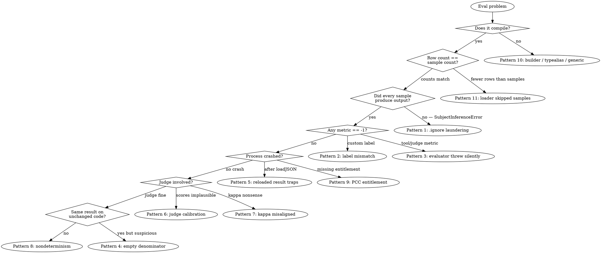

# Evaluations Diagnostics

## Overview

The Evaluations framework (`OS27`) fails **quietly**. Its characteristic failure is not a red build — it's a green suite that measured nothing, a plausible-looking number computed from the wrong data, or an uncatchable trap. The runner deliberately records errors instead of propagating them, and `.ignore`d samples silently leave your aggregates, so the most dangerous bugs *flatter* your score — the inputs your feature handles worst are the ones that stop being counted.

**Core principle**: before you trust any number this framework gives you, prove the run actually happened. Most "my eval is wrong" reports are a wiring bug wearing a decimal point, not a quality signal.

## Red Flags — Suspect a Wiring Bug, Not a Quality Problem

- A metric reads exactly **`-1`** (or `-1.0`)
- Your pass rate didn't drop (or even rose) after you added harder samples
- The suite is green but you never saw a tool call evaluated
- CI is green and you're not sure the model was even available on the runner
- The process **crashes** (SIGABRT/SIGTRAP) instead of throwing
- Cohen's kappa is negative or nonsensical
- The judge scores nearly everything the same
- Scores swing between runs on unchanged code
- The dataset you loaded is smaller than the file you wrote

## Mandatory First Steps

**Prove the run happened before you interpret anything.** In order:

```swift
let result = try await MyEvaluation().run()
let df = result.detailed

// 1. Did every sample actually produce output? A `.ignore`d sample is a HOLE,
//    not a failure row — it leaves the denominator and inflates your score.
#expect(!df.containsColumn("SubjectInferenceError", SubjectInferenceError.self))

// 2. Did every evaluator actually run? A throwing evaluator is RECORDED, not
//    propagated. Its metric column still APPEARS (all .ignore, so it looks healthy)
//    but aggregates over an empty set, so aggregateValue on it returns -1.
//    Checking for a missing column will fool you — check this error column instead.
#expect(!df.containsColumn("EvaluatorErrors", [EvaluatorError].self))

// 3. How many rows are there, really?
print("rows: \(df.shape.rows)")            // vs. the sample count you expect

// 4. Is the number you're about to gate on real, or is it the not-found sentinel?
let score = result.aggregateValue(.mean(of: myMetric))
precondition(score != -1, "metric was never computed — wiring bug, not a quality bug")
```

Record: **rows produced**, **error columns present?**, **any metric reading -1?**

### What this tells you

| Observation | Go to |
|---|---|
| `SubjectInferenceError` column exists | Pattern 1 |
| A metric reads `-1` | Pattern 2 or Pattern 3 |
| `EvaluatorErrors` column exists | Pattern 3 |
| Zero rows, or aggregate over nothing | Pattern 4 |
| Crash, not an error | Pattern 5 or Pattern 9 |
| Judge output looks wrong | Pattern 6 or Pattern 7 |
| Scores unstable across runs | Pattern 8 |
| Fewer rows than samples | Pattern 11 |
| Won't compile at all | Pattern 10 |

## Decision Tree



## Diagnostic Patterns

### Pattern 1: Pass Rate Didn't Drop (or Even Rose) After Adding Harder Samples

**Symptom**: You added edge cases or adversarial samples the feature clearly handles badly, and the aggregate held steady — or went *up*.

**Cause**: Your `subject(from:)` throws. A throwing subject does **not** fail the sample — the runner logs and skips it, sets **every metric for that sample to `.ignore`**, and `.ignore` is excluded from aggregation. The sample leaves the denominator entirely. So the inputs your feature is *worst* at are exactly the ones that stop being counted.

For Foundation Models this is the common case, not a corner case: `LanguageModelError.guardrailViolation`, `.contextSizeExceeded`, `.refusal`, `.unsupportedLanguageOrLocale`, and `SystemLanguageModel.Error.assetsUnavailable` all throw out of a naive subject. Long reviews, dark literary fiction, and non-English text hit those three respectively.

**Do the arithmetic — it tells you whether you have one bug or two.** Ignored rows enter neither the numerator nor the denominator, and your existing rows are untouched. So laundering *alone* **pins the mean flat** at its old value; it cannot raise it. Adding `K` samples to a suite of `N` at mean `m₀` bounds the new mean at `(m₀·N + K)/(N + K)` — every added sample surviving *and* passing.

| Old suite size | Max reachable mean from `m₀` = 0.82, +15 samples |
|---|---|
| 15 | 0.910 |
| 30 | 0.880 |
| 50 | 0.862 |

If your number **rose**, the hard samples that *survived* are passing above baseline — which is a **second bug**: rubber-stamping evaluators. A `(3...8).contains(count)` range check passes happily on eight confidently-wrong Spanish tags. Fix the holes *and* the evaluators. If your number is **above the bound**, you're reading a different aggregate than you think.

(The mechanism does raise scores in the *cross-feature* comparison: a feature that refuses 20% of inputs reports better than one that struggles through them — because the refusals never enter its denominator.)

**Confirm**:
```swift
result.detailed.containsColumn("SubjectInferenceError", SubjectInferenceError.self)  // true == you have holes
```
The rows whose `Response` is `nil` are the vanished samples.

**Why the usual advice fails**: "always inspect individual failures" doesn't help. An ignored sample is a **hole, not a failure row** — there is nothing to inspect.

**Fix**: Catch inside `subject(from:)` and score a sentinel, so the sample stays in the denominator.

```swift
struct Outcome: Codable, Sendable, Equatable {
    var value: [String] = []
    var failure: String? = nil
}

func subject(from sample: ModelSample<Outcome>) async throws -> ModelSubject<Outcome> {
    do {
        return ModelSubject(value: Outcome(value: try await MyService.run(sample.promptDescription)))
    } catch {
        // BARE catch, deliberately. `catch let e as LanguageModelError` looks tighter but
        // RETHROWS SystemLanguageModel.Error.assetsUnavailable — a *different* enum — which
        // is exactly the model-unavailable case you most need to trap. A typed catch here
        // silently leaves the biggest hole open.
        return ModelSubject(value: Outcome(failure: "\(error)"))   // NOT rethrown
    }
}

// Then a guardrail metric that can actually fail:
Evaluator { _, s in
    s.value.failure == nil ? produced.passing() : produced.failing(rationale: s.value.failure!)
}
```

Assert `mean(of: produced) == 1.0`. Distinguish the two legitimate uses of `.ignore`: "no ground truth for this metric" is correct; "the model didn't answer" is a bug in your eval.

---

### Pattern 2: A Metric Reads Exactly `-1`

**Symptom**: `#expect(result.aggregateValue(.custom(label: "…")) > 0.6)` fails, and the value is `-1`. It looks like catastrophic quality.

**Cause**: `aggregateValue(_:)` returns **non-optional `Double`**, and yields **`-1` when the operation isn't found**. That `-1` sails straight into a `> 0.6` assertion looking exactly like a quality failure rather than the wiring bug it is.

Three causes, in order of likelihood:

1. **The operation was never registered.** This is the big one. `aggregateValue` reads back a **precomputed aggregate**, so `.median(of: m)` returns `-1` unless `aggregateMetrics` actually called `computeMedian(of: m)` — no matter how healthy `m` is and how well every sample scored it. Registering `computeMean` and then reading `.standardDeviation` gives you `-1`.
2. **A label typo** in `.custom(label:)` versus `custom(of:label:)`.
3. **The metric was never produced**, or produced only as `.ignore` (see Pattern 3).

**Confirm**: For every operation you read back, find the matching `compute…`/`custom` call in `aggregateMetrics`. Same metric, same operation, same label string.

**Fix**: Share the label as a constant, and add a sentinel guard.

```swift
enum Labels { static let alignment = "Relevance Alignment" }

aggregator.group("Relevance") { g in
    g.custom(of: relevance.metric, label: Labels.alignment) { /* … */ }
}

let k = result.aggregateValue(.custom(label: Labels.alignment))
precondition(k != -1, "alignment was never computed — check the label")
#expect(k > 0.6)
```


---

### Pattern 3: Tool Metrics Read `-1` and the Suite Is Green

**Symptom**: You added `ToolCallEvaluator`, the suite passes, and `ToolsAllPass` reads `-1` — **even though the column is right there in `result.detailed`**.

**Cause**: You didn't attach the transcript. `ToolCallEvaluator` throws `EvaluationError.missingTranscript` — but that throw is **caught by the runner and recorded in the `EvaluatorErrors` column, not propagated**.

Here is the part that misleads people: the metric column **still materializes** — as an all-`.ignore` column. So it is present, `containsColumn("ToolsAllPass", Metric.self)` returns **true**, and everything looks healthy. But an all-`.ignore` metric aggregates over an *empty set*, so no aggregate row is emitted, and `aggregateValue` falls through to the not-found sentinel `-1`. The suite reports green having measured **zero** tool behavior.

**Do not check for a missing column.** It's there. Check the error column.

`ModelJudgeError` travels the identical path — a judge that fails to parse its own output disappears the same way.

**Confirm**:
```swift
result.detailed.containsColumn("EvaluatorErrors", [EvaluatorError].self)   // true == an evaluator died
// and note the contrast:
result.detailed.containsColumn("ToolsAllPass", Metric.self)               // ALSO true — column exists, all .ignore
result.summary                                                            // the aggregate row is what's absent
```

**Fix**: Capture the transcript on the `ModelSubject`. `ModelSubject.init(value:transcript:)` defaults `transcript` to **nil**, so omitting it compiles, runs, and is silently wrong.

```swift
func subject(from sample: ModelSample<String>) async throws -> ModelSubject<String> {
    let session = LanguageModelSession(tools: [SearchBooks()], instructions: "…")
    let response = try await session.respond(to: sample.prompt, generating: String.self)
    return ModelSubject(value: response.content,
                        transcript: session.transcript.structuredTranscript)   // required
}
```

**Still `-1` after attaching the transcript?** Two more causes, and neither trips `EvaluatorErrors` — so the confirm step above comes back *clean* while the metric stays broken:

1. **The aggregation was never registered.** `aggregateValue` reads back a precomputed aggregate; without `aggregator.computeMean(of: toolsAllPass)` you get `-1` no matter how healthy the metric is. (Pattern 2, cause 1.)
2. **No sample carries a `TrajectoryExpectation`.** `ModelSample.init(…, expectations:)` defaults to **nil**, and `ToolCallEvaluator` is constrained on `Input.Expectation == TrajectoryExpectation` — a constraint your sample type satisfies **by type, not by content**. A dataset with zero expectations compiles, runs, goes green, and reports `-1` because there was simply nothing to score. Nothing threw, so `EvaluatorErrors` is absent and looks fine.

Check `dataset.samples.filter { $0.expectations != nil }.count` before you believe any trajectory number.

---

### Pattern 4: CI Is Green and the Model Was Never Available

**Symptom**: The eval gate passes on CI. It also passes on a runner with no Apple Intelligence.

**Cause**: If the model is unavailable, *every* `subject(from:)` throws, *every* sample is `.ignore`d, and the aggregate is computed over an **empty set**. An empty aggregate is not a failing gate.

**Confirm**: Assert the wiring gate (Mandatory First Steps) *before* any quality assertion, and check the row count.

**Fix**: Make an unavailable model **skip**, never silently pass.

```swift
@Test(.enabled(if: SystemLanguageModel.default.isAvailable), .evaluates(MyEvaluation()))
func quality() throws { /* … */ }
```

**Where it can run** (device, Simulator, and the open question of hosted CI): `axiom-ai (skills/foundation-models-evaluations-ref.md)`.

---

### Pattern 5: SIGABRT Right After `loadJSON`

**Symptom**: The process aborts — not throws — on `aggregateValue`, `groupedSummary`, or `detailed[metric:]` (SIGABRT, exit 134):
```
Could not cast value of type 'TabularData.Column<Swift.String>' (0x…)
                          to 'TabularData.Column<Evaluations.AggregateMetric>' (0x…).
```
`aggregateValue` and `groupedSummary` name `Column<Evaluations.AggregateMetric>`; `detailed[metric:]` names `Column<Evaluations.Metric>`. Same cause.

**Cause**: **JSON persistence is lossy.** After `saveJSON` → `loadJSON` (or `init(jsonData:)` / `loadJSONLines`), *every* column comes back typed as `String`. The typed inspection API then hard-casts and **traps uncatchably**.

**Fix**: The typed API works **only on the in-memory result returned by `run()`**. On a reloaded result, only `resultID`, `evaluationID`, `evaluationInfo`, `startTime`, `endTime`, and `duration` are safe; read cells as `String` (each holds the JSON text of the original value).

For cross-run comparison, use **Xcode's Compare view**, not reloaded results in code. Label runs with `info:` so they're identifiable.

This looks like a beta defect. Do not build a trend-tracking harness on `loadJSON` until it's fixed.

---

### Pattern 6: The Judge Scores Nearly Everything the Same

**Symptom**: Every sample gets a 3 (or every one passes). Variance is near zero.

**Cause**, in order of likelihood:
1. **Odd-numbered scale.** A 1–5 scale hands the judge a noncommittal middle to hide in, and it takes it. Leniency/compression collapses everything to 3s and 4s.
2. **Vague middle levels.** The judge defaults to whichever level is least specific.
3. **Gradient rubric.** Levels that differ only in *degree* ("good" vs "very good") are not distinguishable by a model. Levels must name **observable features**.
4. **Bundled dimension.** "Helpfulness" is several questions at once; the judge averages them into mush.

**Confirm**: a cheap direct tripwire — zero variance is a broken judge, regardless of what its mean says.

```swift
// You MUST register the operation, or aggregateValue returns -1 (Pattern 2) and the
// tripwire "fails" for the wrong reason.
aggregator.computeStandardDeviation(of: dimension.metric)
// …then:
#expect(result.aggregateValue(.standardDeviation(of: dimension.metric)) > 0.3)
```

**Fix**: this is a rubric bug, not a feature bug. Read the **rationales** first — they show you which criterion the judge invented or over-weighted. Then repair the scale and dimensions per `axiom-ai (skills/foundation-models-evaluations.md)` (Judge Discipline), which owns the how.

---

### Pattern 7: Cohen's Kappa Is Negative or Nonsensical

**Symptom**: Alignment comes back negative, or wildly inconsistent between runs on the same data.

**Two distinct causes.**

**(a) The judge genuinely isn't aligned.** This is *normal on the first run* — Apple's own sample judge starts at **kappa = −0.037**, worse than chance, while looking entirely reasonable. Fix it in this order, all configuration, no code: add app context to the `ModelJudgePrompt`; sharpen the dimension descriptions; add a *few* worked examples (keep them few, or you overfit the alignment score itself).

**(b) Your score vectors are misaligned.** `custom(of:label:)` hands you `[Double]` containing **only the non-`.ignore`d scores**. If you align that positionally against a separately-built expert array — which is what **Apple's own Book Tracker sample does** — then the moment *one* sample is ignored, the two vectors shift relative to each other and you get a garbage kappa that still looks like a plausible number.

**Fix for (b)**: guarantee every calibration sample produces a real score (no `.ignore`, no throwing subject), or key scores by sample rather than by position. Verify the array lengths match before computing.

**Also check the statistic itself**: plain Cohen's kappa on an ordinal scale understates a judge that's directionally right (it punishes 3-vs-4 as hard as 1-vs-4), and kappa needs `scoringMode: .discrete` to mean anything. Both are covered in `axiom-ai (skills/foundation-models-evaluations.md)`.

---

### Pattern 8: Scores Swing Between Runs on Unchanged Code

**Symptom**: The gate flaps red/green with no code change. The team is about to disable it.

**Cause**: A model is not a pure function.

**Fix, in three parts:**

1. **Pin the subject.** `GenerationOptions(samplingMode: .greedy)` produces the same output for the same input — verified byte-identical. Set it in `subject(from:)`. (Seeded `.random(top:seed:)` is explicitly "best effort" per Apple, *not* a guarantee.)

```swift
let response = try await session.respond(
    to: sample.prompt, generating: Tags.self,
    options: GenerationOptions(samplingMode: .greedy)
)
```

2. **Accept that you cannot pin the judge.** `ModelJudgeEvaluator` accepts only a `LanguageModel` — there is no public API to hand it `GenerationOptions`. A model-as-judge stays a nondeterminism source even when the subject is greedy.

3. **Measure the noise floor, then gate above it.** Run the identical suite 5–10 times on unchanged code and look at the spread. If the metric's own standard deviation is 0.15, then 3.6 and 3.4 are the *same build*. Threshold and dataset-size guidance: `axiom-ai (skills/foundation-models-evaluations.md)`.

---

### Pattern 9: Process Crashes With "Missing Required Entitlement"

**Symptom**:
```
Fatal error: Process is missing required entitlement: com.apple.developer.private-cloud-compute
```
SIGTRAP, exit 133. Not a thrown error you can catch.

**Cause**: `PrivateCloudComputeLanguageModel` requires a **managed** entitlement you must apply for. And **`availability` lies**: an unentitled process still reports `.available`, then `respond()` hard-crashes. An availability check does not protect you.

**Fix**: Confirm the entitlement before designing a judge (or a subject) around PCC. Its quota is also per-*person*, tied to a signed-in Apple Account — a CI runner with nobody signed in is a further unknown. Apple's own sample uses PCC for **offline dataset generation**, not as the model under test in CI.

Falling back to `SystemLanguageModel` as the judge is safe but costs you: it only half-mitigates self-enhancement bias when the subject is also `SystemLanguageModel`.

---

### Pattern 10: The Evaluation Won't Compile

Five errors specific to this framework:

| Error | Cause | Fix |
|---|---|---|
| `argument type '[any EvaluatorProtocol<…>]' does not conform to expected type 'EvaluatorProtocol'` | An **`if` without `else`** in the `evaluators` block. The dead `buildOptional` fires and returns an array that the variadic `buildBlock` can't consume. | Build the evaluator list outside the builder. |
| `closure containing control flow statement cannot be used with result builder 'EvaluatorsBuilder'` | **`if/else`, `for`, or `if #available`** in the `evaluators` block. `@EvaluatorsBuilder` has no `buildEither`, no `buildArray`, no `buildLimitedAvailability` — so **no** conditional or loop of any kind compiles there. | Same — move the branching outside. |
| `unsupported recursion for reference to type alias 'Evaluators'` | Declaring `var evaluators: Evaluators` makes associated-type resolution circular as soon as anything in the module touches `inputColumn`/`responseColumn` — which result triage does. Compiles fine alone; breaks the moment you add triage. | Spell the concrete type: `var evaluators: [any EvaluatorProtocol<ModelSample<T>, ModelSubject<T>>]`. Or add `typealias Sample` / `typealias Subject` to the struct. |
| `cannot convert value of type 'BookTags?' to expected argument type 'Optional<String>'` | You **omitted** `expected`. Its default argument is hard-typed `Optional<String>`, so omission only works when `ExpectedValue == String`. | Pass `expected: nil` explicitly. |
| `generic parameter 'ExpectedValue' could not be inferred` | You passed `expected: nil` but didn't **name the generic** — `nil` carries no type information. | `ModelSample<BookTags>(prompt: "x", expected: nil)` |

---

### Pattern 11: The Dataset Silently Shrank

**Symptom**: You wrote 200 samples to a file; the run reports far fewer rows.

**Cause**: `JSONLoader` **logs-and-skips malformed entries via OSLog** rather than throwing. Only a file-open failure throws. Separately, `makeSamples(_:targetCount:)` **silently discards** whatever your `validator` rejects.

**Fix**: Check `result.detailed.shape.rows` against the sample count you expect — that single assertion catches both. For synthesis, construct a `SampleGenerator` directly so you can read `invalidSamples` and see *why* they were rejected; `makeSamples` throws that away.

## Quick Reference

| Symptom | Pattern |
|---|---|
| Pass rate rose after adding hard samples | 1 — `.ignore` laundering |
| Metric reads exactly `-1` | 2 — label mismatch, or 3 |
| Tool metrics read `-1` (column present!), suite green | 3 — missing transcript / no expectations / unregistered aggregate |
| CI green, model unavailable | 4 — empty denominator |
| SIGABRT after `loadJSON` | 5 — lossy reload, typed API traps |
| Judge scores everything the same | 6 — odd scale / vague levels / bundled dimension |
| Kappa negative or nonsensical | 7 — uncalibrated judge, or positional misalignment |
| Scores swing run to run | 8 — subject not greedy; judge can't be pinned |
| SIGTRAP "missing required entitlement" | 9 — PCC, and `availability` lies |
| Won't compile | 10 — builder / typealias recursion / generic inference |
| Fewer rows than samples | 11 — `JSONLoader` and `makeSamples` skip silently |

## Resources

**WWDC**: 2026-298, 2026-335, 2026-299

**Docs**: /evaluations, /foundationmodels/generationoptions

**Skills**: axiom-ai (skills/foundation-models-evaluations.md), axiom-ai (skills/foundation-models-evaluations-ref.md), axiom-ai (skills/foundation-models-diag.md)

---

**Last Updated**: 2026-07-12
**Platforms**: iOS / iPadOS / macOS / watchOS / visionOS 27+ (not tvOS)
**Skill Type**: Diagnostic
