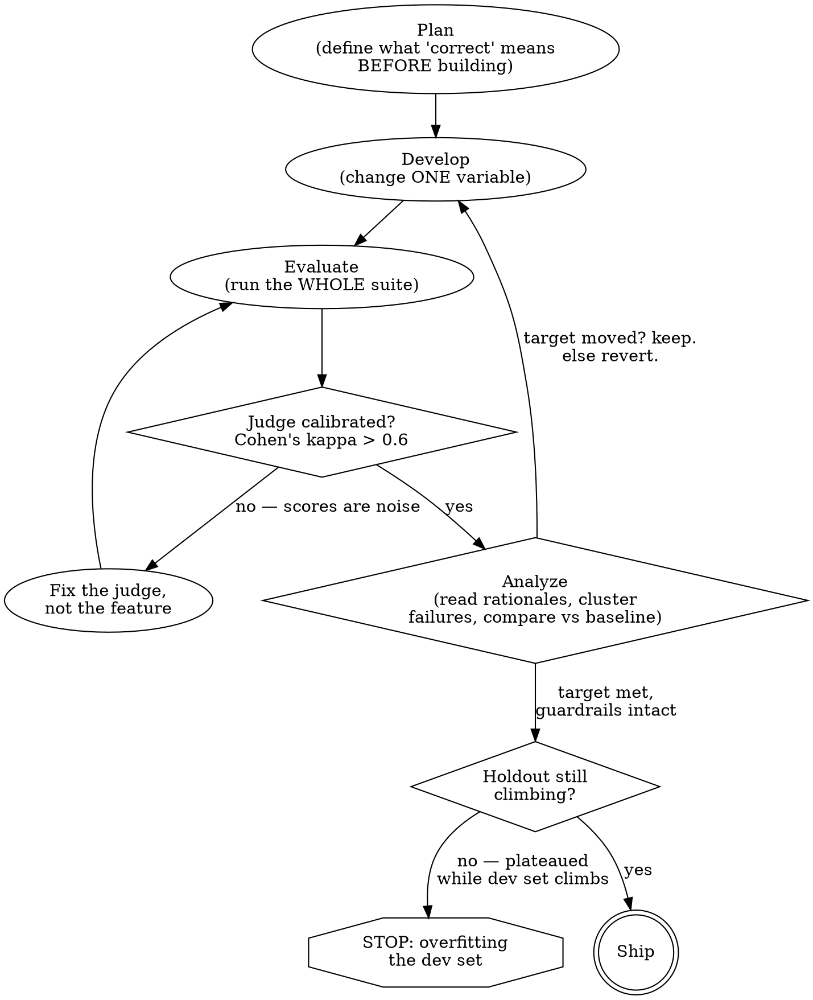

# Evaluation-Driven Development for Intelligence Features

## When to Use This Skill

Use when:
- Building or changing ANY generative feature and asking "is it actually good?" or "did that change help?"
- Tempted to ship an AI feature after trying a handful of prompts by hand
- Tuning instructions, `@Guide` schemas, tools, or swapping models
- Standing up a regression suite so an AI feature can't silently degrade
- Grading open-ended output where no `#expect` can express "correct"
- An agentic feature returns plausible answers and you don't know whether it took the right path
- Designing an evaluation dataset, or growing one with synthetic samples
- A model judge is producing scores you don't trust

#### Related Skills
- Use `axiom-ai (skills/foundation-models-evaluations-ref.md)` for the complete API surface
- Use `axiom-ai (skills/foundation-models-evaluations-diag.md)` when the suite itself is misbehaving — a metric reading `-1`, a pass rate that rose when you added hard samples, a green suite that measured nothing
- Use `axiom-ai (skills/foundation-models.md)` to build the feature this skill measures
- Use `axiom-testing (skills/swift-testing.md)` for the surrounding test target — Evaluations runs *inside* Swift Testing, it does not replace it
- Use `axiom-security (skills/agentic-security.md)` to express red-team prompt sets as adversarial eval suites

---

## Core Principle

Traditional unit tests verify deterministic behavior: if a test passes today it passes tomorrow unless the code changes. **Intelligence-powered features break that assumption** — five ways at once:

- **Probabilistic output.** The same input produces different responses across runs.
- **Fuzzy correctness.** "Helpful tone" and "appropriate for beginners" are not string matches.
- **External model changes.** The model shifts under you between OS releases, with no code change on your side.
- **Context sensitivity.** Small prompt-wording differences cause large output swings.
- **High stakes.** One wrong answer erodes trust in the whole app.

So `#expect(result == expected)` fails on a synonym and passes on a fluent lie. The replacement is **evaluation-driven development**: run the feature over a dataset, score every output into named metrics, aggregate, gate on the aggregate. Then change one thing and watch the number move. Apple calls that loop *hill-climbing*.

**Your evaluation suite is your specification.** It's executable (it programmatically defines what "correct" means), precise (it replaces vague goals with measurable targets), and always current (it runs against every change). Writing it forces you to define, from the beginning, what the feature must do, what it must not do, and how you measure the difference.

Evaluation is not the last step before shipping. It's part of every step from the beginning.



---

## Red Flags — Anti-Patterns That Will Fail

### ❌ Eyeballing outputs

**Why it fails**: Five good results tell you nothing about the five hundred that fail. It produces no number, no dataset, and no gate, so the next prompt tweak or model release silently undoes your work and you learn about it from App Store reviews.

**Instead**: Whatever you were about to eyeball, write down as 10–20 samples with expected values. That's your golden set and it's an afternoon of work.

### ❌ Trusting a model judge you haven't calibrated

**Why it fails**: The judge follows *your words*, not your intent, and it carries four measurable biases (below). An uncalibrated judge produces confident noise. In Apple's own sample the *starting* alignment was **kappa = −0.037** — worse than chance.

**Instead**: Calibrate before you trust. Cohen's kappa against expert ratings, gated at **> 0.6**.

### ❌ Passing metrics as proof of quality

**Why it fails**: Metrics that pass can still be lying. `TagCount` hit 100% after a `.count(3...8)` guide was added — because the feature then emitted *exactly 8 tags every single time*. All quantitative metrics green; the tags themselves were reader-reaction words and a wrong genre.

A perfect score on a *scored* metric is a warning sign, not a victory: a bias evaluation returning zero bias might mean your model is unbiased, or it might mean **your model isn't answering the questions at all**. (This doesn't apply to guardrails — 100% is their required state, not a suspicious one.)

**Instead**: Beside every pass/fail range check, add a `scoring` metric recording the raw value, and aggregate its mean and standard deviation. Distributions expose what pass rates hide.

### ❌ A happy-path dataset

**Why it fails**: A dataset that only covers the happy path gives you false confidence. **If an input category isn't represented, your evaluation is silent about it.** And a 95% pass rate can hide the fact that every single failure comes from one category — that 5% may be an entire use case.

**Instead**: Four categories (golden / edge / adversarial / known-failures), and always inspect individual failures, never just the summary.

### ❌ Re-running only the failing samples

**Why it fails**: A targeted prompt change can fix one category while introducing regressions elsewhere. Stronger constraint language might fix boundary violations and make the model too rigid for open-ended requests.

**Instead**: Run the entire suite after every change. Check that the previously failing samples now pass **and that everything else held its score**.

### ❌ Tuning until the dev set is perfect

**Why it fails**: That's overfitting. A prompt engineered to pass 50 specific test cases fails on the 51st because it's optimized for your dataset's quirks rather than the underlying quality criteria.

**Instead**: Keep a **holdout set** you never develop against. Run it at milestones, not every change. If the dev set keeps climbing while the holdout plateaus or declines, stop — you're overfitting.

### ❌ Letting `subject(from:)` throw for a failure mode your users will hit

**Why it fails**: This is the most dangerous trap in the framework, because it makes your score *flatter you*.

A throwing `subject(from:)` does not fail the sample. The runner logs the error, sets every metric for that sample to `.ignore` — and `.ignore` is *excluded from aggregation*. The sample leaves the denominator entirely. So a feature that trips `guardrailViolation` on the 20% of reviews discussing dark literary fiction reports a **higher** pass rate than one that struggles through them — the refusals never enter its denominator. (Within one suite, laundering *pins* the number rather than raising it: ignored rows leave both numerator and denominator, so the mean of what remains is unchanged. Either way you are not measuring the inputs you care most about.) In the degenerate case — Apple Intelligence unavailable on the CI runner — *every* sample is ignored and your quality gate is computed over an empty set.

And the usual remedy doesn't save you. "Always inspect individual failures" fails here because an ignored sample is a **hole, not a failure row**. There is nothing to inspect.

For Foundation Models this is not a corner case. `LanguageModelError.guardrailViolation`, `.contextSizeExceeded`, and `SystemLanguageModel.Error.assetsUnavailable` are the three most common real-world outcomes. (`OS27` renamed these — `LanguageModelSession.GenerationError` and its `exceededContextWindowSize` case are deprecated in 27.)

**Instead**: catch inside `subject(from:)` — with a **bare `catch`**, not `catch let e as LanguageModelError`, which would rethrow `SystemLanguageModel.Error.assetsUnavailable` (a separate enum, and the model-unavailable case you most need to trap). Return a sentinel carrying the failure, and score it with a `Produced` guardrail metric asserted at 100%. Then assert the error columns are absent, so a wiring bug fails loudly:

```swift
#expect(!result.detailed.containsColumn("SubjectInferenceError", SubjectInferenceError.self))
#expect(!result.detailed.containsColumn("EvaluatorErrors", [EvaluatorError].self))
```

**The two legitimate uses of `.ignore` are not the same thing.** "This sample has no ground truth for this metric" is correct. "The model didn't answer" is a bug in your evaluation.

The same silence bites tool evaluation: forget the transcript and `ToolCallEvaluator` throws, the runner *records* the throw rather than propagating it, the trajectory metric column materializes as an all-`.ignore` column that **looks present and healthy**, `aggregateValue` on it returns **-1**, and the suite goes green with zero tool coverage.

### ❌ Evaluating only the output of an agentic feature

**Why it fails**: A model can produce a reasonable-sounding answer without ever calling the right tool. The output looks correct while the path is wrong — and the path is what breaks in production.

**Instead**: Evaluate the trajectory too, in the same suite. And never score trajectories *alone*: a model that calls the right tools but returns an incomplete answer still failed the user.

---

## Define Criteria Before You Build

Vague criteria produce vague signals. Every quality goal must become a target code can verify.

| Vague goal | Precise criterion |
|---|---|
| "Stay within budget." | 100% compliance with stated budget ceiling (pass/fail) |
| "Be helpful." | > 90% task success rate on a common-query benchmark |
| "Match the user's skill level." | Complexity score (1–4) within 0.5 of stated preference |
| "Generate accurate tags." | 95% of tags classify as factual descriptors, not subjective reactions |

**The six quality dimensions.** Choose the ones that represent real risk or real value for your feature, and assign **at least one evaluator to each**:

- **Task fidelity** — the response accomplishes what it's supposed to
- **Consistency** — similar quality across varied inputs (measure as the standard deviation of per-category mean scores)
- **Tone and style** — output matches your app's voice
- **Safety** — avoids harmful content, refuses adversarial prompts gracefully
- **Privacy preservation** — doesn't surface data outside its intended scope
- **Latency and cost** — responds within acceptable time and token budgets

Start with **two or three evaluators** on your most important dimensions. Add more as you learn where the feature fails.

### Choosing how to score

| Approach | Use when | Speed | Cost | Reproducibility |
|---|---|---|---|---|
| Code (`Evaluator`) | Correctness is computable: exact match, schema validation, range check | Instant | Free | Perfect |
| Judge (`ModelJudgeEvaluator`) | Quality is subjective or needs reasoning: helpfulness, tone, groundedness | Seconds | Inference | High, if levels are well defined |
| Human | High stakes, **calibrating the judge**, discovering gaps in your dimensions | Minutes+ | Expensive | Variable |

**Use code when you can.** Word limits, schema conformance, numeric ranges, format compliance — these *never* need a judge.
**Use a judge when code can't express the criterion.**
**Use humans to calibrate, not to score at scale.** Human review is too slow for routine evaluation; its value is calibrating your automated evaluators.

**Then go further: consider changing the feature so code *can* score it.** If your `@Generable` type returns free-form `[String]` tags, no code check can tell a good tag from a bad one and you're forced into a judge. Constrain the output space — a `@Generable` enum of curated cases — and suddenly precision and recall are arithmetic against your expected values, the judge disappears, and the tag vocabulary stops drifting across "page-turner" / "pageturner" / "unputdownable". The cheapest judge is the one you designed away. (It's also a real defense against prompt injection: a model that can only emit enum cases cannot be talked into emitting anything else.)

Ground truth comes in three flavors, and most suites use all three: **explicit** (a known-correct answer per sample), **rule-based** (the rule *is* the truth — "≤ 200 words" needs no golden answer), and **none** (open-ended output, where you need a judge).

### Guardrails vs the optimization target

| | Guardrail | Optimization target |
|---|---|---|
| What it is | A hard invariant that must never break | The number you are actively trying to move |
| Example | `noDuplicates` == 1, no `disallowed` tool fires, safety == 100% | Judge's `Relevance` mean, task success rate |
| Gate | 100%, or a hard floor | Your current bar, raised as you climb |
| Failure mode | **Keeps passing while the feature degrades** | Honestly reports that you got worse |

Pick **one** optimization target per round; everything else is a guardrail. A suite made entirely of guardrails will be green on the day your feature is at its worst.

Aggregate correctly: **mean** of pass/fail metrics gives you a pass rate; **median** of scored metrics resists outlier skew. (In a *calibration* evaluation, report the judge's mean and standard deviation too — you're characterizing the judge's distribution, not gating on quality.)

**Never gate on one global number.** An 87% average that is 97% on typical inputs and 40% on short ones is not an 87% feature — it is a feature that is broken for an entire input category, and the average is hiding it. Run each dataset category as its own suite with its own gate, and add a **worst-category** floor. `aggregator.group(_:_:)` gives you the per-category breakdown; the minimum across those groups is the number that actually tells you whether you can ship.

---

## Dataset Discipline

**Your evaluation is only as good as the inputs you measure.**

### Four categories

| Category | What it holds | Role |
|---|---|---|
| **Golden set** | Core happy-path cases that must always pass | Defines your quality floor |
| **Edge cases** | Valid but uncommon: very short/long inputs, odd formatting, ambiguity, contradictory constraints | Boundary behavior |
| **Adversarial** | Prompt injection, harmful-content requests, system-prompt extraction attempts | Safety |
| **Known failures** | Every production failure, captured as a regression test | The ratchet |

Model them as separate `@Suite`s. The known-failures category is what makes quality **monotonic**: a failure surfaces → reproduce it as a test case → fix it → *the test case stays forever*. Your quality level can only go up.

Sketch **user profiles** before writing samples — typical users, their goals, how they phrase requests. Each profile needs at least one sample.

### The numbers

| Stage | Apple's guidance |
|---|---|
| Week one | 2–3 evaluators, **10–20 sample** golden set |
| First month | **30–50 samples** across categories; add a judge for subjective dimensions |
| Mature single feature | **100–500 samples** |
| Multi-feature benchmark | 50–200 per feature |
| To detect a 5% difference at 95% confidence | **~400 samples** |

**More is not always better.** Unlike training data, evaluation datasets have diminishing returns — a well-built 100–500 sample set discriminates better than a noisy 5,000-sample one full of duplicates and ambiguous expectations. Start small, focus on quality, and expand only once your evaluators are stable.

### Growing it synthetically

**Stabilize your evaluators first, then scale the dataset.** Not the other way around.

**Seeds are amplified, flaws and all.** Synthetic generation amplifies whatever patterns exist in your seeds. Improving ten mediocre seeds into ten excellent seeds beats adding ninety more mediocre ones.

**Make 20–30% of your seeds genuinely hard.** Models gravitate toward medium difficulty when generating; hard seeds pull the generated distribution toward the limits. Include seeds where the correct behavior is to **refuse, flag ambiguity, or answer partially** — without them, synthetic datasets develop a bias toward always producing a confident, complete answer.

**Never write one "generate diverse test cases" prompt.** It produces frequency bias (the model reaches for its most common training examples), uneven coverage (categories you listed explicitly still don't get equal allocation), and diminishing novelty (later items become rephrasings). **Generate per category, and for the cross-product of your dimensions**: urgent work tasks, easy personal tasks, ambiguous health tasks.

**What synthesis is bad at** — do not lean on it for:
- **Domain-expert knowledge** (medical, legal, scientific). Models produce plausible-but-subtly-wrong reference answers exactly where correctness matters most.
- **Adversarial and safety testing.** Synthetic attacks are predictable patterns the model was already trained to handle. **Real human-crafted attacks are what expose gaps.**
- **Long-tail distributions** and **cultural/regional nuance**, both of which get flattened into generic patterns.

**Failure modes to watch for**: *mode collapse* (variations of a few patterns), *difficulty collapse* (everything converges to medium), *answer leakage* (the prompt hints the answer, making the eval trivially easy), *distributional shift* (synthetic distribution ≠ real usage).

**Validate in layers**: a `validator` closure for structural rules → category-balance check → **manual spot-check of a random 5–10%** → self-consistency check (generate multiple answers to one question; wild variance means the question is ambiguous) → deduplication.

**Keep ≥ 20–30% human-written samples** as a calibration anchor. Synthetic data expands coverage; it does not replace deliberate adversarial thinking or real production failures.

**Gotcha**: `makeSamples(_:targetCount:)` **silently discards** whatever your validator rejects. Construct a `SampleGenerator` directly if you want to see `invalidSamples` and understand *why* they were rejected. Also note `targetCount` is the size of the **whole resulting set including your seeds** — 13 seeds and `targetCount: 100` means 87 new ones.

---

## Judge Discipline

A model judge applies a subjective, human-style judgment consistently across your whole dataset. It is the only way to scale grading past what you can read — and it is a model, so it is wrong in ways you must measure.

### Pick the right judge and the right scale

**Use a *different, more capable* model than the one under test.** Two separate reasons: a stronger judge is less swayed by style and evaluates on substance, and a *different model family* avoids **self-enhancement bias** — models rate their own family's output more favorably.

`PrivateCloudComputeLanguageModel()` is the pragmatic default for a feature running on the on-device `SystemLanguageModel`, and it buys you the capability half. Be honest that it only *half* buys the family half: PCC is Apple's own server-side model, plausibly the same lineage and stylistic priors. If a dimension is high-stakes, judge with a genuinely foreign model through a custom `LanguageModel` provider — Evaluations accepts any `LanguageModel`.

⚠️ **PCC will crash an unentitled process, and `availability` won't warn you.** It requires the *managed* entitlement `com.apple.developer.private-cloud-compute`, which you must apply for. Without it, `availability` still reports `.available` and the subsequent `respond()` is a hard `Fatal error: Process is missing required entitlement` — a SIGTRAP, not a thrown error you can catch. An availability check does not protect you. Its quota is also per-*person*, tied to a signed-in Apple Account, so a CI runner with nobody signed in is a further unknown. Confirm the entitlement before you design a judge around PCC.

| Scale | Use for | Reliability |
|---|---|---|
| Binary (`.passFail`) | Safety, compliance, format, factual correctness | Highest |
| 1–4 (even-numbered `.numeric`) | Subjective quality: tone, clarity, helpfulness | Good |
| Custom `ScoreLevel` | Domain-specific categories (safe / borderline / unsafe) | Varies |

**Binary judgments get binary scales.** Forcing a multi-point judgment on a binary dimension adds noise without signal — the judge just clusters at the middle.

**Even-numbered scales, always.** An odd scale hands the judge a noncommittal middle to default into, and wide scales suffer score compression (everything lands in a narrow band regardless of real quality). Four levels give enough distinction and force a commit to one side of the midpoint.

### Write rubrics as observable features, not gradients

The single most common rubric defect: levels that differ only in **degree**. A judge cannot reliably tell "excellent quality" from "good quality". It *can* tell "all key points addressed with supporting evidence" from "most key points addressed but missing supporting detail".

- **Describe features, not feelings.** "Perfect AABBA rhyme, strong meter, surprising punchline" is actionable. "Excellent limerick" is not.
- **Make adjacent levels distinguishable** — two independent reviewers should agree on the 3-vs-4 boundary. If two levels blur, merge them or sharpen them.
- **Anchor the middle as carefully as the extremes.** Vague middle levels are what the judge defaults to.
- **Describe the boundary explicitly**: "correct structure but rough execution is a 3, not a 4."

### One question per dimension

Bundling — *"the response is accurate, well-written, and helpful"* — makes it impossible to score output that excels on one axis and fails another. **Independence test: can a response score high on A and low on B? If not, they overlap.** Split them.

**Budget: 3–4 dimensions per judge call.** Beyond 4–5, attention decay means later criteria get less consideration. Keep genuinely separate concerns (safety vs quality) in **separate evaluator calls**. Dimensions in one call are scored in a single round trip, so splitting by concern costs latency — split by *independence*, not by taste.

### Give the judge steps, not just criteria

Without evaluation steps, the judge forms an immediate impression from surface features (length, formatting) and back-fills a score to match. A step-by-step procedure forces it to engage with the content. Structure the instructions as: a **role**, the **criteria**, then **numbered evaluation steps** ending in a synthesis step that weighs everything together.

### The four judge biases

| Bias | What happens | Mitigation |
|---|---|---|
| **Verbosity** | Longer responses score higher even when the length adds nothing | Make conciseness an explicit criterion, or instruct that length ≠ quality |
| **Leniency / compression** | Scores cluster mid-scale; a 1–5 scale collapses to 3s and 4s | Even-numbered scale; detailed descriptions at *every* level; few-shot examples showing that low scores are expected and appropriate |
| **Self-enhancement** | The judge favors its own model family's output | Judge with a different, more capable model |
| **Position** (pairwise only) | The judge prefers whichever response it read first | Run both orderings; only trust verdicts where both agree |

### Reference-guided judging

For tasks with objectively correct answers (math, factual recall, code, tool selection), **give the judge the expected answer** via `ModelJudgePrompt(reference:)`. Without a reference the judge only sees prompt and response, and can only ask "does this seem reasonable in isolation?" Worse, it's exposed to **answer contamination**: an incorrect answer in context leads the judge to copy the wrong reasoning into its own chain of thought, even when it could have solved the problem itself. A reference substantially reduces this.

### Calibrate — Cohen's kappa > 0.6

**Do this before you trust a single judge score.**

Why not raw agreement? Your dataset skews toward decent output, so your ratings skew high, so a judge that **simply always scores high** looks accurate on a small set — then drifts badly as the set grows. Cohen's kappa subtracts the agreement you'd expect by chance:

```
kappa = (accuracy − chance_agreement) / (1 − chance_agreement)
```

The protocol:

1. **2–3 human annotators** score **20–50 responses** with your criteria and levels, **blind** — don't look at the judge's score first, or you're measuring your own anchoring. Collapse the annotators into one gold label per sample by majority, or by adjudicating disagreements. **Compute human–human agreement too**: it is your ceiling, and if two humans can't agree, your rubric is broken and no judge can beat a broken rubric. Fix the rubric before you blame the model.
2. Run the judge over the same set. (Xcode writes a **test attachment** containing all the evaluation data — the input/response pairs the judge saw. That's your calibration dataset; add your expert ratings to it.)
3. Build a *second* evaluation whose subject **is the judge**: dataset = the pre-scored pairs, `subject(from:)` returns the already-generated output, evaluators = the `ModelJudgeEvaluator` under test. Because `Sample.ExpectedValue == Subject.Value`, this needs its **own sample type** carrying both the generated output and the expert score — don't pollute your production `expected` type with calibration fields.
4. Aggregate with `custom(of:label:)` — it hands you `[Double]` (the judge's score per sample) and you return one number.
5. Gate it, and iterate on the judge *configuration* until it clears.

```swift
func aggregateMetrics(using aggregator: inout MetricsAggregator) {
    let expertRelevance = Self.samples.map { Double($0.expected?.expertScore ?? 0) }

    aggregator.group("Relevance") { group in
        group.computeMean(of: relevance.metric)
        group.computeStandardDeviation(of: relevance.metric)
        group.custom(of: relevance.metric, label: "Relevance Alignment") { judgeScores in
            // Statistics is YOUR type — the framework ships no kappa.
            Statistics.quadraticWeightedKappa(expertRelevance, judgeScores) ?? 0
        }
    }
}
```

```swift
#expect(result.aggregateValue(.custom(label: "Relevance Alignment")) > 0.6)
// The always-scores-high judge shows up directly as zero variance. Cheap, catches it without kappa.
#expect(result.aggregateValue(.standardDeviation(of: relevance.metric)) > 0.3)
```

Four things that will silently ruin this:

- **Use quadratic-weighted kappa on an ordinal scale.** Plain Cohen's kappa is for *nominal* categories — it punishes a 3-vs-4 disagreement exactly as hard as a 1-vs-4, which systematically understates a judge that's directionally right, and pushes you to over-tune. Weighted kappa costs the same to write.
- **`scoringMode: .discrete` is mandatory here.** Kappa needs discrete categories; `.continuous` makes it meaningless.
- **The `[Double]` excludes `.ignore`d samples**, so aligning it positionally with your expert array — which Apple's own sample does — misaligns the vectors the moment one sample is ignored, and yields a garbage kappa that still looks plausible. Guarantee every calibration sample scores.
- **`aggregateValue` returns -1 on a label typo.** That fails a `> 0.6` gate looking exactly like a quality problem rather than a wiring bug. Share the label string as a constant.

Expect to *fail* this on the first run. Apple's own sample starts at kappa = **−0.037**, worse than chance, while looking entirely reasonable.

### The escape hatch — and you must take it rather than fake it

Calibration is an open-ended loop with a model in it, and it does not respect your ship date. So decide in advance what happens if it doesn't converge.

**If the judge hasn't cleared your kappa bar by the deadline: cut the judge. Gate on the code evaluators alone, and write down that the subjective dimension is *unmeasured*.**

That is an honorable outcome. Shipping an uncalibrated judge is *worse than shipping no judge*, because you will believe its number, quote it in standup, and gate on it. An unmeasured dimension you know about is a known gap; a miscalibrated one is a lie with a decimal point. Keep the calibration loop as the next sprint's first task.

### Fixing an unaligned judge — in this order

1. **Add app context** to the `ModelJudgePrompt` instructions: what the app is, what a good result looks like, the common failure modes.
2. **Sharpen the dimension descriptions.** If every score clusters at 2–3, the judge is being harsh because your description is vague — that's a rubric bug, not a feature bug.
3. **Add a few worked examples** of your own grading, spanning the full range of the scale. **Keep the set small** — a long list overfits the alignment score and destroys your ability to tell whether the judge actually agrees with you on unseen data.

This is all *configuration*, no code changes.

### Debugging a judge from its rationales

Read them. They are the window into *why* a score came out the way it did.

| Rationale pattern | Diagnosis | Fix |
|---|---|---|
| Mentions criteria you never defined ("creativity") | **Criteria drift** | Instruct it to evaluate *only* on the listed criteria |
| Describes the response positively, scores it low | **Score–rationale mismatch** | The scale descriptions are ambiguous — sharpen the adjacent-level boundary |
| Similar responses get different scores | **Inconsistent weighting** | Compare rationales to find the criterion being weighted differently |
| The same weakness flagged everywhere | Either a real pattern in your output, **or** the judge over-weighting one criterion | Check a sample by hand before "fixing" the feature |

---

## Hill-Climbing Is a Science Experiment

Every iteration has a **control** (the current baseline) and an **experimental** group (one change), and **exactly one variable may differ**. When you keep a change, fold it into the baseline before the next round, or the next comparison measures two things at once.

The inner loop:

1. **Hypothesize.** Don't just observe "the output is wrong" — ask *why*. Is the model misunderstanding the constraint? Missing context? Over-weighting part of the input?
2. **Modify.** One targeted change, attributable to that hypothesis.
3. **Re-run the whole suite.** Not just the failures.
4. **Compare.** Did the failures pass, *and* did everything else hold?

Xcode 27's evaluation report has a **Compare** view for exactly this — baseline beside experimental, metric by metric. Pass `info:` to `.evaluates(_:info:)` to label what each run was testing; that dictionary is what makes a run identifiable a week later. Track the model name, dataset version, and prompt version there.

**What to look for in results**, beyond the pass rate:
- **Clusters of failure** — concentration means a systematic issue, not noise.
- **Near-misses** — a 3-out-of-4 is as informative as an outright failure. It shows where the feature is fragile and about to regress.
- **Unexpected passes** — if something you expected to fail passed, your mental model is wrong. Find out why before you celebrate.

**Prefer changes that teach the model a principle over changes that enumerate specific prohibitions.** If a fix only works with very specific wording, it's brittle.

**Passing the target is not the same as being good.** You can meet every expectation and still know the output is weak — that means your metrics aren't yet measuring what you care about.

**Failed experiments tell you as much as successful ones.** A change that moves nothing has told you the variable doesn't matter.

**A deliberate regression is allowed; an unexamined one is not.** Keeping a change that lifts Relevance and drops Usefulness is a legitimate call — *state* the trade.

### When to run

- **Every prompt change.** Even small wording adjustments shift behavior. Full suite, every time.
- **Every model update.** An OS bump changes the model under you with no code change on your side. Treat it as a **re-baselining event, not a regression** — otherwise the first Apple model update looks like a catastrophe (or silently moves your baseline). Record the OS build in `info:`.
- **Every tool change.** Tool definitions affect how the model reasons about the task.
- Treat evaluation runs like CI checks.

---

## Making the Gate Survive Nondeterminism

A model isn't a pure function, so a threshold gate flaps unless you pin what you can and measure what you can't. A flapping gate gets disabled by the team within two sprints, which is worse than having no gate.

**Pin the subject.** `GenerationOptions(samplingMode: .greedy)` produces the same output for the same input — verified byte-identical across runs. Use it in `subject(from:)` for a stable regression signal, even though production uses default sampling. (Seeded `.random(top:seed:)` is explicitly "best effort" per Apple, not a guarantee.) Then, separately, run the suite a few times at *production* settings once, to learn how much the user-visible output actually varies.

**You cannot pin the judge.** `ModelJudgeEvaluator` accepts only a model — there is no public API to hand it `GenerationOptions`. A model-as-judge stays a nondeterminism source even when the subject is greedy. This is the honest headline: *the subject can be made deterministic; the judge cannot.*

**So measure the noise floor before you pick a threshold.** Run the identical suite on unchanged code 5–10 times and look at the spread. If the metric's own standard deviation is 0.15, then 3.6 and 3.4 are the same build, and any gate finer than that will flap. Report `computeStandardDeviation` on every scored metric so the floor stays visible.

**Put your real risk in guardrails.** Pass/fail metrics gated at 100% don't have this problem — they're binary and they don't drift. Gate hard on guardrails from day one. Gate the *optimization target* only once the dataset is big enough that run-to-run variance is smaller than the movement you care about — and remember Apple's number: **~400 samples to detect a 5% difference at 95% confidence**. A 15-sample golden set has enormous standard error on a judge mean; gating it tightly is theater.

**Where it can run:** on device, and — contrary to widespread claims — **in the Simulator**, which executes live inference using the host Mac's model. **Xcode Cloud and hosted CI are an open question**: Apple documents nothing about Apple Intelligence on their runners. Assume unavailable until you prove otherwise on yours, and make the eval **skip** rather than fail, so an unavailable model doesn't masquerade as a quality result.

---

## Evaluate the Path, Not Just the Answer

A model that picks the wrong tool, passes bad arguments, or calls tools out of order silently breaks your app while returning something that reads fine.

**Tool evaluation measures selection, not execution.** Your tools don't need to do real work during evaluation — **stubs are correct and expected**.

Three judgments matter here; the construct syntax lives in the reference.

**Capture the transcript, or your tool metrics silently become nothing.** `ToolCallEvaluator` needs `session.transcript.structuredTranscript` on the `ModelSubject`. Forget it and the evaluator throws — but the runner *records* that throw instead of propagating it. The metric column still appears (all `.ignore`, so it looks healthy), aggregates over an empty set, and reads back as **-1**. Your suite goes green having measured no tool behavior at all. Assert the `EvaluatorErrors` column is absent.

**Enforce ordering only where ordering is genuinely required** (search must precede fetch-details, because otherwise there's no ID yet). Over-constraining a trajectory turns every legitimate model retry or exploratory call into a red build, and the team learns to ignore the suite.

**Never score trajectories alone.** A model that calls exactly the right tools and then returns an incomplete answer still failed the user. Output metrics and tool metrics belong in the same suite; each alone is half a test.

If you synthesize tool-eval samples, the generator **does not know your tools exist** — enumerate the tools, their purpose, the ordering rules, and which matchers to use, in its instructions.

---

## Evaluate the Code You Actually Ship

`subject(from:)` must call the **real** service, not a copy of its prompt. If you evaluate a duplicate, you are measuring a thing you don't ship, and every conclusion you draw is about the wrong artifact.

(Practical consequence: `Evaluations.framework` links into **test targets only**, so that service has to be reachable from your test target. If the feature is currently inlined in a view or view model, extracting it is the first thing to do — a 30-minute job that becomes a two-hour job if you discover it the afternoon before you ship.)

---

## If You Only Have a Day

The checklist below is what a mature suite looks like, and read as a to-do list under a deadline it is a wall. It isn't one. Do these five, in this order:

1. **Type up the prompts you've been testing by hand** as `ModelSample`s with expected values. You probably already have 10–20. That's your golden set — this is transcription, not authoring.
2. **Write the checks you were making in your head while eyeballing** as code `Evaluator`s. Right count? No duplicates? Correct category? Two or three of these is a real suite.
3. **Add the `Produced` guardrail with a non-throwing `subject(from:)`.** Without it, the inputs your feature *refuses* silently leave the aggregate and your score goes up. This is the one that ships bugs.
4. **Add a distribution metric beside every range check.** One extra `.scoring()` line; it's what catches a model that satisfies the range degenerately.
5. **Write down the thresholds before you tune anything**, and gate them. The moment you start tweaking, an un-named threshold drifts down to meet whatever you got.

That is one long afternoon and it is the difference between shipping with a number and shipping with a hunch.

**Cut, in this order, if you fall behind**: synthetic dataset expansion (it's week three — stabilize evaluators first); extra judge dimensions; **the judge entirely** if kappa won't converge (and say out loud that the subjective dimension is unmeasured); the holdout — but only if you did fewer than two tuning rounds, since with one round there is little to overfit *to*.

**Never cut**: the dataset, the `Produced` guardrail, the distribution metric, and the pre-committed thresholds.

---

## Pressure Scenarios

### Scenario: "No time for an eval suite — I tried it on a few reviews and it looks great"

**Trigger**: A generative feature about to ship on the strength of manual spot-checks.

**Reality**: Five good results tell you nothing about the five hundred that fail. And the spot-checks aren't wasted — they *are* the seed dataset, and there are probably a dozen already. Without a suite, the first person to measure your feature's quality is a user writing a one-star review, and the next model release can undo your work with no code change on your side.

**Correct action**: Turn the prompts already tried by hand into `ModelSample`s with expected values (10–20 is a real golden set). Add the two or three checks you were *implicitly* making while eyeballing — right number of items? no duplicates? correct category? — as `Evaluator`s. Gate the mean at the level you're already tolerating.

**Push-back template**: "The examples we've been testing by hand are the dataset — I'll spend the afternoon encoding them plus the checks we're already doing in our heads. We ship with a number instead of a hunch, and it re-runs on every prompt change and every OS update for free."

### Scenario: "The judge agreed with me on the ten I checked — good enough"

**Trigger**: A model judge about to grade thousands of samples after an informal agreement check.

**Reality**: Your data skews toward decent output, so your ratings skew high, so a judge that *always* scores high looks perfectly aligned on ten samples. That is exactly the judge that drifts hardest as the dataset grows, and every number downstream of it is noise with a decimal point. Apple's own sample judge started at kappa = −0.037 — worse than chance — while looking entirely reasonable.

**Correct action**: 2–3 annotators, 20–50 responses, Cohen's kappa (not raw agreement), gate at 0.6, and fix the judge by adding app context, sharpening dimensions, and adding a *few* worked examples.

**Push-back template**: "Ten samples can't tell a judge that agrees with me apart from a judge that always scores high — and our data skews high, so both look identical. Kappa is one aggregation closure and it tells us which one we have."

### Scenario: "All our metrics are green, so we're done"

**Trigger**: Every quantitative metric passes; the team wants to ship.

**Reality**: Green pass rates are trivially satisfiable degenerately. A range check on tag count passes 100% when the model emits the maximum every time. And a *perfect* score is a red flag: a bias metric reading zero may mean the model isn't answering at all.

**Correct action**: Add a scoring metric recording the raw value beside each range check and aggregate its distribution. Then check whether every failure is clustered in one input category — a 95% pass rate can conceal a wholly broken use case.

### Scenario: "Scores dropped after we expanded the dataset — revert the change"

**Trigger**: A bigger dataset produces worse numbers, and the instinct is to blame the last code change.

**Reality**: Almost certainly the opposite. The feature *looked* like it was performing well because it wasn't being tested with a representative dataset. The drop is the evaluation finally telling the truth. It signals one of four things: a weak prompt, a real gap in the feature, an evaluation measuring the wrong thing, or a dataset that's *still* unrepresentative — all worth knowing.

**Correct action**: Keep the bigger dataset. Re-baseline against it, then hill-climb from the honest number.

---

## Anti-Rationalization

| Thought | Reality |
|---------|---------|
| "The outputs looked good when I tried it" | Five good results say nothing about the five hundred that fail. Your spot-checks are a golden set waiting to be typed up. |
| "Unit tests are enough — I'll assert on the output" | A model isn't a pure function. That test fails on a synonym and passes on a fluent lie. |
| "I'll add the eval suite after we ship" | The suite's value is the *baseline*. Written afterward it can tell you where you are, never whether you got worse. |
| "We didn't change any code, so quality is stable" | The model changes under you on OS updates. That's precisely what the suite catches and nothing else does. |
| "The judge is a big model, it knows what good means" | It knows what your *words* mean, not what you meant — and it carries verbosity, leniency, self-enhancement, and position biases. |
| "Our judge agreed with me on the samples I checked" | On a high-skewed set, raw agreement can't distinguish a good judge from one that always scores high. Cohen's kappa. |
| "Let's judge with the same model — it's cheaper" | Self-enhancement bias: models favor their own family's output. Judge with a different, more capable model. |
| "A 1–5 scale gives more nuance" | Odd scales hand the judge a middle to hide in. Even scales force a commit. |
| "All the metrics pass" | Passing metrics can be lying metrics. A range check passes 100% when the model always emits the max. |
| "We got a perfect score" | Inspect it. Zero bias might mean an unbiased model — or a model that isn't answering the question. |
| "95% pass rate, ship it" | Check whether the 5% is one entire use case. Summary numbers hide clustered failure. |
| "The fix worked — those samples pass now" | Re-run the *whole* suite. Constraint language that fixes boundary cases often makes the model too rigid elsewhere. |
| "Our dev-set scores keep climbing" | Check the holdout. If it's plateaued, you're overfitting to your test cases, not improving the feature. |
| "Scores dropped when we grew the dataset — the change was bad" | The bigger dataset is the first honest measurement you've had. |
| "I'll generate the adversarial set synthetically" | Synthetic attacks are predictable patterns the model already handles. Real human-crafted attacks are the ones that find gaps. |
| "One prompt: 'generate diverse test cases'" | Frequency bias, uneven coverage, diminishing novelty. Generate per category, across the cross-product of dimensions. |
| "I changed the prompt, the tools, and the model, and it got better" | You now know nothing about why. One variable per round. |
| "The agent gives the right answer, so the tools are fine" | The output can be right while the path is wrong. Evaluate the trajectory. |
| "Evaluating our evaluator is overkill" | It's the cheapest thing in the loop, and everything downstream depends on it. |
| "The refusals aren't our problem — they're the model's guardrails, not our bug" | They're *your users' experience*, and a throwing `subject(from:)` deletes them from your denominator. Your score goes **up** as your feature refuses more people. |
| "The eval gate keeps flapping, let's loosen the threshold" | You're tuning against noise you never measured. Pin the subject to greedy, measure the run-to-run spread, then set a threshold coarser than it. |
| "CI is green, so the model is fine" | Check that the model was *available* on the runner. Every sample erroring produces an empty aggregate, which is not a failing gate — it's a passing one. |

---

## Checklist

**Before you build**:
- [ ] Every vague goal rewritten as a measurable criterion
- [ ] Quality dimensions chosen; at least one evaluator assigned to each
- [ ] Success threshold named *before* prompt tuning starts

**Dataset**:
- [ ] Golden set (10–20 to start), edge cases, adversarial, known failures — as separate suites
- [ ] User profiles sketched; each has at least one sample
- [ ] Holdout set reserved and never developed against
- [ ] ≥ 20–30% of seeds genuinely hard; refusal/ambiguity cases included
- [ ] Synthetic expansion generated **per category**, validated, and 5–10% spot-checked by hand
- [ ] ≥ 20–30% human-written samples retained as a calibration anchor
- [ ] Adversarial samples human-written, not synthesized

**Metrics**:
- [ ] Everything computable is an `Evaluator`; everything else is a `ScoreDimension`
- [ ] Output space constrained (enum over free-form string) wherever that lets code score it
- [ ] Exactly one optimization target; everything else is a guardrail
- [ ] Every pass/fail range check has a distribution metric beside it
- [ ] Mean for pass/fail metrics, median for scored metrics
- [ ] Guardrails asserted at 100% or a hard floor
- [ ] **Inference completeness asserted — an `.ignore`d sample is not a passing sample.** `subject(from:)` catches instead of throwing, a `Produced` guardrail scores the sentinel, and the `SubjectInferenceError` / `EvaluatorErrors` columns are asserted absent
- [ ] Gated per category, with a worst-category floor — never on one global number

**Judge** (if used):
- [ ] More capable than the model under test, and a different family where the stakes justify it (PCC only half-satisfies this)
- [ ] PCC entitlement confirmed if PCC is the judge — an unentitled process **crashes**, and `availability` won't warn you
- [ ] Even-numbered scale (1–4 default; binary for binary dimensions)
- [ ] Levels describe **observable features**, not degrees of goodness
- [ ] Each dimension asks exactly one question; 3–4 per call maximum
- [ ] `ModelJudgePrompt` carries app context, criteria, and numbered evaluation steps
- [ ] `reference:` supplied for tasks with objectively correct answers
- [ ] Judge is told to treat the content it grades as **data**, not instructions — model output derived from user documents can carry an injection aimed at the judge
- [ ] **Quadratic-weighted kappa > 0.6 vs 2–3 blind human annotators over 20–50 responses, asserted in its own test**, with `scoringMode: .discrete`
- [ ] Human–human agreement computed first (it's the ceiling; disagreement means the rubric is broken)
- [ ] Zero-variance tripwire on the judge's scores (catches always-scores-high directly)
- [ ] Few-shot examples span the scale but stay few (overfitting risk)
- [ ] Rationales read, not just scores
- [ ] **A decision made in advance for what to do if kappa doesn't converge by the deadline** — cut the judge, don't ship it uncalibrated
- [ ] Alignment re-checked after any judge-model update

**Agentic features**:
- [ ] `subject(from:)` captures `session.transcript.structuredTranscript` (forget it and the tool metrics vanish silently)
- [ ] Ordering enforced only where it's a real requirement
- [ ] `disallowed:` covers negative instructions and side-effectful tools
- [ ] `allowsAdditionalCalls` set deliberately (and its denominator effect understood)
- [ ] Output quality scored alongside the trajectory

**Gate**:
- [ ] Subject pinned to `GenerationOptions(samplingMode: .greedy)` for a stable regression signal
- [ ] Noise floor measured (identical suite, 5–10 runs) before any threshold is chosen
- [ ] Threshold coarser than the noise floor; dataset large enough to detect the movement you care about
- [ ] Model availability on the runner verified — an unavailable model must **skip**, not report a quality result

**Loop**:
- [ ] `subject(from:)` calls the shipped code path, not a copy
- [ ] One variable per round; baseline updated when a change is kept
- [ ] Whole suite re-run on every prompt, model, and tool change
- [ ] `info:` labels each run (model, OS build, dataset version, prompt version)
- [ ] Failures inspected individually, not just as a summary number
- [ ] Every production failure added permanently to known-failures

## Resources

**WWDC**: 2026-298, 2026-335, 2026-299, 2026-246

**Docs**: /evaluations/designing-effective-evaluations, /evaluations/designing-evaluation-datasets, /evaluations/designing-evaluation-criteria, /evaluations/designing-effective-model-judges, /evaluations/scoring-with-model-as-judge-evaluators, /evaluations/evaluating-tool-calling-behavior, /evaluations/generating-synthetic-evaluation-datasets, /foundationmodels/generationoptions

**Skills**: axiom-ai (skills/foundation-models-evaluations-ref.md), axiom-ai (skills/foundation-models-evaluations-diag.md), axiom-ai (skills/foundation-models.md), axiom-ai (skills/foundation-models-adapters.md), axiom-security (skills/agentic-security.md), axiom-testing (skills/swift-testing.md)

---

**Last Updated**: 2026-07-12
**Platforms**: iOS / iPadOS / macOS / watchOS / visionOS 27+ (not tvOS)
**Skill Type**: Discipline
