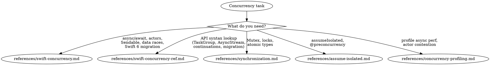

# Concurrency

**You MUST use this skill for ANY concurrency, async/await, threading, or Swift 6 concurrency work.**

## Quick Reference

| Symptom / Task | Reference |
|----------------|-----------|
| async/await patterns, @MainActor, actors | See `references/swift-concurrency.md` |
| Data race errors, Sendable conformance | See `references/swift-concurrency.md` |
| Swift 6 migration, @concurrent attribute | See `references/swift-concurrency.md` |
| Actor definition, reentrancy, global actors | See `references/swift-concurrency-ref.md` |
| Task/TaskGroup/cancellation API | See `references/swift-concurrency-ref.md` |
| AsyncStream, continuations | See `references/swift-concurrency-ref.md` |
| DispatchQueue → actor migration | See `references/swift-concurrency-ref.md` |
| Mutex (iOS 18+), OSAllocatedUnfairLock | See `references/synchronization.md` |
| Atomic types, lock vs actor decision | See `references/synchronization.md` |
| MainActor.assumeIsolated | See `references/assume-isolated.md` |
| @preconcurrency protocol conformances | See `references/assume-isolated.md` |
| Legacy delegate callbacks | See `references/assume-isolated.md` |
| Swift Concurrency Instruments template | See `references/concurrency-profiling.md` |
| Actor contention diagnosis | See `references/concurrency-profiling.md` |
| Thread pool exhaustion | See `references/concurrency-profiling.md` |

## Decision Tree

1. Data races / actor isolation / @MainActor / Sendable / Swift 6 migration? → `references/swift-concurrency.md`
1a. Need specific API syntax (actor definition, TaskGroup, AsyncStream, continuations)? → `references/swift-concurrency-ref.md`
2. Writing async/await code? → `references/swift-concurrency.md`
3. assumeIsolated / @preconcurrency? → `references/assume-isolated.md`
4. Mutex / lock / synchronization? → `references/synchronization.md`
5. Profile async performance / actor contention? → `references/concurrency-profiling.md`
6. Value type / ARC / generic optimization? → See axiom-performance (references/swift-performance.md)
7. borrowing / consuming / ~Copyable? → `/skill axiom-ownership-conventions`
8. Combine / @Published / AnyCancellable / reactive streams? → `/skill axiom-combine-patterns`
9. Want automated concurrency scan? → concurrency-auditor (Agent)

## Conflict Resolution

**concurrency vs ios-performance**: When app freezes or feels slow:
1. **Try concurrency FIRST** — Main thread blocking is the #1 cause of UI freezes. Check for synchronous work on @MainActor before profiling.
2. **Only use ios-performance** if concurrency fixes don't help — Profile after ruling out obvious blocking.

**concurrency vs ios-build**: When seeing Swift 6 concurrency errors:
- **Use concurrency, NOT ios-build** — Concurrency errors are CODE issues, not environment issues.

**concurrency vs ios-data**: When concurrency errors involve Core Data or SwiftData:
- Core Data threading (NSManagedObjectContext thread confinement) → **use ios-data first**
- SwiftData + @MainActor ModelContext → **use concurrency**
- General "background saves losing data" → **use ios-data first**

## Critical Patterns

**Swift Concurrency** (`references/swift-concurrency.md`):
- Progressive journey: single-threaded → async → concurrent → actors
- @concurrent attribute for forced background execution
- Isolated conformances, main actor mode
- 12 copy-paste patterns including delegate value capture, weak self in Tasks
- Comprehensive decision tree for 7 common error messages

**API Reference** (`references/swift-concurrency-ref.md`):
- Actor definition, reentrancy, global actors, nonisolated
- Sendable patterns, @unchecked Sendable, sending parameter
- Task/TaskGroup/cancellation, async let, withDiscardingTaskGroup
- AsyncStream, continuations, buffering policies
- Isolation patterns (#isolation, @preconcurrency, nonisolated(unsafe))
- DispatchQueue/DispatchGroup/completion handler migration

**Synchronization** (`references/synchronization.md`):
- Mutex (iOS 18+), OSAllocatedUnfairLock (iOS 16+), Atomic types
- Lock vs actor decision tree
- Danger patterns: locks across await, semaphores in async context

**Profiling** (`references/concurrency-profiling.md`):
- Swift Concurrency Instruments template
- Diagnosing main thread blocking, actor contention, thread pool exhaustion
- Safe vs unsafe primitives for cooperative pool

## Automated Scanning

**Concurrency audit** → Launch `concurrency-auditor` agent or `/axiom:audit concurrency` (5-phase semantic audit: maps isolation architecture, detects 8 anti-patterns, reasons about missing concurrency patterns, correlates compound risks, scores Swift 6.3 readiness)

## Anti-Rationalization

| Thought | Reality |
|---------|---------|
| "Just add @MainActor and it'll work" | @MainActor has isolation inheritance rules. `references/swift-concurrency.md` covers all patterns. |
| "I'll use nonisolated(unsafe) to silence the warning" | Silencing warnings hides data races. `references/swift-concurrency.md` shows the safe pattern. |
| "It's just one async call" | Even single async calls have cancellation and isolation implications. |
| "I know how actors work" | Actor reentrancy and isolation rules changed in Swift 6.2. |
| "I'll fix the Sendable warnings later" | Sendable violations cause runtime crashes. Fix them now. |
| "Combine is dead, just use async/await" | Combine has no deprecation notice. Rewriting working pipelines wastes time. See `/skill axiom-combine-patterns`. |
| "I'll use @unchecked Sendable to silence this" | You're hiding a data race from the compiler. It will crash in production. |
| "This async function runs on a background thread" | `async` suspends without blocking but resumes on the *same actor*. Use `@concurrent` to force background. |

## Example Invocations

User: "I'm getting 'data race' errors in Swift 6"
→ Read: `references/swift-concurrency.md`

User: "How do I use @MainActor correctly?"
→ Read: `references/swift-concurrency.md`

User: "How do I create a TaskGroup?"
→ Read: `references/swift-concurrency-ref.md`

User: "What's the AsyncStream API?"
→ Read: `references/swift-concurrency-ref.md`

User: "How do I use assumeIsolated?"
→ Read: `references/assume-isolated.md`

User: "Should I use Mutex or actor?"
→ Read: `references/synchronization.md`

User: "My async code is slow, how do I profile it?"
→ Read: `references/concurrency-profiling.md`

User: "My app is slow due to unnecessary copying"
→ See axiom-performance (references/swift-performance.md)

User: "Check my code for Swift 6 concurrency issues"
→ Invoke: `concurrency-auditor` agent
