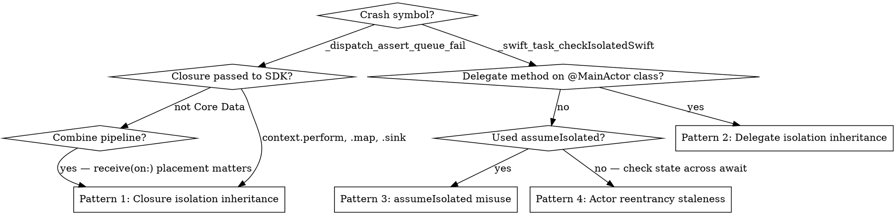

# Runtime Isolation Crashes — Diagnostic

**Use this when a warning-free Swift 6 build crashes in production with `_dispatch_assert_queue_fail` or `_swift_task_checkIsolatedSwift`.**

Strict concurrency catches data races at compile time. It does **not** catch all of them. The compiler injects runtime isolation assertions at actor and GCD boundaries — these fire in production even with zero warnings.

## Crash Signatures

Recognize these in `.ips` files, MetricKit reports, or `xcsym crash` output:

| Symbol | Meaning |
|--------|---------|
| `_dispatch_assert_queue_fail` | Code expected a specific dispatch queue, ran on a different one |
| `_swift_task_checkIsolatedSwift` | Code expected actor isolation (e.g. `@MainActor`), ran outside it |
| `swift_task_checkIsolated` | Same family — runtime isolation guard tripped |

Both originate from the same root cause: **a closure or method inherited actor isolation from its enclosing context, then an SDK called it on a different thread.**

## Why a Warning-Free Build Still Crashes

Static isolation checking cannot see through framework callbacks, delegate dispatch, or GCD bridges. When isolation is ambiguous, the compiler inserts a **runtime check** rather than rejecting the code. If the assumption is wrong at runtime, the process traps immediately.

**Zero warnings means "the type system is happy", not "the runtime invariants hold."**

Swift 5 mode would silently run the offending code on the wrong thread. Swift 6 mode preemptively crashes rather than continuing in an unsafe state.

### Red Flag — `nonisolated(unsafe)` produces a warning-free build that crashes in production

`nonisolated(unsafe)` and blanket `@MainActor` do not fix isolation — they delete the compiler's evidence that something is wrong. The build goes green, then the *runtime* isolation assertion (`_swift_task_checkIsolatedSwift` / `_dispatch_assert_queue_fail`) fires on a real device because the actual thread still violates the isolation the runtime expects.

**Warning-free ≠ runtime-safe.** "Slap `@MainActor` everywhere and `nonisolated(unsafe)` to silence it" trades a compile-time error you can see for a production crash you can't. The compiler was the cheap warning; the runtime trap is the expensive one. Every shortcut in this file moves the failure *later and more expensive*, never away.

`nonisolated(unsafe)` is legitimate only for a value you can prove is never accessed concurrently (e.g. a `let` set once before any task spawns) — never as a way to quiet a real cross-actor access.

## Diagnosis Decision Tree



## Pattern 1 — Closures Inherit Actor Isolation

A closure defined inside an `@MainActor`-isolated context inherits that isolation. The compiler marks it main-actor-isolated and inserts a runtime assertion. If the framework calls it on a background thread, the assertion fires.

### Core Data `context.perform`

```swift
// ❌ CRASHES with _dispatch_assert_queue_fail
@MainActor
class ContactsViewModel {
    func deleteAll(context: NSManagedObjectContext) {
        context.perform {
            // Inherits @MainActor from enclosing method.
            // Core Data runs it on its private background queue. Trap.
            let request = NSFetchRequest<Contact>(entityName: "Contact")
            let contacts = try? context.fetch(request)
            contacts?.forEach { context.delete($0) }
        }
    }
}
```

**Fix — mark the closure `@Sendable`.** A `@Sendable` closure has no implied actor context, so no runtime assertion is injected.

```swift
// ✅ Works — @Sendable opts out of isolation inheritance
context.perform { @Sendable in
    let request = NSFetchRequest<Contact>(entityName: "Contact")
    let contacts = try? context.fetch(request)
    contacts?.forEach { context.delete($0) }
}
```

See axiom-data (skills/core-data.md) for the broader Core Data threading patterns.

### PhotoKit `performChanges`

Same shape as `context.perform`. `performChanges` takes `dispatch_block_t`, which imports as a **non-`Sendable`** closure, so the block inherits `@MainActor` from the enclosing method. PhotoKit runs it on its own serial queue (header: "handlers are invoked on an arbitrary serial queue"). Warning-free build, runtime trap.

```swift
// ❌ CRASHES — compiles with zero diagnostics
@MainActor
final class Deleter {
    var log: [String] = []
    func delete(_ assets: [PHAsset]) async throws {
        try await PHPhotoLibrary.shared().performChanges {
            PHAssetChangeRequest.deleteAssets(assets as NSArray)
            self.log.append("deleted")   // allowed *because* the block inherited @MainActor
        }
    }
}
```

**Fix — `@Sendable` on the block, then mutate isolated state after the `await`.** `@Sendable` makes `self.log.append` inside the block a compile error, which is the point: that mutation never belonged on PhotoKit's queue.

```swift
// ✅ Works
try await PHPhotoLibrary.shared().performChanges { @Sendable in
    PHAssetChangeRequest.deleteAssets(assets as NSArray)
}
log.append("deleted")   // back on @MainActor after the await
```

`PHAsset`, `PHObject`, `PHFetchResult`, `PHChange`, and `PHPhotoLibrary` are all `NS_SWIFT_SENDABLE` as of the iOS 26 SDK, so capturing an asset in the block is **not** a Sendable violation. Re-fetching by `localIdentifier` inside the block is about **staleness** — a `PHAsset` is a snapshot, and one that sat in a queue can target the wrong state — not about isolation. See axiom-media (skills/photo-library.md).

### Combine `.map`, `.filter`, etc.

```swift
// ❌ CRASHES — .map closure inherits @MainActor, publisher emits off-main
@MainActor
class SearchViewModel {
    func subscribe() {
        searchPublisher
            .map { value in            // inherits @MainActor from subscribe()
                value.lowercased()
            }
            .receive(on: DispatchQueue.main)  // too late — .map already crashed
            .sink { self.results = $0 }
            .store(in: &cancellables)
    }
}
```

**Fix A — move `.receive(on:)` before any isolated operator.** The thread hop happens first, so the closure runs on main where its isolation is satisfied.

```swift
// ✅ Works — hop to main before isolated closures
searchPublisher
    .receive(on: DispatchQueue.main)
    .map { value in value.lowercased() }
    .sink { self.results = $0 }
    .store(in: &cancellables)
```

**Fix B — `@Sendable` if the operator should run off-main.**

```swift
// ✅ Works — explicit non-isolated transformation
searchPublisher
    .map { @Sendable value in value.lowercased() }
    .receive(on: DispatchQueue.main)
    .sink { self.results = $0 }
    .store(in: &cancellables)
```

### NotificationCenter `.sink`

```swift
// ❌ CRASHES if notification is posted off-main inside @MainActor class
NotificationCenter.default.publisher(for: .didRefresh)
    .sink { [weak self] _ in
        self?.reload()   // sink inherits @MainActor, fires on poster's thread
    }
    .store(in: &cancellables)
```

**Fix — insert `.receive(on: DispatchQueue.main)` before `.sink`.**

```swift
// ✅ Works
NotificationCenter.default.publisher(for: .didRefresh)
    .receive(on: DispatchQueue.main)
    .sink { [weak self] _ in self?.reload() }
    .store(in: &cancellables)
```

## Pattern 2 — Delegate Methods Inherit Isolation Too

When an entire class is `@MainActor`-isolated, **every method inherits that isolation, including delegate overrides**. If an SDK calls a delegate method from its own internal queue, the runtime check fires.

### NSDocument

```swift
// ❌ CRASHES — AppKit calls autosavesInPlace from a background queue
@MainActor
class MyDocument: NSDocument {
    override class var autosavesInPlace: Bool { true }
}
```

**Fix — mark the specific method `nonisolated`.** Leave the rest of the class on the main actor.

```swift
// ✅ Works
override nonisolated class var autosavesInPlace: Bool { true }
```

### CLLocationManagerDelegate

```swift
// ❌ CRASHES — CLLocationManager delivers updates on its own queue
@MainActor
class LocationManager: NSObject, CLLocationManagerDelegate {
    func locationManager(
        _ manager: CLLocationManager,
        didUpdateLocations locations: [CLLocation]
    ) {
        updateMap(with: locations)   // inherits @MainActor, crashes
    }
}
```

**Fix — `nonisolated` on the delegate method, then `Task { @MainActor in }` for UI work.**

```swift
// ✅ Works
nonisolated func locationManager(
    _ manager: CLLocationManager,
    didUpdateLocations locations: [CLLocation]
) {
    Task { @MainActor in
        self.updateMap(with: locations)
    }
}
```

### Getting off the main actor — `Task { @concurrent in }`, not `Task.detached`

When the goal is the opposite direction — leave `@MainActor` to do real background work — the reflex is `Task.detached`. It works, but it drops everything the originating task carried: **no priority inheritance and no task-local values**, which silently severs trace IDs, logging metadata `MDC`, and any other `@TaskLocal` context. Crashes vanish; observability quietly does too.

`Task { @concurrent in }` (Swift 6.2+) is the correct tool: it leaves the actor and runs on the concurrent pool **while preserving the originating priority and task-locals**.

```swift
// ❌ Off-main, but task-locals (trace ID, log context) are gone
Task.detached(priority: .utility) {
    await indexDocuments()   // logs here have no request context
}

// ✅ Off-main AND keeps priority + @TaskLocal values
Task { @concurrent in
    await indexDocuments()   // trace ID still flows through
}
```

Reach for `Task.detached` only when you deliberately want a clean slate (no inherited cancellation, priority, or task-locals). Defaulting to it for "just run this in the background" is the trap.

### PHPhotoLibraryChangeObserver

The protocol is **nonisolated** — the header states the callback "is invoked on an arbitrary serial queue", and it carries no `NS_SWIFT_UI_ACTOR` and no apinotes actor entry. Conforming a `@MainActor` class is therefore a Swift 6 **compile error**, not a silent trap:

```
error: conformance of 'VM' to protocol 'PHPhotoLibraryChangeObserver' crosses into
       main actor-isolated code and can cause data races [#ConformanceIsolation]
note: main actor-isolated instance method 'photoLibraryDidChange'
      cannot satisfy nonisolated requirement
```

**The trap is the fix-it menu.** That error offers three remedies. Two of them build clean and hand you `_swift_task_checkIsolatedSwift` / `_dispatch_assert_queue_fail` on device.

| Fix-it | Builds | Runtime |
|--------|--------|---------|
| `nonisolated` on the method | clean | ✅ correct |
| `@preconcurrency` on the conformance | clean | ❌ traps on PhotoKit's queue |
| Isolated conformance (`@MainActor` on the conformance) | clean | ❌ traps on PhotoKit's queue |

`PHPhotoLibraryChangeObserver` is `@objc`, so the compiler cannot see PhotoKit's call site and cannot catch either mistake — see "The `@objc` exception" under Pattern 3.

```swift
// ✅ Works — nonisolated matches the protocol's real signature, then hop
@MainActor
final class GalleryModel: NSObject, PHPhotoLibraryChangeObserver {
    nonisolated func photoLibraryDidChange(_ changeInstance: PHChange) {
        Task { @MainActor in self.apply(changeInstance) }
    }
}
```

Marking the method `nonisolated` is **not** a workaround against the SDK — it matches the SDK's declaration. Developers who assume the protocol is `@MainActor` reach for `@preconcurrency` instead and ship the crash.

### Other delegates with the same trap

- `PHPhotoLibraryPersistentChangesObserver` `OS27` — identical "arbitrary serial queue" contract and identical fix-it trap as `PHPhotoLibraryChangeObserver` above (iOS/macOS/tvOS/visionOS 27)
- `AVAudioPlayerDelegate` — audio completion callbacks
- `WKNavigationDelegate` — navigation callbacks may arrive off-main
- `URLSessionDelegate` — completion handlers run on session's delegate queue
- Any third-party SDK delegate that does not document main-thread delivery

**General rule** If a delegate protocol does not document main-thread delivery, treat its methods as background-thread by default and mark them `nonisolated`.

## Pattern 3 — `MainActor.assumeIsolated` Misuse

`MainActor.assumeIsolated` is a runtime assertion, not a thread hop. **It crashes immediately if the code is not actually on the main actor.**

Using it as a synchronous alternative to `await MainActor.run` in arbitrary contexts will crash whenever the assumption fails.

```swift
// ❌ DANGEROUS — assumeIsolated used in a context that might not be on main
func handleCallback() {
    MainActor.assumeIsolated {   // crashes if called off-main
        updateUI()
    }
}

// ✅ Use only when you KNOW you're on main (legacy delegate documented to deliver on main)
nonisolated func legacyCallback() {
    // SDK guarantees main-thread delivery
    MainActor.assumeIsolated {
        updateUI()
    }
}

// ✅ Or use proper async hop when uncertain
func handleCallback() async {
    await MainActor.run { updateUI() }
}
```

See `skills/assume-isolated.md` for the full assumeIsolated decision matrix.

### Prefer compiler-checked escape hatches over `assumeIsolated`

`assumeIsolated` is a *runtime* assertion — it's the right tool only when you can prove the code is already on the actor (a legacy delegate documented to deliver on main). For everything else, Swift 6.2 has escape hatches the compiler verifies, so the failure surfaces at build time instead of as a device crash. Try these first:

| Situation | Compiler-checked tool | What it does |
|-----------|----------------------|--------------|
| Protocol witness can't satisfy a nonisolated requirement from a `@MainActor` type — **Swift-native protocol only** | Isolated conformance: `extension T: @MainActor P` (SE-0470) | Pins the conformance to the main actor. The compiler sees the call site and rejects nonisolated use (`#IsolatedConformances`), so misuse is a build error, not a trap |
| Conforming to an old, un-annotated protocol whose callbacks are **documented main-thread** | `@preconcurrency` on the conformance | Suppresses the diagnostic without `unsafe`. Apple's own note is blunt: "turn data races into runtime errors" — it defers the failure, it does not prevent it |
| `@Sendable` closure / API can't capture non-Sendable `self` once | `sending` parameter (SE-0430) | Transfers the value across the boundary one time; compiler proves the caller stops using it |
| Async helper needs a non-Sendable delegate to stay on the caller's actor | `isolated (any Actor)? = #isolation` (SE-0420) | Inherits the caller's isolation so the value never crosses a boundary |

```swift
// Witness case: @MainActor type vs a nonisolated protocol requirement.
// ❌ Reflex: mark the witness nonisolated, then assumeIsolated inside → crashes if off-main
// ✅ Isolated conformance — compiler-verified, no runtime trap
@MainActor final class Renderer: @MainActor Drawable {
    func draw() { /* main-actor work, no nonisolated, no assumeIsolated */ }
}

// Capture case: hand a non-Sendable value to a @Sendable boundary exactly once.
func enqueue(_ job: sending Job) {           // SE-0430
    Task { @concurrent in await job.run() }  // compiler proves no shared access
}
```

### The `@objc` exception — isolated conformance stops being compiler-checked

Both hatches above rely on the compiler seeing the call site. For an **`@objc` protocol invoked by the Objective-C runtime** (SDK delegates and observers — `PHPhotoLibraryChangeObserver`, `CLLocationManagerDelegate`, and friends) it cannot. The conformance compiles clean and the framework calls the witness from its own queue anyway, so an isolated conformance converts a build error into `_swift_task_checkIsolatedSwift` / `_dispatch_assert_queue_fail` on device.

| Protocol kind | Isolated conformance / `@preconcurrency` | Correct tool |
|---------------|------------------------------------------|--------------|
| Swift-native, you control the call sites | Compiler-checked — misuse is a build error | Either hatch above |
| `@objc`, dispatched by an SDK off-main | Builds clean, traps at runtime | `nonisolated` witness + `Task { @MainActor in }` |

See Pattern 2 (`PHPhotoLibraryChangeObserver`) for the worked example.

## Pattern 4 — Actor Reentrancy State Staleness

Not a hard crash, but a precondition failure or silent corruption. After an `await` inside an actor method, **the actor unlocks and other tasks can mutate state**. State captured before suspension may be stale after it.

```swift
// ❌ Bug — `cached` may be stale after the await
actor ImageCache {
    var images: [URL: UIImage] = [:]

    func image(for url: URL) async -> UIImage? {
        let cached = images[url]                    // read before await
        if cached == nil {
            let downloaded = await download(url)    // ← reentrancy point
            images[url] = downloaded                 // stale `cached` no longer relevant
            return downloaded
        }
        return cached
    }
}
```

**Fix — re-check state after every `await`, or restructure to avoid the gap.**

```swift
// ✅ Works — re-check after suspension
actor ImageCache {
    var images: [URL: UIImage] = [:]

    func image(for url: URL) async -> UIImage? {
        if let cached = images[url] { return cached }
        let downloaded = await download(url)
        // Another task may have populated images[url] during await — prefer existing
        if let existing = images[url] { return existing }
        images[url] = downloaded
        return downloaded
    }
}
```

## Testing Implication

These crashes only surface with **real SDK callbacks and background-thread publishers**. Unit tests that drive code paths synchronously on the main thread will not trigger the runtime assertions.

**Add to your test plan**

- Drive Core Data through `context.perform` from background-spawned tasks
- Push notifications from `DispatchQueue.global().async { NotificationCenter.default.post(...) }`
- Exercise location/audio/network delegates on real devices, not just mocks
- Validate Combine pipelines by sending values on non-main schedulers
- Run integration tests on iOS 17.4+ where Swift 6 runtime assertions are strictest

See axiom-testing (skills/swift-testing.md) for testing async code that exercises real SDK callbacks.

## Anti-Rationalizations

| Thought | Reality |
|---------|---------|
| "My build is warning-free, so Swift 6 isolation is correct" | Static checking can't see through SDK callbacks. Runtime assertions fire anyway. |
| "Slap `@MainActor` everywhere + `nonisolated(unsafe)` to silence it and ship" | That deletes the compiler's evidence, not the bug. Warning-free build crashes in production at `_swift_task_checkIsolatedSwift`. Warning-free ≠ runtime-safe. |
| "Just use `Task.detached` to get off the main actor" | `Task.detached` drops priority and all `@TaskLocal` values — trace/log context silently lost. Use `Task { @concurrent in }` (Swift 6.2+). |
| "`assumeIsolated` is my escape hatch for isolation errors" | It's a crashing assertion, valid only when provably on-actor. Prefer compiler-checked `extension T: @MainActor P`, `sending`, or `#isolation`. |
| "I'll wrap it in `MainActor.assumeIsolated` to silence the warning" | `assumeIsolated` is a runtime trap, not a silencer. It crashes when the assumption is wrong. |
| "The compiler suggested `@preconcurrency`, so it's the fix" | Fix-its resolve the *diagnostic*, not the isolation. For a nonisolated protocol requirement, `@preconcurrency` and isolated conformance both build clean and trap at runtime. Only `nonisolated` on the method is correct. |
| "Adding `@Sendable` is the same as `@unchecked Sendable`" | `@Sendable` on a closure breaks isolation inheritance. `@unchecked Sendable` on a type hides data races. |
| "PhotoKit types aren't `Sendable`, so I'll box them in `@unchecked Sendable`" | They are, as of the iOS 26 SDK. The compiler won't stop you — a redundant `extension` conformance is a *warning*, and a wrapper struct compiles silently — so this lands as house style and suppresses real diagnostics later. Check the SDK header before assuming an SDK type lacks the annotation; these landed after most training data. |
| "I'll just remove `@MainActor` from the class" | Now you have data races on UI state. The class-level isolation is correct — fix the specific method/closure. |
| "I'll use `DispatchQueue.main.async` inside the delegate method" | Works, but `nonisolated` + `Task { @MainActor in }` is the Swift 6 idiom and integrates with structured concurrency. |
| "`.receive(on:)` position doesn't matter — it's still in the pipeline" | Operators run in order. Any isolated closure before `.receive(on:)` runs on the upstream thread. |
| "Tests pass, so it works" | Mocked tests don't exercise SDK threading. Real-device integration tests do. |

## Cross-References

- `skills/swift-concurrency.md` — Core Swift 6 concurrency patterns (isolation rules, `@concurrent`)
- `skills/assume-isolated.md` — Full `assumeIsolated` patterns and when it's safe
- `skills/swift-concurrency-ref.md` — `nonisolated`, `@Sendable`, isolation syntax reference
- axiom-data (skills/core-data.md) — Core Data threading model and `context.perform` patterns
- axiom-uikit (skills/combine-patterns.md) — Combine schedulers and `.receive(on:)` placement
- crash-analyzer (Agent) — Recognizes these crash signatures via pattern tags

## Resources

**WWDC**: 2024-10169, 2025-268

**Docs**: /swift/sendable, /swift/mainactor, /coredata/nsmanagedobjectcontext/perform

**Skills**: assume-isolated, swift-concurrency, swift-concurrency-ref

**External**: Khoa Pham — "How to avoid Swift 6 concurrency crashes" (onmyway133.com)
