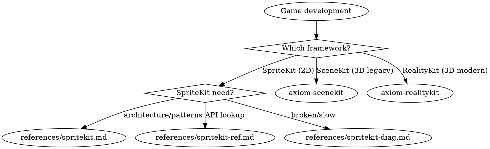

# Games

**You MUST use this skill for ANY game development, SpriteKit, SceneKit, RealityKit, or interactive simulation work.**

## Quick Reference

| Symptom / Task | Reference |
|----------------|-----------|
| Building a SpriteKit game | See `references/spritekit.md` |
| SpriteKit API lookup | See `references/spritekit-ref.md` |
| Physics contacts not firing | See `references/spritekit-diag.md` |
| Frame rate drops (SpriteKit) | See `references/spritekit-diag.md` |
| Touches not registering | See `references/spritekit-diag.md` |
| Memory spikes in gameplay | See `references/spritekit-diag.md` |
| Coordinate confusion | See `references/spritekit-diag.md` |
| Scene transition crashes | See `references/spritekit-diag.md` |
| Objects tunneling through walls | See `references/spritekit-diag.md` |
| SpriteKit node/action reference | See `references/spritekit-ref.md` |
| SceneKit maintenance/migration | `/skill axiom-scenekit` |
| SceneKit API / migration mapping | `/skill axiom-scenekit-ref` |
| RealityKit (3D, ECS, AR) | `/skill axiom-realitykit` |
| RealityKit API reference | `/skill axiom-realitykit-ref` |
| RealityKit diagnostics | `/skill axiom-realitykit-diag` |

## External Routes

These topics are part of the broader games/3D domain but live in separate skill suites:

**SceneKit (3D — soft-deprecated iOS 26):**
- Maintenance and migration planning → `/skill axiom-scenekit`
- API reference and migration mapping → `/skill axiom-scenekit-ref`

**RealityKit (3D — modern):**
- ECS architecture, AR, SwiftUI integration → `/skill axiom-realitykit`
- API reference → `/skill axiom-realitykit-ref`
- Troubleshooting → `/skill axiom-realitykit-diag`

## Decision Tree

1. Building/designing a 2D SpriteKit game? → `references/spritekit.md`
2. How to use a specific SpriteKit API? → `references/spritekit-ref.md`
3. SpriteKit broken or performing badly? → `references/spritekit-diag.md`
4. Maintaining existing SceneKit code? → `/skill axiom-scenekit`
5. SceneKit API reference or migration mapping? → `/skill axiom-scenekit-ref`
6. Building new 3D game or experience? → `/skill axiom-realitykit`
7. How to use a specific RealityKit API? → `/skill axiom-realitykit-ref`
8. RealityKit entity not visible, gestures broken, performance? → `/skill axiom-realitykit-diag`
9. Migrating SceneKit to RealityKit? → `/skill axiom-scenekit` (migration tree) + `/skill axiom-scenekit-ref` (mapping table)
10. Building AR game? → `/skill axiom-realitykit`
11. Want automated SpriteKit code scan? → `spritekit-auditor` agent

## Automated Scanning

**SpriteKit audit** → Launch `spritekit-auditor` agent or `/axiom:audit spritekit`
- Physics bitmask issues
- Draw call waste (SKShapeNode in gameplay)
- Node accumulation (missing cleanup)
- Action memory leaks (strong self)
- Coordinate confusion
- Touch handling issues
- Missing object pooling
- Missing debug overlays

## Critical Patterns

**SpriteKit** (`references/spritekit.md`):
- PhysicsCategory struct with explicit bitmasks (default `0xFFFFFFFF` causes phantom collisions)
- Camera node pattern for viewport + HUD separation
- SKShapeNode pre-render-to-texture conversion
- `[weak self]` in all `SKAction.run` closures
- Delta time with spiral-of-death clamping

**SpriteKit diagnostics** (`references/spritekit-diag.md`):
- 5-step bitmask checklist (2 min vs 30-120 min guessing)
- Debug overlays as mandatory first diagnostic step
- Tunneling prevention flowchart
- Memory growth diagnosis via `showsNodeCount` trending

## Anti-Rationalization

| Thought | Reality |
|---------|---------|
| "SpriteKit is simple, I don't need a skill" | Physics bitmasks default to 0xFFFFFFFF and cause phantom collisions. The bitmask checklist catches this in 2 min. |
| "I'll just use SKShapeNode, it's quick" | Each SKShapeNode is a separate draw call. 50 of them = 50 draw calls. spritekit.md has the pre-render-to-texture pattern. |
| "I can figure out the coordinate system" | SpriteKit uses bottom-left origin (opposite of UIKit). Anchor points add another layer. spritekit-diag.md Symptom 6 resolves in 5 min. |
| "Physics is straightforward" | Three different bitmask properties, modification rules inside callbacks, and tunneling edge cases. spritekit.md Section 3 covers all gotchas. |
| "The performance is fine on my device" | Performance varies dramatically across devices. spritekit.md Section 6 has the debug overlay checklist. |
| "SceneKit is fine for our new project" | SceneKit is soft-deprecated iOS 26. No new features, only security patches. axiom-scenekit has the migration decision tree. |
| "ECS is overkill for a simple 3D app" | You're already using ECS — Entity + ModelComponent. axiom-realitykit shows how to scale from simple to complex. |
| "I don't need collision shapes for taps" | RealityKit gestures require CollisionComponent. axiom-realitykit-diag diagnoses this in 2 min vs 30 min guessing. |

## Example Invocations

User: "I'm building a SpriteKit game"
→ See `references/spritekit.md`

User: "My physics contacts aren't firing"
→ See `references/spritekit-diag.md`

User: "How do I create a physics body from a texture?"
→ See `references/spritekit-ref.md`

User: "Frame rate is dropping in my game"
→ See `references/spritekit-diag.md`

User: "What action types are available?"
→ See `references/spritekit-ref.md`

User: "Objects pass through walls"
→ See `references/spritekit-diag.md`

User: "I need to build a 3D game"
→ Invoke: `/skill axiom-realitykit`

User: "I'm migrating from SceneKit to RealityKit"
→ Invoke: `/skill axiom-scenekit` + `/skill axiom-scenekit-ref`

User: "Can you scan my SpriteKit code for common issues?"
→ Launch `spritekit-auditor` agent
