# iOS System Integration

**You MUST use this skill for ANY iOS system integration including Siri, Shortcuts, widgets, in-app purchases, background tasks, push notifications, and more.**

## Quick Reference

| Symptom / Task | Reference |
|----------------|-----------|
| Siri, App Intents, entity queries | See `references/app-intents-ref.md` |
| App Shortcuts, phrases, Spotlight | See `references/app-shortcuts-ref.md` |
| App discoverability strategy | See `references/app-discoverability.md` |
| Core Spotlight indexing | See `references/core-spotlight-ref.md` |
| Widgets, Live Activities, Control Center | See `references/extensions-widgets.md` |
| Widget/Live Activity API reference | See `references/extensions-widgets-ref.md` |
| In-app purchases, subscriptions | See `references/in-app-purchases.md` |
| StoreKit 2 API reference | See `references/storekit-ref.md` |
| Calendar events, reminders (EventKit) | See `references/eventkit.md` |
| EventKit API reference | See `references/eventkit-ref.md` |
| Contacts, contact picker | See `references/contacts.md` |
| Contacts API reference | See `references/contacts-ref.md` |
| Localization, String Catalogs | See `references/localization.md` |
| Privacy manifests, permissions UX | See `references/privacy-ux.md` |
| AlarmKit (iOS 26+) | See `references/alarmkit-ref.md` |
| Timer patterns, scheduling | See `references/timer-patterns.md` |
| Timer API reference | See `references/timer-patterns-ref.md` |
| Background tasks, BGTaskScheduler | See `references/background-processing.md` |
| Background task debugging | See `references/background-processing-diag.md` |
| Background task API reference | See `references/background-processing-ref.md` |
| Push notifications, APNs | See `references/push-notifications.md` |
| Push notification debugging | See `references/push-notifications-diag.md` |
| Push notification API reference | See `references/push-notifications-ref.md` |

## Decision Tree

```dot
digraph integration {
    start [label="Integration task" shape=ellipse];
    what [label="Which system feature?" shape=diamond];

    start -> what;
    what -> "references/app-intents-ref.md" [label="Siri / App Intents"];
    what -> "references/app-shortcuts-ref.md" [label="Shortcuts / phrases"];
    what -> "references/app-discoverability.md" [label="discoverability\nstrategy"];
    what -> "references/extensions-widgets.md" [label="widgets / Live Activities\n/ Control Center"];
    what -> "references/in-app-purchases.md" [label="IAP / subscriptions"];
    what -> "references/eventkit.md" [label="calendar / reminders"];
    what -> "references/contacts.md" [label="contacts"];
    what -> "references/localization.md" [label="localization"];
    what -> "references/privacy-ux.md" [label="privacy / permissions"];
    what -> "references/alarmkit-ref.md" [label="alarms (iOS 26+)"];
    what -> "references/timer-patterns.md" [label="timers"];
    what -> "references/background-processing.md" [label="background tasks"];
    what -> "references/push-notifications.md" [label="push notifications"];
}
```

1. Siri / App Intents / entity queries? → `references/app-intents-ref.md`
2. App Shortcuts / phrases? → `references/app-shortcuts-ref.md`
3. App discoverability / Spotlight strategy? → `references/app-discoverability.md`, `references/core-spotlight-ref.md`
4. Widgets / Live Activities / Control Center? → `references/extensions-widgets.md`, `references/extensions-widgets-ref.md`
5. In-app purchases / StoreKit? → `references/in-app-purchases.md`, `references/storekit-ref.md`
6. Calendar / reminders / EventKit? → `references/eventkit.md`, `references/eventkit-ref.md`
7. Contacts / contact picker? → `references/contacts.md`, `references/contacts-ref.md`
8. Localization? → `references/localization.md`
9. Privacy / permissions? → `references/privacy-ux.md`
10. Alarms (iOS 26+)? → `references/alarmkit-ref.md`
11. Timers? → `references/timer-patterns.md`, `references/timer-patterns-ref.md`
12. Background tasks / BGTaskScheduler? → `references/background-processing.md`, `references/background-processing-diag.md`, `references/background-processing-ref.md`
13. Push notifications? → `references/push-notifications.md`, `references/push-notifications-diag.md`, `references/push-notifications-ref.md`
14. Want IAP audit? → Launch `iap-auditor` agent
15. Want full IAP implementation? → Launch `iap-implementation` agent
16. Camera / photos / audio / haptics / ShazamKit? → **Use `axiom-media` instead**

## Cross-Domain Routing

**Widget + data sync** (widget not showing updated data):
- Widget timeline not refreshing → **stay here** (extensions-widgets)
- SwiftData/Core Data not shared with extension → **also invoke axiom-data** (App Groups)

**Live Activity + push notification**:
- ActivityKit push token setup → **stay here** (extensions-widgets)
- Push delivery failures → **also invoke axiom-networking** (networking-diag)
- Entitlements/certificates → **also invoke axiom-build**

**Push + background processing** (silent push not triggering background work):
- Push payload and delivery → **stay here** (push-notifications-diag)
- BGTaskScheduler execution → **stay here** (background-processing)

**Calendar/Contacts + data sync**:
- EventKit/Contacts data issues → **stay here**
- Shared data with widget via App Groups → **also invoke axiom-data**

## Conflict Resolution

**integration vs axiom-build**: When system features fail with entitlement/certificate errors:
- Use **axiom-build** for signing and provisioning issues
- Use **integration** for API usage and permission patterns

**integration vs axiom-data**: When widgets or extensions can't access shared data:
- App Groups and shared containers → **axiom-data**
- Widget timeline, Live Activity updates → **integration**

**integration vs axiom-media**: When media features overlap with system features:
- Camera/photo/audio/haptics code → **axiom-media**
- Privacy manifests for camera/microphone → **stay here** (privacy-ux)
- Background audio mode → **stay here** (background-processing)

## Anti-Rationalization

| Thought | Reality |
|---------|---------|
| "App Intents are just a protocol conformance" | App Intents have parameter validation, entity queries, and background execution. |
| "Widgets are simple, I've done them before" | Widgets have timeline, interactivity, and Live Activity patterns that evolve yearly. |
| "Localization is just String Catalogs" | Xcode 26 has type-safe localization, generated symbols, and #bundle macro. |
| "Push notifications are just a payload and a token" | Token lifecycle, Focus levels, service extension gotchas cause 80% of push bugs. |
| "Just request full Calendar access" | Most apps only need to add events — EventKitUI does that with zero permissions. |
| "I'll use CNContactStore directly for picking" | CNContactPickerViewController needs no authorization and shows all contacts. |

## Example Invocations

User: "How do I add Siri support?"
→ Read: `references/app-intents-ref.md`

User: "My widget isn't updating"
→ Read: `references/extensions-widgets.md`

User: "Implement in-app purchases with StoreKit 2"
→ Read: `references/in-app-purchases.md`

User: "How do I implement push notifications?"
→ Read: `references/push-notifications.md`

User: "Push notifications work in dev but not production"
→ Read: `references/push-notifications-diag.md`

User: "My background task never runs"
→ Read: `references/background-processing-diag.md`

User: "How do I add an event to the user's calendar?"
→ Read: `references/eventkit.md`

User: "How do I let users pick a contact?"
→ Read: `references/contacts.md`

User: "Review my in-app purchase implementation"
→ Launch: `iap-auditor` agent
