# iOS UI Router

**You MUST use this skill for ANY iOS UI work including SwiftUI, UIKit, layout, navigation, animations, and design.**

## When to Use

Use this router when working with:
- SwiftUI views, state, bindings
- UIKit views and constraints
- Layout issues (Auto Layout, SwiftUI layout)
- Navigation (NavigationStack, deep linking)
- Animations and transitions
- Liquid Glass design (iOS 26+)
- Apple Human Interface Guidelines
- UI architecture and patterns
- Accessibility UI issues

## Conflict Resolution

**ios-ui vs ios-performance**: When UI is slow (e.g., "SwiftUI List slow"):
1. **Try ios-ui FIRST** — Domain-specific fixes (LazyVStack, view identity, @State optimization) often solve UI performance in 5 minutes
2. **Only use ios-performance** if domain fixes don't help — Profiling takes longer and may confirm what domain knowledge already knows

**Rationale**: Jumping to Instruments wastes time when the fix is a known SwiftUI pattern. Profile AFTER trying domain fixes, not before.

## Routing Logic

### SwiftUI Issues

**View not updating** → `/skill axiom-swiftui-debugging`
**Navigation issues** → `/skill axiom-swiftui-nav`
**Performance/lag** → `/skill axiom-swiftui-performance`
**Layout problems** → `/skill axiom-swiftui-layout`
**Stacks/grids/outlines** → `/skill axiom-swiftui-containers-ref`
**Animation issues** → `/skill axiom-swiftui-animation-ref`
**Gesture conflicts** → `/skill axiom-swiftui-gestures`
**Drag/drop, copy/paste, sharing** → `/skill axiom-transferable-ref`
**Architecture/testability** → `/skill axiom-swiftui-architecture`
**App-level composition** → `/skill axiom-app-composition`
**Search implementation** → `/skill axiom-swiftui-search-ref`
**iOS 26 features** → `/skill axiom-swiftui-26-ref`
**UIKit bridging (Representable, HostingController)** → `/skill axiom-uikit-bridging`

### UIKit Issues

**Auto Layout conflicts** → `/skill axiom-auto-layout-debugging`
**Animation timing issues** → `/skill axiom-uikit-animation-debugging`
**SwiftUI embedding (HostingController, HostingConfiguration)** → `/skill axiom-uikit-bridging`

### Design & Guidelines

**Liquid Glass adoption** → `/skill axiom-liquid-glass`
**SF Symbols (effects, rendering, custom)** → `/skill axiom-sf-symbols`
**Design decisions** → `/skill axiom-hig`
**Typography** → `/skill axiom-typography-ref`
**TextKit/rich text** → `/skill axiom-textkit-ref`

### tvOS

**Focus Engine, remote input, TVUIKit, text input** → `/skill axiom-tvos`

### Accessibility

**VoiceOver, Dynamic Type** → `/skill axiom-accessibility-diag`

### Testing

**UI test flakiness** → `/skill axiom-ui-testing`

### Automated Scanning

**Architecture audit** → Launch `swiftui-architecture-auditor` agent (separation of concerns, logic in views, testability)
**Performance scan** → Launch `swiftui-performance-analyzer` agent or `/axiom:audit swiftui-performance` (expensive view body ops, unnecessary updates)
**Navigation audit** → Launch `swiftui-nav-auditor` agent or `/axiom:audit swiftui-nav` (deep link gaps, state restoration, wrong containers)
**Liquid Glass scan** → Launch `liquid-glass-auditor` agent or `/axiom:audit liquid-glass` (adoption opportunities, toolbar improvements)
**TextKit scan** → Launch `textkit-auditor` agent or `/axiom:audit textkit` (TextKit 1 fallbacks, deprecated glyph APIs, Writing Tools)

## Decision Tree

```dot
digraph ios_ui {
    start [label="UI issue" shape=ellipse];
    is_tvos [label="tvOS?" shape=diamond];
    is_swiftui [label="SwiftUI?" shape=diamond];
    is_uikit [label="UIKit?" shape=diamond];
    is_design [label="Design/guidelines?" shape=diamond];

    start -> is_tvos;
    is_tvos -> "axiom-tvos" [label="focus, remote, TVUIKit, text input, storage"];
    is_tvos -> is_swiftui [label="no"];
    is_swiftui -> swiftui_type [label="yes"];
    is_swiftui -> is_uikit [label="no"];
    is_uikit -> uikit_type [label="yes"];
    is_uikit -> is_design [label="no"];
    is_design -> design_type [label="yes"];
    is_design -> "accessibility-diag" [label="accessibility"];

    swiftui_type [label="What's wrong?" shape=diamond];
    swiftui_type -> "swiftui-debugging" [label="view not updating"];
    swiftui_type -> "swiftui-nav" [label="navigation"];
    swiftui_type -> "swiftui-performance" [label="slow/lag"];
    swiftui_type -> "swiftui-layout" [label="adaptive layout"];
    swiftui_type -> "swiftui-containers-ref" [label="stacks/grids/outlines"];
    swiftui_type -> "swiftui-architecture" [label="feature architecture"];
    swiftui_type -> "app-composition" [label="app-level (root, auth, scenes)"];
    swiftui_type -> "swiftui-animation-ref" [label="animations"];
    swiftui_type -> "swiftui-gestures" [label="gestures"];
    swiftui_type -> "transferable-ref" [label="drag/drop, sharing, copy/paste"];
    swiftui_type -> "swiftui-search-ref" [label="search"];
    swiftui_type -> "swiftui-26-ref" [label="iOS 26 features"];
    swiftui_type -> "uikit-bridging" [label="UIKit interop"];

    uikit_type [label="UIKit issue?" shape=diamond];
    uikit_type -> "auto-layout-debugging" [label="Auto Layout"];
    uikit_type -> "uikit-animation-debugging" [label="animations"];
    uikit_type -> "uikit-bridging" [label="SwiftUI embedding"];

    design_type [label="Design topic?" shape=diamond];
    design_type -> "liquid-glass" [label="Liquid Glass"];
    design_type -> "sf-symbols" [label="SF Symbols"];
    design_type -> "hig" [label="HIG compliance"];
    design_type -> "typography-ref" [label="typography"];
    design_type -> "textkit-ref" [label="TextKit/rich text"];
}
```

**Automated scanning agents:**
- Want architecture audit (separation of concerns, testability)? → swiftui-architecture-auditor (Agent)
- Want SwiftUI performance scan (view body ops, unnecessary updates)? → swiftui-performance-analyzer (Agent)
- Want navigation audit (deep links, state restoration)? → swiftui-nav-auditor (Agent)
- Want Liquid Glass adoption scan? → liquid-glass-auditor (Agent)
- Want TextKit scan (Writing Tools, deprecated APIs)? → textkit-auditor (Agent)

## Anti-Rationalization

| Thought | Reality |
|---------|---------|
| "Simple SwiftUI layout, no need for the layout skill" | SwiftUI layout has 12 gotchas. swiftui-layout covers all of them. |
| "I know how NavigationStack works" | Navigation has state restoration, deep linking, and identity traps. swiftui-nav prevents 2-hour debugging. |
| "It's just a view not updating, I'll debug it" | View update failures have 4 root causes. swiftui-debugging diagnoses in 5 min. |
| "I'll just add .animation() and fix later" | Animation issues compound. swiftui-animation-ref has the correct patterns. |
| "This UI is simple, no architecture needed" | Even small features benefit from separation. swiftui-architecture prevents refactoring debt. |
| "I know how .searchable works" | Search has 6 gotchas (navigation container, isSearching level, suggestion completion). swiftui-search-ref covers all of them. |
| "I know SF Symbols, it's just Image(systemName:)" | 4 rendering modes, 12+ effects, 3 Draw playback modes, custom symbol authoring. sf-symbols has decision trees for all of them. |
| "Drag and drop is just .draggable and .dropDestination" | UTType declarations, representation ordering, file lifecycle, cross-app transfer gotchas. transferable-ref covers all of them. |
| "I'll just wrap this UIView real quick" | UIViewRepresentable has lifecycle, coordinator, sizing, and memory gotchas. uikit-bridging prevents 1-2 hour debugging sessions. |
| "tvOS is just iOS on a TV" | tvOS has no persistent storage, no WebView, a dual focus system, and two remote generations. axiom-tvos covers all the traps. |

## Example Invocations

User: "My SwiftUI view isn't updating when I change the model"
→ Invoke: `/skill axiom-swiftui-debugging`

User: "How do I implement Liquid Glass in my toolbar?"
→ Invoke: `/skill axiom-liquid-glass`

User: "NavigationStack is popping unexpectedly"
→ Invoke: `/skill axiom-swiftui-nav`

User: "Should I use MVVM for this SwiftUI app?"
→ Invoke: `/skill axiom-swiftui-architecture`

User: "How do I switch between login and main screens?"
→ Invoke: `/skill axiom-app-composition`

User: "Where should auth state live in my app?"
→ Invoke: `/skill axiom-app-composition`

User: "How do I create a grid layout with LazyVGrid?"
→ Invoke: `/skill axiom-swiftui-containers-ref`

User: "What's the difference between VStack and LazyVStack?"
→ Invoke: `/skill axiom-swiftui-containers-ref`

User: "How do I display hierarchical data with OutlineGroup?"
→ Invoke: `/skill axiom-swiftui-containers-ref`

User: "How do I add search to my SwiftUI list?"
→ Invoke: `/skill axiom-swiftui-search-ref`

User: "My search suggestions aren't working"
→ Invoke: `/skill axiom-swiftui-search-ref`

User: "How do I animate an SF Symbol when tapped?"
→ Invoke: `/skill axiom-sf-symbols`

User: "My SF Symbol Draw animation isn't working on my custom symbol"
→ Invoke: `/skill axiom-sf-symbols`

User: "Which rendering mode should I use for my toolbar icons?"
→ Invoke: `/skill axiom-sf-symbols`

User: "How do I make my model draggable in SwiftUI?"
→ Invoke: `/skill axiom-transferable-ref`

User: "How do I add ShareLink with a custom preview?"
→ Invoke: `/skill axiom-transferable-ref`

User: "How do I wrap a UIKit view in SwiftUI?"
→ Invoke: `/skill axiom-uikit-bridging`

User: "How do I embed SwiftUI in my UIKit app?"
→ Invoke: `/skill axiom-uikit-bridging`

User: "My UIViewRepresentable isn't updating correctly"
→ Invoke: `/skill axiom-uikit-bridging`

User: "How do I use UIHostingConfiguration for collection view cells?"
→ Invoke: `/skill axiom-uikit-bridging`

User: "I'm building a tvOS app and focus navigation isn't working"
→ Invoke: `/skill axiom-tvos`

User: "How do I handle text input on tvOS?"
→ Invoke: `/skill axiom-tvos`

User: "Check my SwiftUI architecture for separation of concerns"
→ Invoke: `swiftui-architecture-auditor` agent

User: "Scan my SwiftUI views for performance issues"
→ Invoke: `swiftui-performance-analyzer` agent

User: "Audit my navigation for deep link gaps"
→ Invoke: `swiftui-nav-auditor` agent

User: "Check my app for Liquid Glass adoption opportunities"
→ Invoke: `liquid-glass-auditor` agent

User: "Why isn't Writing Tools appearing in my text view?"
→ Invoke: `textkit-auditor` agent
