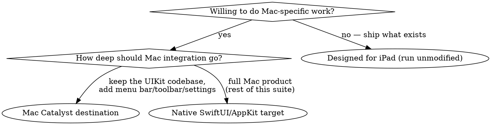

# iOS Apps on Mac — Designed for iPad & Mac Catalyst

Two migration paths bring an iOS codebase to the Mac without a native rewrite: running the iOS app unmodified on Apple silicon ("Designed for iPad" / "Designed for iPhone"), and building a Mac app with Mac Catalyst. They are different products with different obligations — choose deliberately, don't drift into one.

(iPhone Mirroring is a third way users get your iPhone app on a Mac screen, with no opt-in or distribution work — see axiom-uikit (skills/uikit-modernization.md) for its compatibility checklist.)

## Choosing the Mac experience

For new cross-platform code, a SwiftUI multiplatform target usually beats both paths — this skill is for existing iOS/iPad codebases. The native-target path is the rest of this suite (skills/windows.md, skills/menus-and-commands.md, skills/swiftui-differences.md).

## Designed for iPad / Designed for iPhone (run unmodified)

Compatible iOS apps are **automatically offered on the Mac App Store** for Apple silicon Macs — availability is opt-out, not opt-in. Manage it in App Store Connect ("Make this app available on Mac"); turning it off stops new downloads but existing users keep the app.

The app runs on the Mac Catalyst infrastructure but stays an iOS app:

- The idiom stays `.pad` (or `.phone` for iPhone-only apps) — **never `.mac`**. Don't try to detect the Mac via idiom.
- Touch events are synthesized from the mouse, **one touch at a time** — multifinger gestures don't translate. The system offers Touch Alternatives (keyboard/trackpad equivalents) for touch-only apps; real keyboard shortcuts and menu commands are the better answer.
- Hardware-dependent frameworks (Core Motion, ARKit) stay linkable but **return errors at runtime**; other capabilities degrade rather than fail (location resolves via Wi-Fi at lower accuracy, no TrueDepth camera). Check capability availability before use instead of assuming device hardware.
- Multi-window on the Mac requires the same `UIApplicationSupportsMultipleScenes` declaration as iPad multi-window.

Opt out only when the app genuinely cannot work (heavy iOS-exclusive hardware reliance, essential multifinger interactions) or a real Mac version already exists. "The absence of specific hardware on a Mac doesn't always require you to opt out" — gate features, not the whole app.

## Mac Catalyst

Enable the **Mac Catalyst destination** on the app target — same project, same source, a real Mac app out the back.

#### Pick the interface idiom first

| Setting | Idiom | Rendering |
|---|---|---|
| Scale Interface to Match iPad (default) | `.pad` | iPad metrics scaled to 77% |
| Optimize Interface for Mac | `.mac` (iOS 14) | native AppKit-styled controls at 100% |

"Optimize for Mac" is the better end state but the bigger migration: control sizes, fonts, and some UIKit metrics change. See axiom-design (skills/typography-ref.md) for the 77%-scaling type consequences of staying on the iPad idiom.

#### The adoption checklist — what makes it a Mac app

A Catalyst app that ships the raw iPad layout in a Mac window reads as a port. The Mac-defining work:

- **Menu bar** — build real menus with `UIMenuBuilder` (`buildMenu(with:)`, iOS 13); cover the standard App/File/Edit/View/Window/Help organization (see skills/menus-and-commands.md for what belongs where) and give every action a keyboard shortcut.
- **Window chrome** — configure `UIWindowScene.titlebar` (`UITitlebar`): `titleVisibility`, `toolbarStyle`, and an `NSToolbar` (via `NSToolbar+UIKitAdditions`, with sidebar-tracking separator items). Move primary actions from in-content buttons into the toolbar.
- **Settings window** — Mac users expect a Settings scene, not an in-app settings screen (see skills/settings.md).
- **Pointer and keyboard** — hover via `UIHoverGestureRecognizer`, full keyboard navigation, right-click context menus. Remove touch-only assumptions (swipe-only actions, long-press-only menus).
- **AppKit where needed** — Catalyst apps may call AppKit APIs marked available in Mac Catalyst; bridge patterns live in skills/appkit-interop.md.

Distribution is normal Mac distribution — Mac App Store, or Developer ID + notarization (skills/direct-distribution.md).

## Don't confuse the three runtime checks

| Check | True for | Kind |
|---|---|---|
| `#if targetEnvironment(macCatalyst)` | Catalyst builds only | compile-time |
| `ProcessInfo.processInfo.isMacCatalystApp` (iOS 13) | Catalyst **and** iOS-on-Mac | runtime |
| `ProcessInfo.processInfo.isiOSAppOnMac` (iOS 14) | iOS-on-Mac only | runtime |

`isMacCatalystApp` being true for unmodified iOS apps on Mac is the trap — Apple's own header note says to use `isiOSAppOnMac` to tell the two apart.

## Resources

**Docs**: /apple-silicon/running-your-ios-apps-in-macos, /apple-silicon/adapting-ios-code-to-run-in-the-macos-environment, /apple-silicon/providing-touch-gesture-equivalents-using-touch-alternatives, /uikit/mac-catalyst, /uikit/uimenubuilder, /foundation/processinfo

**Skills**: skills/windows.md, skills/menus-and-commands.md, skills/settings.md, skills/appkit-interop.md, skills/direct-distribution.md, axiom-uikit (skills/uikit-modernization.md), axiom-design (skills/typography-ref.md)
