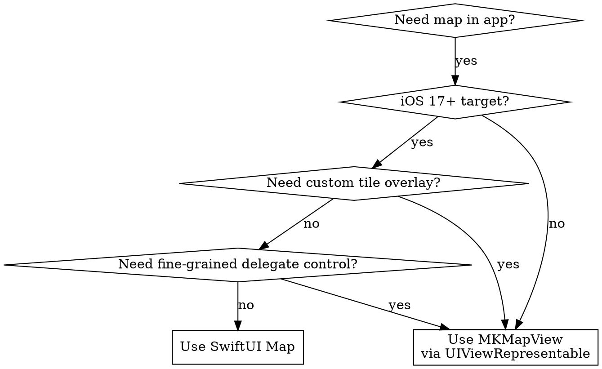

# MapKit Patterns

MapKit patterns and anti-patterns for iOS apps. Prevents common mistakes: using MKMapView when SwiftUI Map suffices, annotations in view bodies, setRegion loops, and performance issues with large annotation counts.

## When to Use

- Adding a map to your iOS app
- Displaying annotations, markers, or custom pins
- Implementing search (address, POI, autocomplete)
- Adding directions/routing to a map
- Debugging map display issues (annotations not showing, region jumping)
- Optimizing map performance with many annotations
- Deciding between SwiftUI Map and MKMapView

## Related Skills

- `axiom-mapkit-ref` — Complete API reference
- `axiom-mapkit-diag` — Symptom-based troubleshooting
- `axiom-core-location` — Location authorization and monitoring

---

## Part 1: Anti-Patterns (with Time Costs)

| Anti-Pattern | Time Cost | Fix |
|---|---|---|
| Using MKMapView when SwiftUI Map suffices | 2-4 hours UIViewRepresentable boilerplate | Use SwiftUI `Map {}` for standard map features (iOS 17+) |
| Creating annotations in SwiftUI view body | UI freeze with 100+ items, view recreation on every update | Move annotations to model, use `@State` or `@Observable` |
| No annotation view reuse (MKMapView) | Memory spikes, scroll lag with 500+ annotations | `dequeueReusableAnnotationView(withIdentifier:for:)` |
| `setRegion` in `updateUIView` without guard | Infinite loop — region change triggers update, update sets region | Guard with `mapView.region != region` or use flag |
| Ignoring MapCameraPosition (SwiftUI) | Can't programmatically control camera, broken "center on user" | Bind `position` parameter to `@State var cameraPosition` |
| Synchronous geocoding on main thread | UI freeze for 1-3 seconds per geocode | Use `CLGeocoder().geocodeAddressString` with async/await |
| Not filtering annotations to visible region | Loading all 10K annotations at once | Use `mapView.annotations(in:)` or fetch by visible region |
| Ignoring `resultTypes` in MKLocalSearch | Irrelevant results, slow search | Set `.resultTypes = [.pointOfInterest]` or `.address` to filter |

---

## Part 2: Decision Trees

### Decision Tree 1: SwiftUI Map vs MKMapView



#### When SwiftUI Map is Right (most apps)

- Standard map with markers and annotations
- Programmatic camera control
- Built-in user location display
- Shape overlays (circle, polygon, polyline)
- Map style selection (standard, imagery, hybrid)
- Selection handling
- Clustering

#### When MKMapView is Required

- Custom tile overlays (e.g., OpenStreetMap, custom imagery)
- Fine-grained delegate control (willBeginLoadingMap, didFinishLoadingMap)
- Custom annotation view animations beyond SwiftUI
- Pre-iOS 17 deployment target
- Advanced overlay rendering with custom MKOverlayRenderer subclasses

### Decision Tree 2: Annotation Strategy by Count

```
Annotation count?
├─ < 100 → Use Marker/Annotation directly in Map {} content builder
│   Simple, declarative, no performance concern
│
├─ 100-1000 → Enable clustering
│   Set .clusteringIdentifier on annotation views
│   SwiftUI: Marker("", coordinate:).tag(id)
│   MKMapView: view.clusteringIdentifier = "poi"
│
└─ 1000+ → Server-side clustering or visible-region filtering
    Fetch only annotations within mapView.region
    Or pre-cluster on server, send cluster centroids
    MKMapView with view reuse is preferred for very large datasets
```

#### Why Clustering Matters

Without clustering at 500 annotations:
- Map is unreadable (pins overlap completely)
- Scroll/zoom lag increases with every annotation
- Memory grows linearly with annotation count

With clustering:
- User sees meaningful groups with counts
- Only visible cluster markers rendered
- Tap to expand reveals individual annotations

### Decision Tree 3: Search and Directions

```
Search implementation:
├─ User types search query
│   └─ MKLocalSearchCompleter (real-time autocomplete)
│       Configure: resultTypes, region bias
│       └─ User selects result
│           └─ MKLocalSearch (full result with MKMapItem)
│               Use completion.title for MKLocalSearch.Request
│
└─ Programmatic search (e.g., "nearest gas station")
    └─ MKLocalSearch with naturalLanguageQuery
        Configure: resultTypes, region, pointOfInterestFilter

Directions implementation:
├─ MKDirections.Request
│   Set source (MKMapItem.forCurrentLocation()) and destination
│   Set transportType (.automobile, .walking, .transit)
│
└─ MKDirections.calculate()
    └─ MKRoute
        ├─ .polyline → Display as MapPolyline or MKPolylineRenderer
        ├─ .expectedTravelTime → Show ETA
        ├─ .distance → Show distance
        └─ .steps → Turn-by-turn instructions
```

---

## Part 3: Pressure Scenarios

### Scenario 1: "Just Wrap MKMapView in UIViewRepresentable"

**Setup**: Adding a map to a SwiftUI app. Developer is familiar with MKMapView from UIKit projects.

**Pressure**: "I know MKMapView well. SwiftUI Map is new and might be limited."

**Expected with skill**: Check the decision tree. If the app needs standard markers, annotations, camera control, user location, and shape overlays — SwiftUI Map handles all of that. Use it.

**Anti-pattern without skill**: 200+ lines of UIViewRepresentable + Coordinator wrapping MKMapView, manually bridging state, implementing delegate methods for annotation views, fighting updateUIView infinite loops — when 20 lines of `Map {}` with content builder would have worked.

**Time cost**: 2-4 hours of unnecessary boilerplate + ongoing maintenance burden.

**The test**: Can you list a specific feature the app needs that SwiftUI Map cannot provide? If not, use SwiftUI Map.

### Scenario 2: "Add All 10,000 Pins to the Map"

**Setup**: App has a database of 10,000 location data points. Product manager wants users to see all locations on the map.

**Pressure**: "Users need to see ALL locations. Just add them all."

**Expected with skill**: Use clustering + visible region filtering. 10K annotations without clustering is unusable — pins overlap, scrolling lags, memory spikes. Clustering shows meaningful groups. Visible region filtering loads only what's on screen.

**Anti-pattern without skill**: Adding all 10,000 annotations at once. Map becomes an unreadable blob of overlapping pins. Scroll lag makes the app feel broken. Memory usage spikes 200-400MB.

**Implementation path**:
1. Enable clustering (`.clusteringIdentifier`)
2. Fetch annotations only within visible region (`.onMapCameraChange` + query)
3. Server-side pre-clustering for datasets > 5K if possible

### Scenario 3: "Search Isn't Finding Results"

**Setup**: MKLocalSearch returns irrelevant or empty results. Developer considers adding Google Maps SDK.

**Pressure**: "MapKit search is broken. Let me add a third-party SDK."

**Expected with skill**: Check configuration first. MapKit search needs:
1. `resultTypes` — filter to `.pointOfInterest` or `.address` (default returns everything)
2. `region` — bias results to the visible map region
3. Query format — natural language like "coffee shops" works; structured queries don't

**Anti-pattern without skill**: Adding Google Maps SDK (50+ MB binary, API key management, billing setup) when MapKit search works correctly with proper configuration.

**Time cost**: 4-8 hours adding third-party SDK vs 5 minutes configuring MapKit search.

---

## Part 4: Core Location Integration

MapKit and Core Location interact in ways that surprise developers.

### Implicit Authorization

When you set `showsUserLocation = true` on MKMapView or add `UserAnnotation()` in SwiftUI Map, MapKit implicitly requests location authorization if it hasn't been requested yet.

This means:
- The authorization prompt appears at map display time, not when the developer expects
- The user sees a prompt with no context about why location is needed
- If denied, the blue dot silently doesn't appear

#### Recommended Pattern

Request authorization explicitly BEFORE showing the map:

```swift
// 1. Request authorization with context
let session = CLServiceSession(authorization: .whenInUse)

// 2. Then show map with user location
Map {
    UserAnnotation()
}
```

### CLServiceSession (iOS 17+)

For continuous location display on a map, create a `CLServiceSession`:

```swift
@Observable
class MapModel {
    var cameraPosition: MapCameraPosition = .automatic
    private var locationSession: CLServiceSession?

    func startShowingUserLocation() {
        locationSession = CLServiceSession(authorization: .whenInUse)
    }

    func stopShowingUserLocation() {
        locationSession = nil
    }
}
```

### Cross-Reference

For full authorization decision trees, monitoring patterns, and background location:
- `axiom-core-location` — Authorization strategy, monitoring approach
- `axiom-core-location-diag` — "Location not working" troubleshooting
- `axiom-energy` — Location as battery subsystem

---

## Part 5: SwiftUI Map Quick Start

The most common pattern — a map with markers and user location:

```swift
struct ContentView: View {
    @State private var cameraPosition: MapCameraPosition = .automatic
    @State private var selectedItem: MKMapItem?

    let locations: [Location]  // Your model

    var body: some View {
        Map(position: $cameraPosition, selection: $selectedItem) {
            UserAnnotation()

            ForEach(locations) { location in
                Marker(location.name, coordinate: location.coordinate)
                    .tint(location.category.color)
            }
        }
        .mapStyle(.standard(elevation: .realistic))
        .mapControls {
            MapUserLocationButton()
            MapCompass()
            MapScaleView()
        }
        .onChange(of: selectedItem) { _, item in
            if let item {
                handleSelection(item)
            }
        }
    }
}
```

#### Key Points

- `@State var cameraPosition` — bind for programmatic camera control
- `selection: $selectedItem` — handle tap on markers
- `MapCameraPosition.automatic` — system manages initial view
- `.mapControls {}` — built-in UI for location button, compass, scale
- `ForEach` in content builder — dynamic annotations from data

---

## Part 6: Search Implementation Pattern

Complete search with autocomplete:

```swift
@Observable
class SearchModel {
    var searchText = ""
    var completions: [MKLocalSearchCompletion] = []
    var searchResults: [MKMapItem] = []

    private let completer = MKLocalSearchCompleter()
    private var completerDelegate: CompleterDelegate?

    init() {
        completerDelegate = CompleterDelegate { [weak self] results in
            self?.completions = results
        }
        completer.delegate = completerDelegate
        completer.resultTypes = [.pointOfInterest, .address]
    }

    func updateSearch(_ text: String) {
        searchText = text
        completer.queryFragment = text
    }

    func search(for completion: MKLocalSearchCompletion) async throws {
        let request = MKLocalSearch.Request(completion: completion)
        request.resultTypes = [.pointOfInterest, .address]
        let search = MKLocalSearch(request: request)
        let response = try await search.start()
        searchResults = response.mapItems
    }

    func search(query: String, in region: MKCoordinateRegion) async throws {
        let request = MKLocalSearch.Request()
        request.naturalLanguageQuery = query
        request.region = region
        request.resultTypes = .pointOfInterest
        let search = MKLocalSearch(request: request)
        let response = try await search.start()
        searchResults = response.mapItems
    }
}
```

#### MKLocalSearchCompleter Delegate (Required)

```swift
class CompleterDelegate: NSObject, MKLocalSearchCompleterDelegate {
    let onUpdate: ([MKLocalSearchCompletion]) -> Void

    init(onUpdate: @escaping ([MKLocalSearchCompletion]) -> Void) {
        self.onUpdate = onUpdate
    }

    func completerDidUpdateResults(_ completer: MKLocalSearchCompleter) {
        onUpdate(completer.results)
    }

    func completer(_ completer: MKLocalSearchCompleter, didFailWithError error: Error) {
        // Handle error — network issues, rate limiting
    }
}
```

#### Rate Limiting

Apple rate-limits MapKit search. For autocomplete:
- `MKLocalSearchCompleter` handles its own throttling internally
- Don't create a new completer per keystroke — reuse one instance
- Set `queryFragment` on each keystroke; the completer debounces

For `MKLocalSearch`:
- Don't fire a search on every keystroke — use the completer for autocomplete
- Fire `MKLocalSearch` only when the user selects a completion or submits

---

## Part 7: Directions Implementation Pattern

```swift
func calculateDirections(
    from source: CLLocationCoordinate2D,
    to destination: MKMapItem,
    transportType: MKDirectionsTransportType = .automobile
) async throws -> MKRoute {
    let request = MKDirections.Request()
    request.source = MKMapItem(placemark: MKPlacemark(coordinate: source))
    request.destination = destination
    request.transportType = transportType

    let directions = MKDirections(request: request)
    let response = try await directions.calculate()

    guard let route = response.routes.first else {
        throw MapError.noRouteFound
    }
    return route
}
```

#### Displaying the Route (SwiftUI)

```swift
Map(position: $cameraPosition) {
    if let route {
        MapPolyline(route.polyline)
            .stroke(.blue, lineWidth: 5)
    }

    Marker("Start", coordinate: startCoord)
    Marker("End", coordinate: endCoord)
}
```

#### Displaying the Route (MKMapView)

```swift
// Add overlay
mapView.addOverlay(route.polyline, level: .aboveRoads)

// Implement renderer delegate
func mapView(_ mapView: MKMapView, rendererFor overlay: MKOverlay) -> MKOverlayRenderer {
    if let polyline = overlay as? MKPolyline {
        let renderer = MKPolylineRenderer(polyline: polyline)
        renderer.strokeColor = .systemBlue
        renderer.lineWidth = 5
        return renderer
    }
    return MKOverlayRenderer(overlay: overlay)
}
```

#### Route Information

```swift
let route: MKRoute = ...
let travelTime = route.expectedTravelTime  // TimeInterval in seconds
let distance = route.distance              // CLLocationDistance in meters
let steps = route.steps                    // [MKRoute.Step]

for step in steps {
    print("\(step.instructions) — \(step.distance)m")
    // "Turn right on Main St — 450m"
}
```

---

## Part 8: Clustering Pattern

### SwiftUI (iOS 17+)

```swift
Map(position: $cameraPosition) {
    ForEach(locations) { location in
        Marker(location.name, coordinate: location.coordinate)
            .tag(location.id)
    }
    .mapItemClusteringIdentifier("locations")
}
```

### MKMapView

```swift
func mapView(_ mapView: MKMapView, viewFor annotation: MKAnnotation) -> MKAnnotationView? {
    if let cluster = annotation as? MKClusterAnnotation {
        let view = mapView.dequeueReusableAnnotationView(
            withIdentifier: "cluster",
            for: annotation
        ) as! MKMarkerAnnotationView
        view.markerTintColor = .systemBlue
        view.glyphText = "\(cluster.memberAnnotations.count)"
        return view
    }

    let view = mapView.dequeueReusableAnnotationView(
        withIdentifier: "pin",
        for: annotation
    ) as! MKMarkerAnnotationView
    view.clusteringIdentifier = "locations"
    view.markerTintColor = .systemRed
    return view
}
```

#### Clustering Requirements

1. All annotation views that should cluster MUST share the same `clusteringIdentifier`
2. Register annotation view classes: `mapView.register(MKMarkerAnnotationView.self, forAnnotationViewWithReuseIdentifier: "pin")`
3. Clustering only activates when annotations physically overlap at the current zoom level
4. System manages cluster/uncluster animation automatically

---

## Part 9: Pre-Release Checklist

- [ ] Map loads and displays correctly
- [ ] Annotations appear at correct coordinates (lat/lng not swapped)
- [ ] Clustering works with 100+ annotations
- [ ] Search returns relevant results (resultTypes configured)
- [ ] Camera position controllable programmatically
- [ ] Memory stable when scrolling/zooming with many annotations
- [ ] User location shows correctly (authorization handled before display)
- [ ] Directions render as polyline overlay
- [ ] Map works in Dark Mode (map styles adapt automatically)
- [ ] Accessibility: VoiceOver announces map elements
- [ ] No setRegion/updateUIView infinite loops (if using MKMapView)
- [ ] MKLocalSearchCompleter reused (not recreated per keystroke)
- [ ] Annotation views reused via `dequeueReusableAnnotationView` (MKMapView)
- [ ] Look Around availability checked before displaying (`MKLookAroundSceneRequest`)

---

## Resources

**WWDC**: 2023-10043, 2024-10094

**Docs**: /mapkit, /mapkit/map

**Skills**: mapkit-ref, mapkit-diag, core-location
