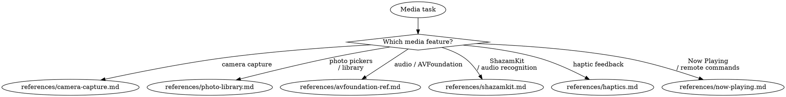

# Media

**You MUST use this skill for ANY camera, photo, audio, haptic, or media playback work.**

## Quick Reference

| Symptom / Task | Reference |
|----------------|-----------|
| Camera capture, AVCaptureSession | See `references/camera-capture.md` |
| Camera API (RotationCoordinator, etc.) | See `references/camera-capture-ref.md` |
| Camera freezes, black preview, rotation | See `references/camera-capture-diag.md` |
| Photo pickers, library access | See `references/photo-library.md` |
| PHPicker, PhotosPicker API reference | See `references/photo-library-ref.md` |
| Audio, AVFoundation, spatial audio | See `references/avfoundation-ref.md` |
| Audio recognition, ShazamKit | See `references/shazamkit.md` |
| ShazamKit API reference | See `references/shazamkit-ref.md` |
| Haptic feedback, Core Haptics | See `references/haptics.md` |
| Now Playing metadata, remote commands | See `references/now-playing.md` |
| CarPlay Now Playing | See `references/now-playing-carplay.md` |
| MusicKit Now Playing | See `references/now-playing-musickit.md` |

## Decision Tree

1. Camera capture? → `references/camera-capture.md` (patterns), `references/camera-capture-ref.md` (API), `references/camera-capture-diag.md` (debugging)
2. Photo pickers / library? → `references/photo-library.md`, `references/photo-library-ref.md`
3. Audio / AVFoundation? → `references/avfoundation-ref.md`
4. ShazamKit / audio recognition? → `references/shazamkit.md`, `references/shazamkit-ref.md`
5. Haptics? → `references/haptics.md`
6. Now Playing / remote commands? → `references/now-playing.md`, `references/now-playing-carplay.md`, `references/now-playing-musickit.md`
7. Want camera code audit? → Launch `camera-auditor` agent

## Cross-Domain Routing

**Camera + permissions** (camera access denied, Info.plist missing):
- Camera code → **stay here** (camera-capture)
- Privacy manifest / Info.plist → **invoke axiom-integration** (privacy-ux reference)
- Build/entitlement errors → **invoke axiom-build**

**ShazamKit + microphone permissions**:
- Microphone NSMicrophoneUsageDescription → **invoke axiom-integration** (privacy-ux reference)
- ShazamKit API and matching → **stay here** (shazamkit)

**Now Playing + background audio**:
- Now Playing metadata/controls → **stay here** (now-playing)
- Background audio mode / BGTaskScheduler → **invoke axiom-integration** (background-processing reference)

**Photo library + privacy**:
- Photo picker (PHPicker, PhotosPicker) → **stay here** (photo-library) — no permissions needed
- Full PHPhotoLibrary access → **stay here** (photo-library-ref) — limited access model
- Privacy manifest for photo usage → **invoke axiom-integration** (privacy-ux reference)

## Anti-Rationalization

| Thought | Reality |
|---------|---------|
| "Camera capture is just AVCaptureSession setup" | Camera has interruption handlers, rotation, and threading requirements. |
| "I'll add haptics with a simple API call" | Haptic design has patterns for each interaction type matching HIG. |
| "ShazamKit is just SHSession + a delegate" | iOS 17+ has SHManagedSession which eliminates all AVAudioEngine boilerplate. |
| "Now Playing info is just setting metadata" | Remote commands, artwork handling, and state sync have 15+ gotchas. |
| "I'll use UIImagePickerController for photos" | PHPicker/PhotosPicker are the modern API — no permissions required. |

## Example Invocations

User: "How do I set up a camera preview?"
→ Read: `references/camera-capture.md`

User: "Camera freezes when I get a phone call"
→ Read: `references/camera-capture-diag.md`

User: "How do I let users pick photos in SwiftUI?"
→ Read: `references/photo-library.md`

User: "Implement haptic feedback for button taps"
→ Read: `references/haptics.md`

User: "Now Playing info doesn't appear on Lock Screen"
→ Read: `references/now-playing.md`

User: "How do I identify songs with ShazamKit?"
→ Read: `references/shazamkit.md`

User: "Check my camera code for issues"
→ Launch: `camera-auditor` agent
