# Security & Credentials

**You MUST use this skill for ANY keychain, encryption, passkey, app integrity, file protection, or code signing work.**

## Quick Reference

| Symptom / Task | Reference |
|----------------|-----------|
| Store tokens, passwords, API keys securely | See `references/keychain.md` |
| Choose kSecAttrAccessible level, biometric protection | See `references/keychain.md` |
| SecItem function signatures, attribute constants | See `references/keychain-ref.md` |
| errSecDuplicateItem, errSecItemNotFound, errSecInteractionNotAllowed | See `references/keychain-diag.md` |
| Encrypt data, sign payloads, key management | See `references/cryptokit.md` |
| Hash functions, HMAC, AES-GCM, ChaChaPoly, ECDSA, EdDSA, key agreement | See `references/cryptokit-ref.md` |
| Passkey sign-in, WebAuthn, ASAuthorizationController | See `references/passkeys.md` |
| App integrity verification, DCAppAttestService | See `references/app-attest.md` |
| NSFileProtection levels, data protection at rest | See `references/file-protection-ref.md` |
| Certificate management, provisioning profiles, CI/CD signing | See `references/code-signing.md` |
| Certificate not found, profile mismatch, entitlement errors | See `references/code-signing-diag.md` |
| Certificate CLI, profile inspection, entitlement extraction | See `references/code-signing-ref.md` |

## Decision Tree

```dot
digraph security {
    start [label="Security task" shape=ellipse];
    what [label="What do you need?" shape=diamond];

    start -> what;
    what -> "references/keychain.md" [label="store/retrieve\ncredentials, tokens,\nsecrets"];
    what -> "references/keychain-ref.md" [label="SecItem API syntax,\nattribute constants,\naccess levels"];
    what -> "references/keychain-diag.md" [label="keychain errors\n(errSec codes)"];
    what -> "references/cryptokit.md" [label="encrypt data,\nsign payloads,\nSecure Enclave keys"];
    what -> "references/cryptokit-ref.md" [label="CryptoKit API\n(AES, ECDSA, HPKE,\npost-quantum)"];
    what -> "references/passkeys.md" [label="passkey sign-in,\nreplace passwords"];
    what -> "references/app-attest.md" [label="app integrity,\nfraud prevention"];
    what -> "references/file-protection-ref.md" [label="file encryption,\nNSFileProtection"];
    what -> "references/code-signing.md" [label="set up signing,\nprofiles, CI/CD"];
    what -> "references/code-signing-diag.md" [label="signing errors,\nupload rejections"];
    what -> "references/code-signing-ref.md" [label="CLI commands,\nprofile inspection"];
}
```

1. Store tokens, passwords, API keys securely? → `references/keychain.md`
1a. Need SecItem function signatures, attribute constants? → `references/keychain-ref.md`
1b. Keychain errors (errSecDuplicateItem, errSecItemNotFound)? → `references/keychain-diag.md`
2. Encrypt data, sign payloads, manage keys? → `references/cryptokit.md`
2a. Need CryptoKit API details (AES-GCM, ECDSA, HPKE, post-quantum)? → `references/cryptokit-ref.md`
3. Implement passkey sign-in, replace passwords? → `references/passkeys.md`
4. Verify app integrity, prevent fraud? → `references/app-attest.md`
5. File encryption at rest, NSFileProtection levels? → `references/file-protection-ref.md`
6. Set up code signing, manage certificates, CI/CD? → `references/code-signing.md`
6a. Code signing error troubleshooting? → `references/code-signing-diag.md`
6b. Certificate CLI commands, profile inspection? → `references/code-signing-ref.md`
7. Build/upload failures after signing? → See axiom-build
8. App Store submission prep? → `/skill axiom-shipping`
9. Privacy manifests, tracking transparency? → See axiom-integration
10. Want automated security scan? → security-privacy-scanner (Agent)

## Conflict Resolution

**security vs ios-build**: When build fails with signing errors:
- Code signing errors (certificate, profile, entitlement) → **use security**
- Environment issues (Xcode version, simulator, Derived Data) → **use ios-build**
- If unsure, check the error message: `CODESIGN`, `ITMS-90xxx`, `errSec` → **security**

**security vs shipping**: When preparing for App Store:
- Privacy manifests, submission checklists, rejections → **use shipping**
- Code signing for distribution, certificate management → **use security**

**security vs ios-data**: When storing sensitive data:
- Tokens, passwords, API keys → **use security** (keychain)
- User preferences, non-sensitive settings → **use ios-data** (UserDefaults/SwiftData)
- File encryption levels for database files → **use security** (file-protection-ref)

**security vs ios-networking**: When securing network communication:
- TLS configuration, certificate pinning → **use ios-networking**
- Signing API requests, encrypting payloads → **use security** (CryptoKit)

## Critical Patterns

**Keychain** (`references/keychain.md`):
- SecItem mental model: uniqueness constraints, data protection classes
- Biometric access control (Face ID / Touch ID)
- Keychain sharing between app and extensions
- Background access pitfalls, Mac keychain differences
- Migration from UserDefaults/@AppStorage for sensitive data

**Keychain API** (`references/keychain-ref.md`):
- SecItemAdd/CopyMatching/Update/Delete signatures
- Item class attributes, uniqueness constraint rules
- kSecAttrAccessible levels and when each applies
- Access control flags, biometric integration
- Complete error code reference

**Keychain Diagnostics** (`references/keychain-diag.md`):
- errSecDuplicateItem from unexpected uniqueness constraints
- errSecItemNotFound despite item existing (query mismatch)
- errSecInteractionNotAllowed in background contexts
- Access group and entitlement mismatches
- Items disappearing after app updates

**CryptoKit** (`references/cryptokit.md`):
- AES-GCM and ChaChaPoly authenticated encryption
- ECDSA/EdDSA digital signatures
- Secure Enclave hardware-backed keys
- Key agreement (ECDH) for end-to-end encryption
- HPKE for modern asymmetric encryption
- Post-quantum algorithms (ML-KEM, ML-DSA)
- CommonCrypto migration path

**CryptoKit API** (`references/cryptokit-ref.md`):
- Hash functions (SHA-256/384/512, SHA-3), HMAC
- Symmetric encryption (AES-GCM, ChaChaPoly)
- Asymmetric signing (P256, P384, P521, Curve25519, Ed25519)
- Key agreement, key derivation (HKDF)
- Secure Enclave key creation and usage
- Swift Crypto cross-platform parity

**Passkeys** (`references/passkeys.md`):
- ASAuthorizationController registration and assertion flows
- AutoFill-assisted requests (QuickType bar integration)
- Automatic passkey upgrades for existing users (iOS 18+)
- Combined credential requests (passkey + password + Sign in with Apple)
- Associated domains configuration for WebAuthn

**App Attest** (`references/app-attest.md`):
- DCAppAttestService attestation and assertion flows
- Server-side validation of attestation objects
- DeviceCheck 2-bit per-device state
- Gradual rollout strategies for large install bases
- Handling unsupported devices gracefully

**File Protection** (`references/file-protection-ref.md`):
- NSFileProtection levels (complete, completeUnlessOpen, afterFirstUnlock, none)
- Hardware-accelerated encryption tied to device passcode
- Background file access requirements
- Keychain vs file protection comparison

**Code Signing** (`references/code-signing.md`):
- Automatic vs manual signing tradeoffs
- Certificate and profile management across teams
- fastlane match for team-wide certificate sharing
- CI/CD signing setup (GitHub Actions, Xcode Cloud)
- Distribution build preparation (App Store, TestFlight, Ad Hoc)

**Code Signing Diagnostics** (`references/code-signing-diag.md`):
- Certificate issues (expired, missing, wrong type, revoked)
- Provisioning profile issues (expired, missing cert, wrong App ID)
- Entitlement mismatches (capability in Xcode but not in profile)
- Keychain issues in CI (locked keychain, errSecInternalComponent)
- Archive/export failures (wrong export method, wrong cert type)

**Code Signing CLI** (`references/code-signing-ref.md`):
- `security find-identity`, `security cms -D` for profile inspection
- `codesign -d --entitlements` for entitlement extraction
- Certificate types, validity periods, per-account limits
- fastlane match commands and Keychain management

## Automated Scanning

**Security audit** → Launch `security-privacy-scanner` agent (scans for hardcoded credentials, insecure @AppStorage usage, missing Privacy Manifests, ATS violations, sensitive data in logs)

## Anti-Rationalization

| Thought | Reality |
|---------|---------|
| "I'll store the token in UserDefaults for now" | UserDefaults is a plist file readable by any process with file access. Keychain takes 10 lines. `references/keychain.md` shows the pattern. |
| "My app doesn't need encryption" | If you store any user data at rest, iOS file protection is free. `references/file-protection-ref.md` covers protection levels. |
| "CommonCrypto works fine, no need to migrate" | CommonCrypto is C API with manual memory management and no compile-time safety. CryptoKit prevents buffer overflows and key misuse. |
| "I'll just use automatic signing" | Automatic signing works until CI, team scaling, or capability changes break it. Understand manual signing before you need it. `references/code-signing.md` covers both. |
| "Passkeys are too new, passwords are fine" | Passkeys are phishing-resistant and supported since iOS 16. The migration path supports both simultaneously. `references/passkeys.md` shows combined flows. |
| "I'll regenerate all certificates to fix this" | Regenerating revokes existing certs and breaks every teammate's build. Diagnose first. `references/code-signing-diag.md` has the diagnostic flow. |
| "App Attest is overkill for my app" | If your app has any server-verified purchase, promotion, or competitive feature, tampered clients will exploit it. `references/app-attest.md` covers gradual rollout. |
| "I'll use @unchecked Sendable on my crypto wrapper" | Hiding thread-safety issues from the compiler in security code is how data corruption happens. See axiom-concurrency for safe patterns. |
| "kSecAttrAccessibleAlways is fine" | Deprecated since iOS 12. Items are accessible even when device is locked and unencrypted during backup. Use kSecAttrAccessibleAfterFirstUnlock at minimum. |

## Example Invocations

User: "How do I store an auth token securely?"
→ Read: `references/keychain.md`

User: "errSecDuplicateItem when saving to keychain"
→ Read: `references/keychain-diag.md`

User: "What are the SecItem attribute constants?"
→ Read: `references/keychain-ref.md`

User: "How do I encrypt user data with AES?"
→ Read: `references/cryptokit.md`

User: "What's the CryptoKit API for ECDSA signing?"
→ Read: `references/cryptokit-ref.md`

User: "How do I add passkey sign-in to my app?"
→ Read: `references/passkeys.md`

User: "How do I verify my app hasn't been tampered with?"
→ Read: `references/app-attest.md`

User: "What NSFileProtection level should I use?"
→ Read: `references/file-protection-ref.md`

User: "My build fails with 'No signing certificate found'"
→ Read: `references/code-signing-diag.md`

User: "How do I set up fastlane match for CI?"
→ Read: `references/code-signing.md`

User: "How do I inspect a provisioning profile?"
→ Read: `references/code-signing-ref.md`

User: "Scan my code for security issues"
→ Invoke: `security-privacy-scanner` agent
