# SwiftUI

**You MUST use this skill for ANY SwiftUI work including views, state, navigation, layout, animations, architecture, gestures, and debugging.**

## Quick Reference

| Symptom / Task | Reference |
|----------------|-----------|
| View not updating | See `references/debugging.md` |
| View update still broken after debugging | See `references/debugging-diag.md` |
| Navigation issues | See `references/nav.md` |
| Navigation still broken after debugging | See `references/nav-diag.md` |
| Navigation API reference | See `references/nav-ref.md` |
| Layout breaks on iPad/rotation | See `references/layout.md` |
| Layout API reference | See `references/layout-ref.md` |
| Performance/lag/slow scroll | See `references/performance.md` |
| Architecture/testability | See `references/architecture.md` |
| Animation issues | See `references/animation-ref.md` |
| Stacks/grids/outlines | See `references/containers-ref.md` |
| Search implementation | See `references/search-ref.md` |
| Gesture conflicts | See `references/gestures.md` |
| iOS 26 features | See `references/26-ref.md` |

## Non-SwiftUI UI Routes

These topics are part of the broader iOS UI domain but live in separate suites:

**UIKit issues:**
- Auto Layout conflicts → `/skill axiom-auto-layout-debugging`
- Animation timing → `/skill axiom-uikit-animation-debugging`
- SwiftUI ↔ UIKit bridging → `/skill axiom-uikit-bridging`

**Design & guidelines:**
- Liquid Glass adoption → `/skill axiom-liquid-glass`
- SF Symbols → `/skill axiom-sf-symbols`
- HIG compliance → `/skill axiom-hig`
- Typography → `/skill axiom-typography-ref`
- TextKit/rich text → `/skill axiom-textkit-ref`

**Other:**
- tvOS (focus, remote, text input) → `/skill axiom-tvos`
- App-level composition (root, auth, scenes) → `/skill axiom-app-composition`
- Drag/drop, sharing, copy/paste → `/skill axiom-transferable-ref`
- VoiceOver, Dynamic Type → `/skill axiom-accessibility`
- UI test flakiness → `/skill axiom-ui-testing`
- UX dead ends, dismiss traps → Launch `ux-flow-auditor` agent

## Conflict Resolution

**axiom-swiftui vs axiom-ios-performance**: When UI is slow (e.g., "SwiftUI List slow"):
1. **Try axiom-swiftui FIRST** — Domain-specific fixes (LazyVStack, view identity, @State optimization) often solve UI performance in 5 minutes
2. **Only use axiom-ios-performance** if domain fixes don't help — Profiling takes longer and may confirm what domain knowledge already knows

## Decision Tree

```dot
digraph swiftui {
    start [label="SwiftUI issue" shape=ellipse];
    what [label="What's wrong?" shape=diamond];

    start -> what;
    what -> "references/debugging.md" [label="view not updating"];
    what -> "references/nav.md" [label="navigation"];
    what -> "references/performance.md" [label="slow/lag"];
    what -> "references/layout.md" [label="adaptive layout"];
    what -> "references/containers-ref.md" [label="stacks/grids/outlines"];
    what -> "references/architecture.md" [label="feature architecture"];
    what -> "references/animation-ref.md" [label="animations"];
    what -> "references/gestures.md" [label="gestures"];
    what -> "references/search-ref.md" [label="search"];
    what -> "references/26-ref.md" [label="iOS 26 features"];
    what -> "axiom-uikit-bridging" [label="UIKit interop"];
    what -> "axiom-app-composition" [label="app-level (root, auth)"];
    what -> "axiom-transferable-ref" [label="drag/drop, sharing"];
}
```

## Automated Scanning

- Architecture audit → Launch `swiftui-architecture-auditor` agent
- Performance scan → Launch `swiftui-performance-analyzer` agent or `/axiom:audit swiftui-performance`
- Navigation audit → Launch `swiftui-nav-auditor` agent or `/axiom:audit swiftui-nav`
- Layout audit → Launch `swiftui-layout-auditor` agent or `/axiom:audit swiftui-layout`
- UX flow audit → Launch `ux-flow-auditor` agent or `/axiom:audit ux-flow`
- Liquid Glass scan → Launch `liquid-glass-auditor` agent or `/axiom:audit liquid-glass`
- TextKit scan → Launch `textkit-auditor` agent or `/axiom:audit textkit`

## Anti-Rationalization

| Thought | Reality |
|---------|---------|
| "Simple SwiftUI layout, no need" | SwiftUI layout has 12 gotchas. `references/layout.md` covers all of them. |
| "I know how NavigationStack works" | Navigation has state restoration, deep linking, and identity traps. `references/nav.md` prevents 2-hour debugging. |
| "It's just a view not updating" | View update failures have 4 root causes. `references/debugging.md` diagnoses in 5 min. |
| "I'll just add .animation()" | Animation issues compound. `references/animation-ref.md` has the correct patterns. |
| "No architecture needed" | Even small features benefit from separation. `references/architecture.md` prevents refactoring debt. |
| "I know .searchable" | Search has 6 gotchas. `references/search-ref.md` covers all of them. |
