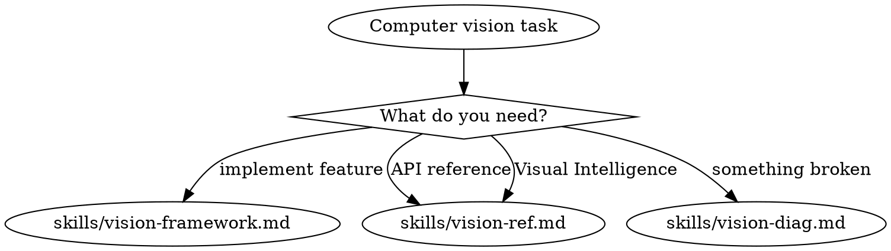

# Computer Vision

**You MUST use this skill for ANY computer vision work using the Vision framework.**

## Quick Reference

| Symptom / Task | Reference |
|----------------|-----------|
| Subject segmentation, lifting | See `skills/vision-framework.md` |
| Hand/body pose detection | See `skills/vision-framework.md` |
| Text recognition (OCR) | See `skills/vision-framework.md` |
| Barcode/QR code detection | See `skills/vision-framework.md` |
| Document scanning | See `skills/vision-framework.md` |
| DataScannerViewController | See `skills/vision-framework.md` |
| Structured document extraction (iOS 26+) | See `skills/vision-framework.md` |
| Isolate object excluding hand | See `skills/vision-framework.md` |
| Vision framework API reference | See `skills/vision-ref.md` |
| Visual Intelligence integration (iOS 26+) | See `skills/vision-ref.md` |
| Subject not detected | See `skills/vision-diag.md` |
| Hand/body pose missing landmarks | See `skills/vision-diag.md` |
| Low confidence observations | See `skills/vision-diag.md` |
| UI freezing during processing | See `skills/vision-diag.md` |
| Coordinate conversion bugs | See `skills/vision-diag.md` |
| Text not recognized / wrong chars | See `skills/vision-diag.md` |
| Barcode not detected | See `skills/vision-diag.md` |
| DataScanner blank / no items | See `skills/vision-diag.md` |
| Document edges not detected | See `skills/vision-diag.md` |

## Decision Tree

1. Implementing (pose, segmentation, OCR, barcodes, documents, live scanning)? → `skills/vision-framework.md`
2. Visual Intelligence system integration (camera feature, iOS 26+)? → `skills/vision-ref.md` (Visual Intelligence section)
3. Need API reference / code examples? → `skills/vision-ref.md`
4. Debugging issues (detection failures, confidence, coordinates)? → `skills/vision-diag.md`

## Critical Patterns

**Implementation** (`skills/vision-framework.md`):
- Decision tree for choosing the right Vision API
- Subject segmentation with VisionKit
- Isolating objects while excluding hands (combining APIs)
- Hand/body pose detection (21/18 landmarks)
- Text recognition (fast vs accurate modes)
- Barcode detection with symbology selection
- Document scanning and structured extraction (iOS 26+)
- Live scanning with DataScannerViewController
- CoreImage HDR compositing

**Diagnostics** (`skills/vision-diag.md`):
- Subject detection failures (edge of frame, lighting)
- Landmark tracking issues (confidence thresholds)
- Performance optimization (frame skipping, downscaling)
- Coordinate conversion (lower-left vs top-left origin)
- Text recognition failures (language, contrast)
- Barcode detection issues (symbology, size, glare)
- DataScanner troubleshooting (availability, data types)

## Anti-Rationalization

| Thought | Reality |
|---------|---------|
| "Vision framework is just a request/handler pattern" | Vision has coordinate conversion, confidence thresholds, and performance gotchas. vision-framework.md covers them. |
| "I'll handle text recognition without the skill" | VNRecognizeTextRequest has fast/accurate modes and language-specific settings. vision-framework.md has the patterns. |
| "Subject segmentation is straightforward" | Instance masks have HDR compositing and hand-exclusion patterns. vision-framework.md covers complex scenarios. |
| "Visual Intelligence is just the camera API" | Visual Intelligence is a system-level feature requiring IntentValueQuery and SemanticContentDescriptor. vision-ref.md has the integration section. |
| "I'll just process on the main thread" | Vision blocks UI on older devices. Users on iPhone 12 will experience frozen app. 15 min to add background queue. |

## Example Invocations

User: "How do I detect hand pose in an image?"
→ See `skills/vision-framework.md`

User: "Isolate a subject but exclude the user's hands"
→ See `skills/vision-framework.md`

User: "How do I read text from an image?"
→ See `skills/vision-framework.md`

User: "Scan QR codes with the camera"
→ See `skills/vision-framework.md`

User: "Subject detection isn't working"
→ See `skills/vision-diag.md`

User: "Text recognition returns wrong characters"
→ See `skills/vision-diag.md`

User: "Show me VNDetectHumanBodyPoseRequest examples"
→ See `skills/vision-ref.md`

User: "How do I make my app work with Visual Intelligence?"
→ See `skills/vision-ref.md`

User: "RecognizeDocumentsRequest API reference"
→ See `skills/vision-ref.md`
