# Skill Map

Visual overview of Axiom's two-layer routing architecture. 17 routers organize 154 skills, 35 agents, and 10 commands into discoverable domains.

## How It Works

Axiom uses **progressive disclosure** — you never need to memorize skill names. Ask a question, and the right router activates automatically:

1. **Your question** hits one of 17 domain routers
2. The **router** selects the right specialized skill, agent, or command
3. You get **expert guidance** tailored to your specific issue

## Color Legend

| Type | Role | Example |
|------|------|---------|
| Router | Domain entry point | ios-ui, ios-data |
| Discipline | Workflow + best practices | swift-concurrency, liquid-glass |
| Reference | Complete API guide | network-framework-ref, storekit-ref |
| Diagnostic | Troubleshooting trees | networking-diag, energy-diag |
| Agent | Autonomous scanner | memory-auditor, build-fixer |
| Command | Explicit invocation | /axiom:fix-build, /axiom:audit |

## Overview

```mermaid
flowchart TD
    classDef core fill:#1a73e8,stroke:#1557b0,color:#fff,font-weight:bold
    classDef build fill:#e8f0fe,stroke:#4285f4,color:#1a3e6e
    classDef ui fill:#d4edda,stroke:#28a745,color:#1b4332
    classDef data fill:#cce5ff,stroke:#0d6efd,color:#003366
    classDef async fill:#f3e8ff,stroke:#6f42c1,color:#3b1f6e
    classDef perf fill:#fff3cd,stroke:#ffc107,color:#664d03
    classDef test fill:#f8d7da,stroke:#dc3545,color:#58151c
    classDef net fill:#ffe0cc,stroke:#e67e22,color:#5a3310
    classDef integ fill:#d1ecf1,stroke:#17a2b8,color:#0c5460
    classDef a11y fill:#e2e3e5,stroke:#6c757d,color:#383d41
    classDef apple fill:#e8daef,stroke:#8e44ad,color:#4a235a
    classDef ship fill:#fadbd8,stroke:#cb4335,color:#641e16

    axiom["Axiom<br/>17 routers · 154 skills · 35 agents"]:::core

    build["Build & Environment<br/><small>6 skills · 2 refs · 6 agents</small>"]:::build
    ui["UI & Design<br/><small>15 skills · 7 refs · 5 agents</small>"]:::ui
    data["Data & Persistence<br/><small>11 skills · 6 refs · 4 agents</small>"]:::data
    concurrency["Concurrency<br/><small>6 skills · 1 agent</small>"]:::async
    perf["Performance<br/><small>8 skills · 4 refs · 3 agents</small>"]:::perf
    testing["Testing<br/><small>5 skills · 1 ref · 5 agents</small>"]:::test
    networking["Networking<br/><small>3 skills · 1 ref · 1 agent</small>"]:::net
    integration["Integration<br/><small>13 skills · 10 refs · 3 agents</small>"]:::integ
    a11y["Accessibility<br/><small>1 diag · 1 agent</small>"]:::a11y
    ai["Apple Intelligence<br/><small>1 skill · 1 ref · 1 diag</small>"]:::apple
    vision["Computer Vision<br/><small>1 skill · 1 ref · 1 diag</small>"]:::apple
    graphics["Graphics & 3D<br/><small>3 skills · 2 refs · 2 diags</small>"]:::apple
    games["Games<br/><small>3 skills · 3 refs · 1 agent</small>"]:::ui
    ml["Machine Learning<br/><small>2 skills · 1 ref · 1 diag</small>"]:::apple
    shipping["Shipping<br/><small>2 skills · 1 ref · 2 agents</small>"]:::ship
    xcodemcp["Xcode MCP<br/><small>2 skills · 1 ref</small>"]:::build
    appledocs["Apple Docs<br/><small>20 guides · 32 diagnostics</small>"]:::integ

    axiom --- build
    axiom --- ui
    axiom --- data
    axiom --- concurrency
    axiom --- perf
    axiom --- testing
    axiom --- networking
    axiom --- integration
    axiom --- a11y
    axiom --- ai
    axiom --- vision
    axiom --- graphics
    axiom --- games
    axiom --- ml
    axiom --- shipping
    axiom --- xcodemcp
    axiom --- appledocs
```

## Domain Breakdown

| Domain | Contents |
|--------|----------|
| **Build & Environment** | 6 discipline, 2 reference, 6 agents, 5 commands |
| **UI & Design** | 15 discipline, 7 reference, 1 diagnostic, 5 agents, 4 commands |
| **Data & Persistence** | 11 discipline, 6 reference, 4 diagnostic, 4 agents, 4 commands |
| **Concurrency** | 6 discipline, 1 agents, 1 commands |
| **Performance** | 8 discipline, 4 reference, 1 diagnostic, 3 agents, 4 commands |
| **Testing** | 5 discipline, 1 reference, 5 agents, 1 commands |
| **Networking** | 3 discipline, 1 reference, 1 diagnostic, 1 agents, 1 commands |
| **Integration** | 13 discipline, 10 reference, 3 diagnostic, 3 agents, 1 commands |
| **Accessibility** | 1 diagnostic, 1 agents, 1 commands |
| **Apple Intelligence** | 1 discipline, 1 reference, 1 diagnostic |
| **Computer Vision** | 1 discipline, 1 reference, 1 diagnostic |
| **Graphics & 3D** | 3 discipline, 2 reference, 2 diagnostic |
| **Games** | 3 discipline, 3 reference, 2 diagnostic, 1 agents, 1 commands |
| **Machine Learning** | 2 discipline, 1 reference, 1 diagnostic |
| **Shipping** | 2 discipline, 1 reference, 1 diagnostic, 2 agents, 1 commands |
| **Xcode MCP** | 2 discipline, 1 reference |

**Apple Docs** provides access to 20 official Apple guides and 32 Swift compiler diagnostics bundled in Xcode.

## Counts

| Category | Count |
|----------|-------|
| Routers | 17 |
| Skills | 154 |
| Agents | 35 |
| Commands | 10 |

