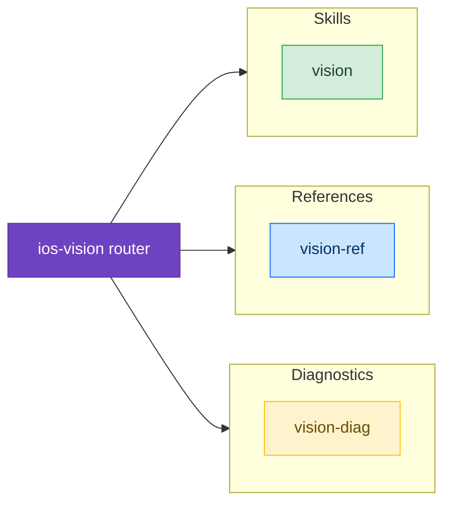

# Computer Vision

Skills for implementing computer vision features on Apple platforms using the Vision framework.

## Available Skills

### [Vision](/skills/computer-vision/vision)

Subject segmentation, hand/body pose detection, text recognition (OCR), barcode/QR scanning, document scanning, and person segmentation using the Vision framework.

## Available References

- [Vision API Reference](/reference/vision-ref) — Complete Vision framework API reference with code examples

## Available Diagnostics

- [Vision Diagnostics](/diagnostic/vision-diag) — Subject not detected, text not recognized, barcode issues, performance problems

## Example Prompts

- "How do I detect hand poses in a camera feed?"
- "I need to segment subjects from a photo background"
- "How do I scan barcodes with the Vision framework?"
- "Text recognition isn't working on my images"
