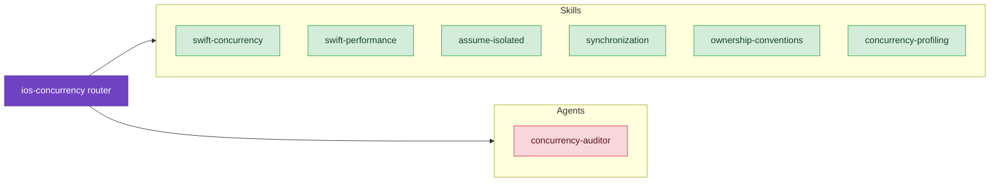

# Concurrency & Async

Master Swift's concurrency model and catch data races at compile time with strict concurrency patterns.

## Skills

- **[Swift Concurrency](/skills/concurrency/swift-concurrency)** – Swift 6 strict concurrency patterns, async/await, MainActor, Sendable, and actor isolation
  - *"I'm getting 'Main actor-isolated property accessed from nonisolated context' errors everywhere."*
  - *"My code is throwing 'Type does not conform to Sendable' warnings when passing data between threads."*
  - *"I have a stored task causing memory leaks. How do I write it correctly with weak self?"*

- **[assumeIsolated](/skills/concurrency/assume-isolated)** – Synchronous actor access for tests, legacy callbacks, and performance-critical code
  - *"How do I access MainActor state from a delegate callback that runs on main thread?"*
  - *"What's the difference between Task { @MainActor in } and MainActor.assumeIsolated?"*

- **[Synchronization](/skills/concurrency/synchronization)** – Thread-safe primitives: Mutex (iOS 18+), OSAllocatedUnfairLock, Atomic types
  - *"Should I use Mutex or actor for this hot path?"*
  - *"What's the difference between os_unfair_lock and OSAllocatedUnfairLock?"*

- **[Ownership Conventions](/skills/concurrency/ownership-conventions)** – borrowing/consuming modifiers for performance and noncopyable types
  - *"What does borrowing do in Swift?"*
  - *"How do I use ~Copyable types?"*

- **[Concurrency Profiling](/skills/concurrency/concurrency-profiling)** – Instruments workflows for async/await performance
  - *"My async code is slow, how do I profile it?"*
  - *"I think I have actor contention, how do I diagnose it?"*
