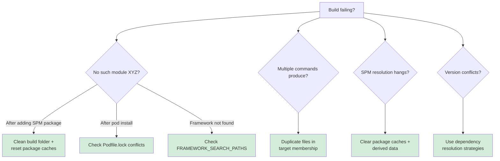

# Build Debugging

Dependency resolution and build configuration debugging for iOS projects. Covers CocoaPods, Swift Package Manager, and framework version conflicts.

## When to Use This Skill

Use this skill when you're:
- Getting "No such module" after adding a Swift Package
- Seeing "Multiple commands produce" the same output file
- Build works on one machine but fails on another
- CocoaPods install succeeds but build still fails
- SPM resolution hangs or times out
- Framework version conflicts in error logs

**Core principle:** Check dependencies BEFORE blaming code. 80% of persistent build failures are dependency resolution issues, not code bugs.

## Example Prompts

Questions you can ask Claude that will draw from this skill:

- "I added a Swift Package but I'm getting 'No such module' errors."
- "The build is failing with 'Multiple commands produce' the same output file."
- "CocoaPods installed dependencies but the build still fails."
- "My build works on my Mac but fails on CI."
- "I'm getting framework version conflicts."

## What's Covered

### Swift Package Manager Issues
- "No such module" after adding package
- SPM resolution hangs or times out
- Package cache clearing (DerivedData + SPM cache)
- FRAMEWORK_SEARCH_PATHS diagnostics

### CocoaPods Issues
- Podfile.lock conflicts
- Post-install build failures
- Linking errors
- Version constraint debugging

### Build Configuration Issues
- "Multiple commands produce" (duplicate target membership)
- Framework search path issues
- Environment-specific paths
- CI vs local differences

### Resolution Strategies
- Dependency graph analysis
- Version constraint resolution
- Reproducible build strategies

## Key Pattern

### Decision Tree



### SPM Package Not Found Fix

```bash
# Reset package caches
rm -rf ~/Library/Developer/Xcode/DerivedData
rm -rf ~/Library/Caches/org.swift.swiftpm

# Then in Xcode: File → Packages → Reset Package Caches
# Build again
```

### "Multiple Commands Produce" Fix

1. Find the file mentioned in error
2. Select file in Xcode project navigator
3. Open File Inspector (right panel)
4. Under "Target Membership", uncheck duplicate targets

## Documentation Scope

This page documents the `axiom-build-debugging` skill—dependency and build configuration debugging patterns Claude uses when you encounter persistent build failures.

**For environment issues:** See [xcode-debugging](/skills/debugging/xcode-debugging) for Derived Data, simulator, and zombie process diagnostics.

## Related

- [xcode-debugging](/skills/debugging/xcode-debugging) — Environment-first diagnostics for Xcode issues
- [swift-concurrency](/skills/concurrency/swift-concurrency) — Swift 6 build settings that can cause failures

## Resources

**WWDC**: 2022-110371 (Swift Package Manager), 2023-10164 (Xcode debugging)

**Docs**: /xcode/swift-packages, /xcode/build-system
