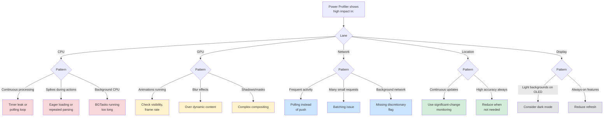

# Energy Optimization

Power Profiler workflows for identifying and fixing battery drain. Covers CPU, GPU, Network, Location, and Display subsystem diagnosis with anti-pattern fixes.

## When to Use This Skill

Use this skill when you're:
- App appears at top of Battery Settings
- Device gets hot during normal use
- Users report battery drain in reviews
- Xcode Energy Gauge shows sustained high impact
- Background runtime exceeds expectations
- Preparing for App Store release

**Core principle:** Measure before optimizing. Use Power Profiler to identify which subsystem dominates, then apply targeted fixes.

**For symptoms:** See [energy-diag](/diagnostic/energy-diag) for decision trees with time-cost analysis.

**For API reference:** See [energy-ref](/reference/energy-ref) for complete code examples from WWDC.

## Example Prompts

Questions you can ask Claude that will draw from this skill:

- "My app is draining battery faster than expected."
- "Device gets hot when using my app."
- "How do I use Power Profiler to find energy issues?"
- "My app uses too much energy in the background."
- "What's causing high CPU usage?"

## What's Covered

### Power Profiler Workflow
- Running baseline measurement (5 min)
- Identifying dominant subsystem
- Before/after verification

### CPU Subsystem
- Timer leaks and polling loops
- Eager loading vs lazy loading
- Background task duration
- Repeated parsing

### GPU Subsystem
- Animation visibility (hidden views still animate)
- Blur effects over dynamic content
- Complex compositing (shadows, masks)
- Frame rate optimization

### Network Subsystem
- Polling vs push notifications
- Request batching
- Discretionary flag for background
- Connection coalescing

### Location Subsystem
- Continuous updates vs significant-change
- Accuracy requirements
- Background location modes
- Deferred location updates

### Display Subsystem
- Dark mode for OLED battery savings
- Reduce brightness API usage
- EDR (Extended Dynamic Range) impact

## Key Pattern

### Energy Decision Tree



### Quick Power Profiler Workflow

```bash
# 1. Open Instruments
open -a Instruments

# 2. Select "Power Profiler" template
# 3. Record for 2-3 minutes of typical app usage
# 4. Identify which lane (CPU/GPU/Network/Location/Display) is high
# 5. Apply fixes for that subsystem
# 6. Record again to verify improvement
```

## Documentation Scope

This page documents the `axiom-energy` skill—Power Profiler workflows Claude uses when you're diagnosing battery drain in your iOS app.

**For symptom-based diagnosis:** See [energy-diag](/diagnostic/energy-diag) for decision trees starting from symptoms like "phone gets hot".

**For complete API reference:** See [energy-ref](/reference/energy-ref) for code examples and WWDC patterns.

## Related

- [energy-diag](/diagnostic/energy-diag) — Symptom-based energy troubleshooting
- [energy-ref](/reference/energy-ref) — Complete API reference with WWDC examples

## Resources

**WWDC**: 2025-226, 2025-227, 2022-10083

**Docs**: /xcode/improving-your-app-s-performance
