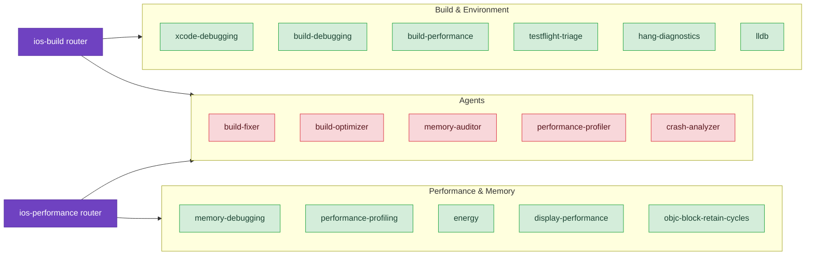

# Debugging & Troubleshooting

Systematic debugging strategies to solve issues faster and prevent common problems before they happen.

## Skills

- **[Accessibility Diagnostics](/diagnostic/accessibility-diag)** – WCAG compliance, VoiceOver testing, Dynamic Type support, App Store Review preparation
  - *"App Store rejected my app for VoiceOver issues. How do I fix missing labels?"*
  - *"How do I test my app for color contrast and Dynamic Type support?"*
  - **Command** [`/axiom:audit-accessibility`](/commands/accessibility/audit-accessibility) for quick WCAG compliance scanning

- **[Xcode Debugging](/skills/debugging/xcode-debugging)** – Environment-first diagnostics for mysterious Xcode issues, prevents 30+ minute rabbit holes
  - *"My build is failing with 'BUILD FAILED' but no error details. I haven't changed anything."*
  - *"Build succeeds but old code is executing. I restarted Xcode but it still happens."*

- **[TestFlight Triage](/skills/debugging/testflight-triage)** – Crash investigation and beta feedback review using Xcode Organizer
  - *"A beta tester said my app crashed. How do I find and understand the crash?"*
  - *"My crash logs aren't symbolicated. How do I fix that?"*
  - *"What does EXC_BAD_ACCESS mean and how do I fix it?"*

- **[Memory Debugging](/skills/debugging/memory-debugging)** – Systematic leak diagnosis with 5 patterns covering 90% of real-world issues
  - *"My app crashes after 10-15 minutes of use with no error messages. How do I find the leak?"*
  - *"View controllers don't deallocate after dismiss. How do I find the retain cycle?"*
  - **Command** [`/axiom:audit-memory`](/commands/debugging/audit-memory) for quick triage scanning

- **[Build Debugging](/skills/debugging/build-debugging)** – Dependency resolution for CocoaPods and Swift Package Manager conflicts
  - *"I added a Swift Package but I'm getting 'No such module' errors."*
  - *"Build works on my Mac but fails on CI. Both have the latest Xcode."*

- **[Performance Profiling](/skills/debugging/performance-profiling)** – Instruments decision trees for CPU, memory, battery profiling with 3 real-world examples
  - *"Scrolling is slow and I need to know if it's Core Data or SwiftUI."*
  - *"We have a deadline and my app feels slow. What should I optimize first?"*

- **[Energy Optimization](/skills/debugging/energy)** – Power Profiler workflows, subsystem diagnosis, anti-pattern fixes for battery drain
  - *"My app drains battery quickly. Where do I even start?"*
  - *"Users report the device gets hot when using my app."*
  - **Command** [`/axiom:audit energy`](/commands/utility/audit) for quick energy anti-pattern scanning

- **[Display Performance](/skills/debugging/display-performance)** – Variable refresh rate diagnosis for ProMotion, MTKView, CADisplayLink, system caps
  - *"My Metal app is stuck at 60fps on iPhone Pro. Why?"*
  - *"How do I configure MTKView for 120Hz?"*
  - *"UIScreen says 120 but I'm measuring 60fps. What's wrong?"*

- **[Deep Link Debugging](/skills/debugging/deep-link-debugging)** – Add debug-only deep links for automated testing and closed-loop debugging (60-75% faster iteration)
  - *"Claude Code can't navigate to specific screens for testing. How do I add debug deep links?"*
  - *"I want to take screenshots of different screens automatically."*
  - **Related** [`simulator-tester` agent](/agents/simulator-tester) for automated testing with deep links

- **[LLDB Debugging](/skills/debugging/lldb)** – 6 playbooks for crash triage, state inspection, `po` alternatives, breakpoint strategy, expression evaluation, and thread analysis
  - *"How do I use LLDB to debug a crash?"*
  - *"What's faster than po for inspecting variables?"*

- **[Timer Safety Patterns](/skills/debugging/timer-patterns)** – Timer invalidation, memory-safe usage, dispatch timers, CADisplayLink
  - *"My timer is causing a memory leak"*
  - *"What's the best way to implement a repeating timer?"*

- **[SwiftUI Debugging Diagnostics](/diagnostic/swiftui-debugging-diag)** – Systematic diagnostic workflows for complex SwiftUI issues with Instruments integration
  - *"Self._printChanges() shows unexpected patterns and I need to trace the data flow."*
  - *"View issues persist after basic troubleshooting. How do I diagnose with Instruments?"*
  - **Cross-reference** [SwiftUI Debugging](/skills/ui-design/swiftui-debugging) for basic troubleshooting patterns
