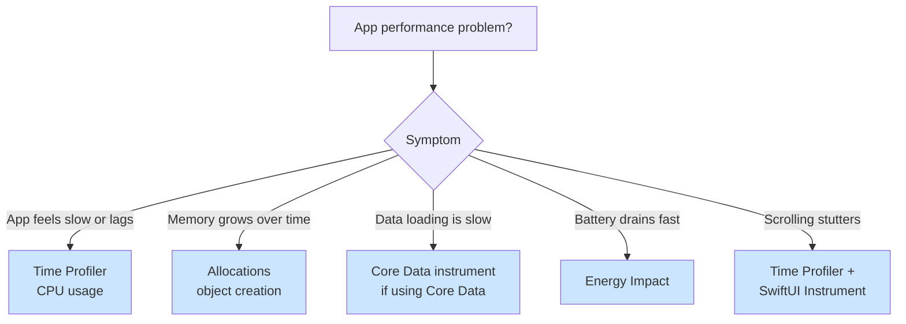

# Performance Profiling

Decision trees to choose the right Instruments tool and interpret results correctly. Covers Time Profiler, Allocations, Core Data, and Energy Impact.

## When to Use This Skill

Use this skill when you're:
- App feels slow (UI lags, loads take 5+ seconds)
- Memory grows over time in Xcode memory gauge
- Battery drains fast (device gets hot)
- Unsure which Instruments tool to use
- Profiling results are confusing or contradictory
- Want to profile proactively before users complain

**Core principle:** Measure before optimizing. Guessing wastes more time than profiling.

## Example Prompts

Questions you can ask Claude that will draw from this skill:

- "My app feels slow. Which Instruments tool should I use?"
- "How do I read Time Profiler results? What's the difference between Self Time and Total Time?"
- "Memory keeps growing but I don't see leaks. What's happening?"
- "How do I find N+1 queries with Core Data instrument?"
- "My app drains battery. How do I profile energy usage?"
- "Time Profiler shows a hot spot but fixing it didn't help. What did I miss?"
- "How do I add custom signposts to measure my own code paths?"
- "How do I set up automated performance regression tests?"

## What's Covered

### Decision Tree



### Time Profiler Deep Dive
- Self Time vs Total Time (critical distinction)
- Call tree navigation
- Identifying hot spots
- Common misinterpretations

### Allocations Deep Dive
- Object creation tracking
- Growth patterns (leak vs cache)
- Heap snapshots
- Mark Generation technique

### Core Data Deep Dive
- N+1 query detection with SQL logging
- Prefetching patterns
- Batch operation optimization

### Energy Impact
- CPU/GPU/Network subsystem analysis
- Background activity auditing
- Location services impact

### OSSignposter
- Custom performance instrumentation with `beginInterval`/`endInterval`
- Integration with Instruments Points of Interest lane
- When to use signposts vs Time Profiler

### Regression-Proofing Pipeline
- Three stages: OSSignposter (dev) → XCTest perf tests (CI) → MetricKit (production)
- All 7 XCTMetric types (clock, CPU, memory, storage, signpost, launch, hitch)
- Performance baselines and tolerance in Xcode
- Bridging signposts to automated tests with XCTOSSignpostMetric

### Pressure Scenarios
- Deadline pressure handling
- Manager authority pressure
- Misinterpretation prevention

## Key Pattern

### Self Time vs Total Time

```
Self Time: Time spent IN this function (not callees)
Total Time: Time spent in this function AND all callees

Example reading:
┌─────────────────────────────┬──────────┬────────────┐
│ Function                    │ Self Time│ Total Time │
├─────────────────────────────┼──────────┼────────────┤
│ processData()               │ 2ms      │ 500ms      │ ← NOT the problem
│   └─ expensiveSort()        │ 498ms    │ 498ms      │ ← THE problem
└─────────────────────────────┴──────────┴────────────┘

✅ Look at Self Time to find actual bottleneck
❌ Don't optimize processData() based on Total Time alone
```

### Quick Profiling Workflow

1. **Profile on real device** (not simulator)
2. **Record specific interaction** (not just app launch)
3. **Look at Self Time** first
4. **Find 80/20** (20% of code causing 80% of time)
5. **Measure after fix** (verify improvement)

## Documentation Scope

This page documents the `axiom-performance-profiling` skill—Instruments decision trees and workflows Claude uses when helping you profile performance issues. The skill contains complete tool tutorials, real-world examples, and pressure scenario handling.

**For SwiftUI-specific profiling:** See [swiftui-performance](/skills/ui-design/swiftui-performance) for the new SwiftUI Instrument in Instruments 26.

**For memory leaks specifically:** See [memory-debugging](/skills/debugging/memory-debugging) for retain cycle diagnosis.

## Related

- [swiftui-performance](/skills/ui-design/swiftui-performance) — SwiftUI Instrument for view update analysis
- [memory-debugging](/skills/debugging/memory-debugging) — Retain cycle and leak diagnosis
- [xcode-debugging](/skills/debugging/xcode-debugging) — Environment-first diagnostics before profiling
- [swift-concurrency](/skills/concurrency/swift-concurrency) — Background thread patterns for CPU work
- [swift-performance](/skills/concurrency/swift-performance) — Language-level optimization after identifying bottlenecks

## Resources

**WWDC**: 2023-10160, 2024-10217, 2025-308, 2025-312

**Docs**: /instruments, /xcode/performance, /os/ossignposter, /xctest/performance-tests
