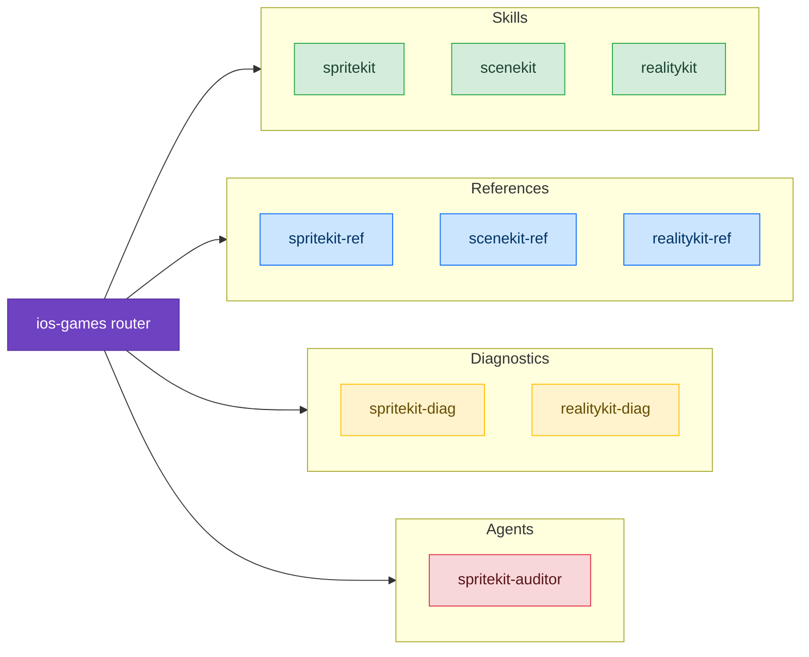

# Games

Skills for building games and interactive 3D experiences on Apple platforms using SpriteKit, SceneKit, and RealityKit.

## Available Skills

### SpriteKit

Complete guide to building 2D games with SpriteKit. Covers the scene graph model, physics engine (bitmask discipline, contact detection, body types), action system, game loop, performance optimization, and SwiftUI/Metal integration.

- [SpriteKit](/skills/games/spritekit) — Architecture, patterns, anti-patterns, and code review checklist

## Available Agents

- [spritekit-auditor](/agents/spritekit-auditor) — Scans SpriteKit code for physics bitmask issues, draw call waste, node accumulation, and action memory leaks

## Available References

- [SpriteKit API](/reference/spritekit-ref) — All 16 node types, physics body creation, complete action catalog, texture atlases, constraints, particles, SKRenderer

## Available Diagnostics

- [SpriteKit Diagnostics](/diagnostic/spritekit-diag) — Decision trees for contacts not firing, tunneling, frame drops, touch bugs, memory spikes, coordinate confusion, transition crashes

## Example Prompts

- "I'm building a SpriteKit game"
- "My physics contacts aren't firing"
- "Frame rate is dropping in my game"
- "How do I set up SpriteKit with SwiftUI?"
- "Objects pass through walls in my game"
- "Audit my SpriteKit code for issues"
