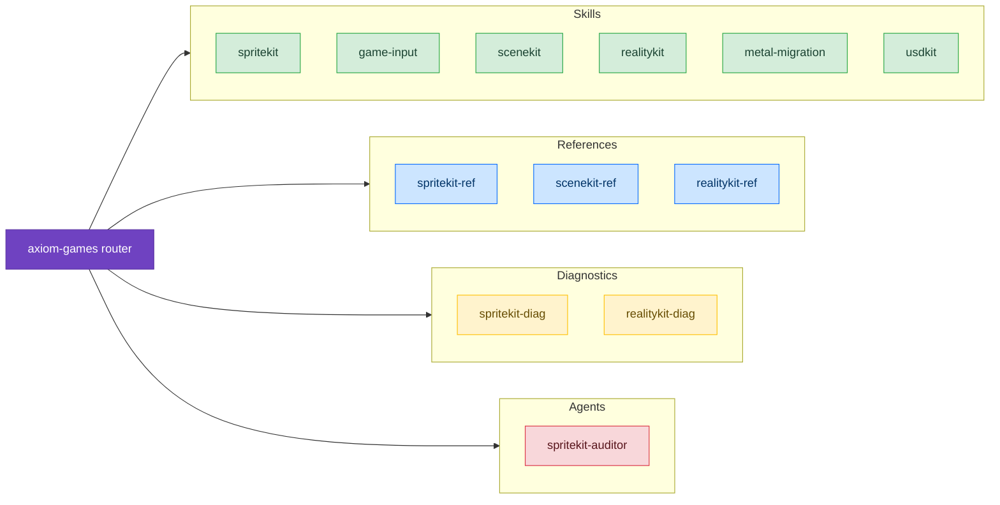

# Games

Skills for building games and interactive 3D experiences on Apple platforms using SpriteKit, SceneKit, and RealityKit.

```mermaid
flowchart LR
    classDef router fill:#6f42c1,stroke:#5a32a3,color:#fff
    classDef discipline fill:#d4edda,stroke:#28a745,color:#1b4332
    classDef reference fill:#cce5ff,stroke:#0d6efd,color:#003366
    classDef diagnostic fill:#fff3cd,stroke:#ffc107,color:#664d03
    classDef agent fill:#f8d7da,stroke:#dc3545,color:#58151c

    axiom_games["axiom-games router"]:::router

    subgraph skills_d["Skills"]
        spritekit["spritekit"]:::discipline
        game_input["game-input"]:::discipline
        scenekit["scenekit"]:::discipline
        realitykit["realitykit"]:::discipline
        metal_migration["metal-migration"]:::discipline
        usdkit["usdkit"]:::discipline
    end
    axiom_games --> skills_d

    subgraph skills_r["References"]
        spritekit_ref["spritekit-ref"]:::reference
        scenekit_ref["scenekit-ref"]:::reference
        realitykit_ref["realitykit-ref"]:::reference
    end
    axiom_games --> skills_r

    subgraph skills_diag["Diagnostics"]
        spritekit_diag["spritekit-diag"]:::diagnostic
        realitykit_diag["realitykit-diag"]:::diagnostic
    end
    axiom_games --> skills_diag

    subgraph agents_sg["Agents"]
        agent_ska["spritekit-auditor"]:::agent
    end
    axiom_games --> agents_sg
```

## Available Skills

### SpriteKit

Complete guide to building 2D games with SpriteKit. Covers the scene graph model, physics engine (bitmask discipline, contact detection, body types), action system, game loop, performance optimization, and SwiftUI/Metal integration.

- [SpriteKit](/skills/games/spritekit) – Architecture, patterns, anti-patterns, and code review checklist

### Game Input

Player input for games: on-screen touch controls with the TouchController framework (iOS/iPadOS), unified game controller handling through GCController, and the GameController additions new in the 27 releases (controller Home button settings, visionOS spatial accessories).

- [Game Input](/skills/games/game-input) – Touch controller setup, control catalog, adaptive layouts, interaction patterns, controller additions

### SceneKit

3D scene graph framework for rendering, animations, and physics:
- [SceneKit](/skills/games/scenekit) – Scene graphs, materials, animations, SceneKit → RealityKit migration
- [SceneKit API](/reference/scenekit-ref) – Complete SceneKit API reference and concept mapping

### RealityKit

Entity-Component-System framework for AR and 3D content:
- [RealityKit](/skills/games/realitykit) – ECS architecture, entity-component patterns, RealityView
- [RealityKit API](/reference/realitykit-ref) – Entity, Component, System, materials, animations
- [RealityKit Diagnostics](/diagnostic/realitykit-diag) – Entity loading failures, physics issues, rendering problems

### Metal Migration

Porting OpenGL/DirectX rendering to Metal:
- [Metal Migration](/skills/games/metal-migration) – Migration patterns, shader conversion, rendering pipeline
- [Metal Migration API](/reference/metal-migration-ref) – Shader translation, pipeline state objects
- [Metal Migration Diagnostics](/diagnostic/metal-migration-diag) – Shader compilation, rendering artifacts

### USDKit

Working with USD/USDZ 3D scene files in Swift (new in the 27 releases): opening and traversing stages, editing prims and attributes, exporting compressed USDZ packages, and rendering stages directly in RealityKit.

- [USDKit](/skills/games/usdkit) – Stages, traversal, editing, AccessibilityAPI schema, compressed export, USDStageComponent

## Available Agents

- [spritekit-auditor](/agents/spritekit-auditor) – Scans SpriteKit code for physics bitmask issues, draw call waste, node accumulation, and action memory leaks

## Available References

- [SpriteKit API](/reference/spritekit-ref) – All 16 node types, physics body creation, complete action catalog, texture atlases, constraints, particles, SKRenderer

## Available Diagnostics

- [SpriteKit Diagnostics](/diagnostic/spritekit-diag) – Decision trees for contacts not firing, tunneling, frame drops, touch bugs, memory spikes, coordinate confusion, transition crashes

## Example Prompts

- "I'm building a SpriteKit game"
- "My physics contacts aren't firing"
- "Frame rate is dropping in my game"
- "I'm porting my game to iPhone — how do I add touch controls?"
- "How do I handle game controller input?"
- "How do I set up SpriteKit with SwiftUI?"
- "Objects pass through walls in my game"
- "My game's layout breaks when the window is resized (iOS 27)"
- "Audit my SpriteKit code for issues"
- "How do I migrate from SceneKit to RealityKit?"
- "My RealityKit entities aren't loading"
- "I need to port my OpenGL renderer to Metal"
