# HealthKit and WorkoutKit

Read and write health data, run live workout sessions, schedule planned workouts, log wellbeing data, and work with clinical and mobility data. These skills cover HealthKit fundamentals, authorization, queries and change tracking, `HKWorkoutSession` and `HKLiveWorkoutBuilder`, WorkoutKit, State of Mind and Medications, and Health Records.

```mermaid
flowchart LR
    classDef router fill:#6f42c1,stroke:#5a32a3,color:#fff
    classDef discipline fill:#d4edda,stroke:#28a745,color:#1b4332

    axiom_health["axiom-health router"]:::router

    subgraph skills["Skills"]
        fundamentals["fundamentals"]:::discipline
        authorization["authorization-and-privacy"]:::discipline
        queries["queries"]:::discipline
        sync_background["sync-and-background"]:::discipline
        workouts["workouts"]:::discipline
        workoutkit["workoutkit"]:::discipline
        wellbeing["wellbeing-and-medications"]:::discipline
        clinical["clinical-and-mobility"]:::discipline
    end
    axiom_health --> skills
```

## When to Use These Skills

Use HealthKit and WorkoutKit skills when you're:

- Integrating HealthKit — setting up `HKHealthStore`, picking data types, requesting authorization
- Writing purpose strings and handling read-asymmetry around user privacy
- Reading data — sample queries, statistics rollups, Swift Concurrency query APIs
- Tracking changes — anchored queries, observer queries, background delivery
- Building workout apps — `HKWorkoutSession`, `HKLiveWorkoutBuilder`, recovery, multi-device mirroring
- Building custom or planned workouts with WorkoutKit
- Logging State of Mind, medications, or symptoms
- Working with Health Records (FHIR) or Mobility Health data

## Example Prompts

Questions you can ask Claude that will draw from these skills:

- "How do I request HealthKit authorization the right way — what do I put in my purpose strings?"
- "I need to show daily step totals for the last 30 days. What query should I use?"
- "My observer query only fires when the app is in the foreground. How do I get background delivery?"
- "How do I start a workout session on Apple Watch and mirror it to the iPhone?"
- "How do I schedule a custom interval workout with WorkoutKit?"
- "How do I log a State of Mind sample and ask for permission?"
- "Can I read a user's medications list, and what's the privacy model?"

## Skills

- **[Fundamentals](/skills/health/fundamentals)** — HealthKit framework model, `HKHealthStore`, sample vs. characteristic data
  - *"What's the difference between a sample type and a characteristic type?"*
  - *"Where should `HKHealthStore` live in my app architecture?"*

- **[Authorization and Privacy](/skills/health/authorization-and-privacy)** — Capability setup, `requestAuthorization`, purpose strings, read-asymmetry
  - *"What do I write in `NSHealthShareUsageDescription`?"*
  - *"Why can't I tell whether the user denied read access to a type?"*

- **[Queries](/skills/health/queries)** — `HKSampleQuery`, Swift Concurrency query APIs, `HKStatisticsCollectionQuery`, sample writes
  - *"How do I get the user's daily step count buckets for the last week?"*
  - *"What's the modern async/await way to query HealthKit?"*

- **[Sync and Background](/skills/health/sync-and-background)** — Anchored queries, observer queries, `HKDeletedObject`, background delivery
  - *"How do I sync heart rate samples from HealthKit to my server, including deletions?"*
  - *"How do I enable the `background-delivery` entitlement and get woken up when new data arrives?"*

- **[Workouts](/skills/health/workouts)** — `HKWorkoutSession`, `HKLiveWorkoutBuilder`, recovery, iOS/iPadOS/watchOS workout tracking
  - *"How do I start a running workout on the watch, and what session type should I use?"*
  - *"My workout crashes mid-run — how do I recover the session?"*

- **[WorkoutKit](/skills/health/workoutkit)** — Custom/planned workouts, scheduling, swimming workouts, previewing
  - *"How do I build a multi-step interval workout and schedule it on the user's watch?"*
  - *"How do I preview a WorkoutKit workout before the user starts it?"*

- **[Wellbeing and Medications](/skills/health/wellbeing-and-medications)** — State of Mind, Medications API, symptom logging
  - *"How do I let the user log State of Mind from my app?"*
  - *"What does the Medications API let me read or write?"*

- **[Clinical and Mobility](/skills/health/clinical-and-mobility)** — Health Records (FHIR), Mobility Health App, motion-based health
  - *"How do I read the user's lab results from Health Records?"*
  - *"What mobility metrics can I read, and what do they mean?"*

## Related

- **[axiom-watchos](/skills/watchos/)** — Watch-specific workout presentation, Smart Stack placement, and Always On display
- **[axiom-concurrency](/skills/concurrency/swift-concurrency)** — Swift 6 actor isolation and Sendable rules that apply to HealthKit query callbacks
- **[axiom-swiftui](/skills/ui-design/)** — Charts rendering for health data and `@Observable` view models
- **[axiom-data](/skills/persistence/)** — Cross-platform sync patterns (CloudKit, GRDB) for the parts of your app data that aren't in HealthKit
- **[axiom-security](/agents/security-privacy-scanner)** — Keychain, encryption, data-protection entitlements for sensitive health-adjacent data
