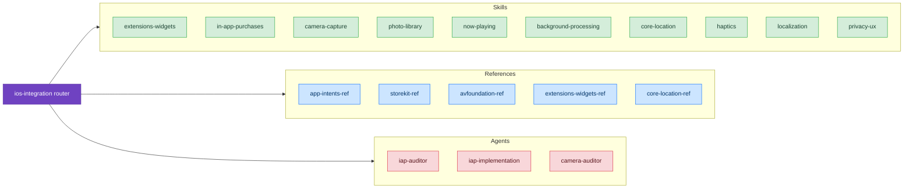

# Apple Intelligence & Integration

Skills for integrating your app with Apple's system-level experiences: Siri, Apple Intelligence, Shortcuts, Spotlight, and more.

## Available Skills

### [Foundation Models](./foundation-models)

On-device AI with Apple's Foundation Models framework (iOS 26+):
- **LanguageModelSession** — Text generation and conversations
- **@Generable** — Structured output with Swift types
- **Streaming** — Progressive response display
- **Tool calling** — Extend model capabilities

**When to use** Implementing on-device AI features, structured output, preventing context overflow

**Requirements** iOS 26+, A17+ or M-series chip

---

### [Background Processing](./background-processing)

BGTaskScheduler implementation and debugging:
- **BGAppRefreshTask** — Keep content fresh (~30s)
- **BGProcessingTask** — Maintenance work (overnight, charging)
- **BGContinuedProcessingTask** — User-initiated continuation (iOS 26+)
- **Debugging** — "Task never runs" decision trees, LLDB commands

**When to use** Implementing background tasks, debugging execution issues, understanding scheduling factors

**Requirements** iOS 13+, iOS 26+ for BGContinuedProcessingTask

---

### [Networking](./networking)

Network.framework patterns for custom protocols:
- **NWConnection** — iOS 12-25 completion-based API
- **NetworkConnection** — iOS 26+ async/await API
- **TLV Framing** — Message boundaries
- **Service Discovery** — Bonjour and Wi-Fi Aware

**When to use** UDP/TCP connections, peer-to-peer, custom protocols (NOT HTTP — use URLSession)

**Requirements** iOS 12+

---

### [Core Location](./core-location)

Implementation patterns for location services:
- **Authorization Strategy** — When In Use vs Always, progressive upgrade
- **Monitoring Approach** — CLLocationUpdate, CLMonitor, significant-change
- **Background Location** — CLBackgroundActivitySession, relaunch recovery
- **Geofencing** — 20-condition limit, radius requirements

**When to use** Implementing location features, choosing authorization strategy, debugging background location, geofencing

**Requirements** iOS 14+ (iOS 17+ for modern APIs)

---

### [MapKit](./mapkit)

Map implementation patterns for SwiftUI and UIKit:
- **SwiftUI Map vs MKMapView** — Decision tree based on requirements
- **Annotation Strategy** — Direct, clustering, or server-side by count
- **Search & Directions** — MKLocalSearch, MKLocalSearchCompleter, MKDirections
- **8 Anti-Patterns** — Common mistakes with time costs

**When to use** Adding maps, implementing annotations, search, directions, debugging map issues

**Requirements** iOS 17+ for SwiftUI Map, iOS 3+ for MKMapView

---

### [App Intents Integration](/reference/app-intents-ref)

Comprehensive guide to the App Intents framework for exposing app functionality to:
- **Siri & Apple Intelligence** — Voice commands and intelligent automation
- **Shortcuts** — User-created workflows and automations
- **Spotlight** — System-wide search integration
- **Focus Filters** — Context-aware content filtering
- **Widgets & Live Activities** — Dynamic system UI

#### Key Features
- Three building blocks: AppIntent, AppEntity, AppEnum
- Parameter validation and natural language summaries
- Entity queries for content discovery
- Background vs foreground execution patterns
- Authentication policies and security
- WWDC 2025 updates: IndexedEntity, Apple Intelligence integration, Mac Automations

**When to use** Exposing app functionality to system experiences, implementing Shortcuts support, debugging intent resolution failures

**Requirements** iOS 16+

---

### [Apple Documentation Access](./apple-docs)

Direct access to Apple's official for-LLM markdown documentation bundled in Xcode:
- **20 Guide Topics** -- Liquid Glass, Foundation Models, Swift Charts 3D, SwiftData, concurrency
- **32 Compiler Diagnostics** -- Swift compiler errors with official explanations and code fixes
- **MCP Integration** -- Auto-detected from Xcode, stays current with updates

**When to use** Authoritative API details, Swift compiler error explanations, official code examples

**Requirements** Xcode installed locally

---

## Integration Categories

### System Services
- **Siri & Voice Control** — Natural language command handling
- **Apple Intelligence** — AI-powered automation and reasoning
- **Shortcuts** — Custom workflow creation
- **Spotlight** — System-wide search
- **Background Processing** — BGTaskScheduler, background URLSession

### Context & Personalization
- **Focus Filters** — Context-aware content filtering
- **Live Activities** — Dynamic Lock Screen updates
- **Widgets** — Home/Lock Screen content

### Platform-Specific
- **Action Button** — Apple Watch Ultra quick actions
- **Mac Automations** — Automated workflows on macOS
- **Spotlight on Mac** — Desktop search integration

---

## Getting Started

1. **Define your app's capabilities** — What actions should users be able to perform?
2. **Choose building blocks** — AppIntent for actions, AppEntity for content
3. **Implement intents** — Create AppIntent conforming types
4. **Test with Shortcuts** — Verify intent appears and executes correctly
5. **Add to Siri** — Test voice command handling
6. **Integrate with Apple Intelligence** — Enable AI-powered automation

---

## See Also

- [Apple App Intents Documentation](https://developer.apple.com/documentation/appintents)
- [WWDC 2025-260: What's new in App Intents](https://developer.apple.com/videos/)
- [Human Interface Guidelines: Siri](https://developer.apple.com/design/human-interface-guidelines/siri)
