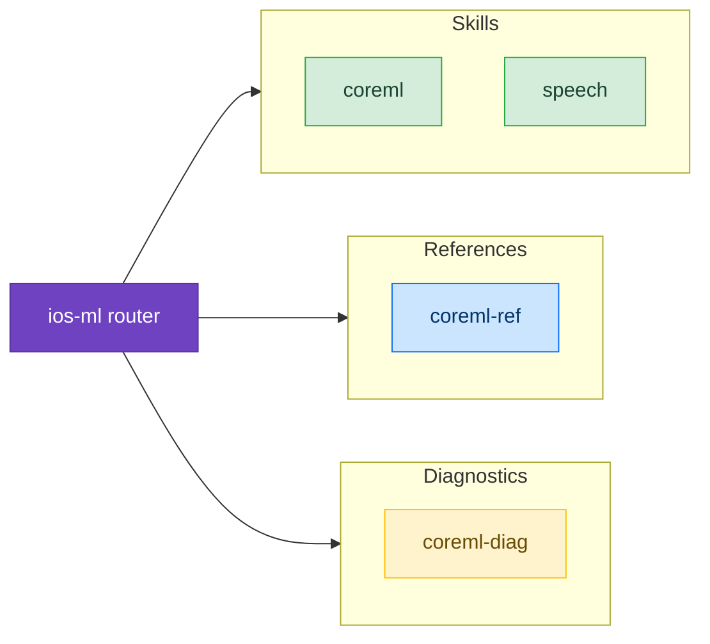

# Machine Learning

Skills for deploying and running machine learning models on Apple devices using CoreML and related frameworks.

## Available Skills

### [CoreML](/skills/machine-learning/coreml)

Deploy custom ML models on-device — model conversion with coremltools, compression (quantization, palettization), stateful models with KV-cache, MLTensor operations, and LLM inference patterns.

### [Speech](/skills/machine-learning/speech)

Speech-to-text with SpeechAnalyzer (iOS 26+) — live transcription from microphone, file transcription, custom vocabulary, and language detection.

## Available References

- [CoreML API Reference](/reference/coreml-ref) — CoreML API reference, MLTensor, coremltools, state management

## Available Diagnostics

- [CoreML Diagnostics](/diagnostic/coreml-diag) — Model load failures, slow inference, compression accuracy loss

## Example Prompts

- "How do I convert a PyTorch model to CoreML?"
- "My CoreML model is too large, how do I compress it?"
- "How do I implement speech-to-text with SpeechAnalyzer?"
- "Model inference is slow, how do I optimize it?"
