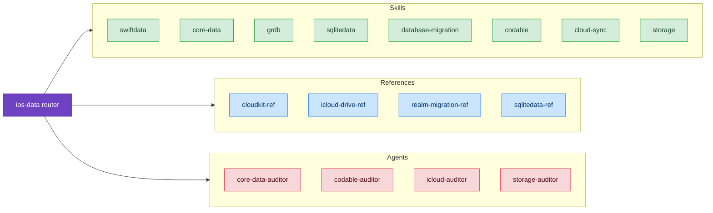

# Persistence

Comprehensive database patterns for safe schema evolution and choosing the right persistence framework for your needs.

## Skills

- **[Database Migration](/skills/persistence/database-migration)** – Safe schema evolution for SQLite/GRDB/SwiftData, prevents data loss
  - *"I need to add a column to my live app without losing user data. How do I migrate safely?"*
  - *"I'm getting 'cannot add NOT NULL column' errors. What does this mean?"*

- **[SQLiteData](/skills/persistence/sqlitedata)** – Point-Free's SQLiteData patterns, batch performance, and CloudKit sync
  - *"I'm building a task app with type-safe queries. How do I set up @Table models and filter by priority?"*
  - *"I'm importing 50,000 notes from an API. How do I batch insert efficiently without blocking the UI?"*

- **[SQLiteData Migration](/skills/persistence/sqlitedata-migration)** – Migration guide from SwiftData to SQLiteData
  - *"SwiftData's CloudKit sync is causing conflicts. Should I migrate to SQLiteData?"*
  - *"How do I convert my @Model classes to @Table? What's the equivalent of @Relationship?"*

- **[GRDB](/skills/persistence/grdb)** – Raw SQL queries, ValueObservation, and DatabaseMigrator patterns
  - *"I need to query messages with their authors and reaction counts in one query. How do I write the JOIN?"*
  - *"I want to observe notes with a specific tag and update the UI whenever they change."*

- **[SwiftData](/skills/persistence/swiftdata)** – iOS 26+ features, @Model, @Query patterns, and Swift 6 concurrency
  - *"I have a notes app with folders. How do I filter and sort with @Query?"*
  - *"When a user deletes a task list, all tasks should auto-delete too. How do I set up cascading deletes?"*

- **[Core Data](/skills/persistence/core-data)** – Stack setup, concurrency patterns, relationship modeling for iOS 16 and earlier
  - *"I'm targeting iOS 16. How do I set up Core Data with CloudKit sync?"*
  - *"I'm getting thread-confinement errors. How do I use background contexts correctly?"*

- **[Codable](/skills/persistence/codable)** – JSON encoding/decoding, Codable conformance, handling decode errors, date strategies
  - *"How do I handle a JSON field that could be a string or a number?"*
  - *"What's the best way to handle date formatting with Codable?"*

- **[Cloud Sync](/skills/persistence/cloud-sync)** – CloudKit vs iCloud Drive, offline-first patterns, conflict resolution
  - *"Should I use CloudKit or iCloud Drive for my app's data?"*
  - *"How do I handle sync conflicts when users edit on multiple devices?"*

- **[SwiftData Migration](/skills/persistence/swiftdata-migration)** – Custom schema migration strategies for SwiftData
  - *"How do I create a custom SwiftData migration?"*
  - *"My SwiftData migration is crashing on device"*
