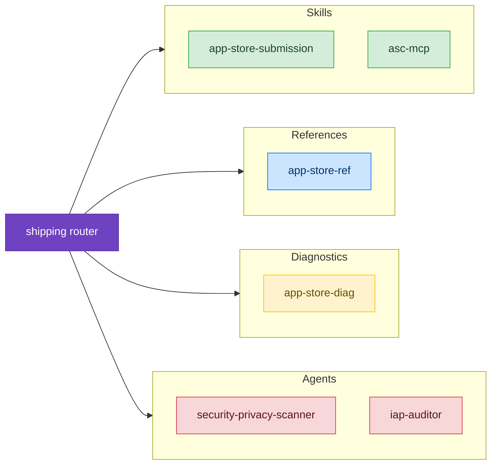

# Shipping & App Store

Skills for preparing, submitting, and troubleshooting App Store submissions. Covers pre-flight checklists, metadata requirements, rejection diagnosis, and appeal processes.

## Available Skills

### [App Store Submission](./app-store-submission)

Systematic pre-flight checklist that catches 90% of App Store rejection causes before submission:
- **Pre-Flight Checklist** — Build config, privacy, metadata, accounts, review info, content, regional compliance
- **Anti-Patterns** — 8 common mistakes with time costs and prevention
- **Decision Tree** — "Is my app ready to submit?" walkthrough
- **Pressure Scenarios** — Deadline pressure, repeat rejections, "just a bug fix" complacency

**When to use** Preparing to submit an app or update, first-time submission, running a pre-submission audit

**Requirements** Apple Developer Program enrollment, Xcode 16+

---

### [App Store Submission Reference](/reference/app-store-ref)

Complete reference for every App Store submission requirement across 10 parts:
- **Metadata Fields** — Character limits, screenshot specs, localization
- **Privacy Requirements** — Manifest schema, nutrition labels, ATT, Required Reason APIs
- **App Review Guidelines** — All sections 1-5 quick reference
- **Age Rating System** — 5-tier ratings with capability declarations
- **WWDC25 Changes** — Draft submissions, accessibility labels, tags

**When to use** Looking up specific field requirements, checking guideline numbers, verifying privacy manifest schema

---

### [App Store Rejection Diagnostics](/diagnostic/app-store-diag)

Systematic rejection diagnosis from message to fix:
- **7 Diagnostic Patterns** — App Completeness, Metadata, Privacy, SIWA, Business, Binary, Appeals
- **Decision Tree** — Map rejection message to correct pattern
- **Production Crisis** — Multi-rejection scenario with escalation protocol
- **Quick Reference** — Rejection type to fix time mapping

**When to use** App rejected by App Review, submission blocked, planning an appeal

---

### [App Store Connect MCP](./asc-mcp)

Programmatic App Store Connect access via asc-mcp MCP server (~208 tools):
- **Release Pipeline** — Create versions, attach builds, submit for review, phased release
- **TestFlight Distribution** — Create groups, add testers, distribute builds, send notifications
- **Review Management** — List reviews, filter by rating, respond to reviews
- **Worker Filtering** — 3 presets to reduce context from 208 tools to 34-55
- **Multi-Company** — Switch between App Store Connect accounts

**When to use** Automating ASC workflows from Claude Code, bulk operations (respond to reviews, distribute to groups), programmatic submission

**Requirements** macOS 14+, App Store Connect API key, Mint, asc-mcp 1.4.0+

---

## Getting Started

1. **Before submission** — Use [App Store Submission](./app-store-submission) to run the pre-flight checklist
2. **Need specific details** — Use [App Store Reference](/reference/app-store-ref) for field specs and guideline numbers
3. **After rejection** — Use [App Store Diagnostics](/diagnostic/app-store-diag) to diagnose and fix

---

## See Also

- [StoreKit 2 Reference](/reference/storekit-ref) — In-app purchase implementation
- [Privacy UX Patterns](/reference/privacy-ux) — Privacy manifest and ATT implementation
- [App Store Connect](/reference/app-store-connect-ref) — ASC navigation, crash data, metrics
- [App Store Connect MCP Reference](/reference/asc-mcp-ref) — asc-mcp tool parameters and API constraints
