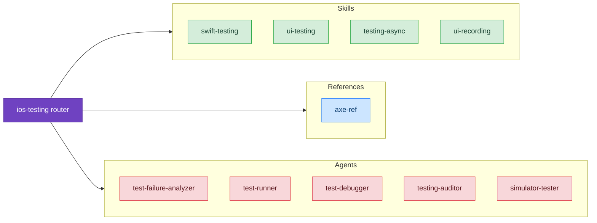

# Testing

Skills for writing fast, reliable tests on iOS.

## Skills

### [Swift Testing](./swift-testing)
Modern Swift Testing framework with `@Test`, `#expect`, parameterized tests, and the ability to run without simulator. Covers async testing, TestClock, migration from XCTest.

### [Testing Async Code](./testing-async)
Patterns for testing async/await with Swift Testing — confirmation for callbacks, @MainActor tests, parallel execution, XCTest migration.

### [UI Testing](/skills/ui-design/ui-testing)
XCUITest patterns for reliable UI tests. Condition-based waiting, Recording UI Automation (WWDC 2025), cross-device testing.

## Quick Comparison

| Need | Skill |
|------|-------|
| Unit tests (logic, models) | [Swift Testing](./swift-testing) |
| Testing async code | [Testing Async](./testing-async) |
| Callback confirmation patterns | [Testing Async](./testing-async) |
| UI tests (tap, swipe, screens) | [UI Testing](/skills/ui-design/ui-testing) |
| Tests without simulator | [Swift Testing](./swift-testing) |
| Flaky UI tests | [UI Testing](/skills/ui-design/ui-testing) |
| Migrating from XCTest | [Swift Testing](./swift-testing) |
