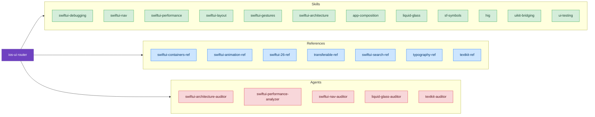

# UI & Design

Build beautiful, performant interfaces with expert guidance on the latest Apple design systems and testing practices.

## Skills

- **[Human Interface Guidelines](/skills/ui-design/hig)** – Quick design decisions, compliance checklists, defending design choices
  - *"Should my app have a dark background?"*
  - *"What's the right background color for my list view?"*
  - *"How do I push back on design requests that violate HIG?"*

- **[HIG Reference](/reference/hig-ref)** – Comprehensive HIG coverage with code examples (color, typography, shapes, materials, accessibility, platform-specific)
  - *"What are Apple's semantic colors and when should I use them?"*
  - *"How do I implement Base vs Elevated backgrounds?"*
  - *"What's the concentricity principle for iOS 26 shape geometry?"*

- **[Liquid Glass](/skills/ui-design/liquid-glass)** – Apple's new material design system (iOS 26+) with expert review checklist
  - *"I'm implementing Liquid Glass but the lensing effect looks like regular blur. What am I missing?"*
  - *"How do I ensure text contrast and legibility while using Liquid Glass?"*

- **[SF Symbols](/skills/ui-design/sf-symbols)** – Rendering modes, symbol effects, Draw animations (iOS 26+), custom symbol authoring
  - *"My SF Symbol shows as a flat color but I want it to have depth."*
  - *"How do I use the new SF Symbols 7 Draw animations?"*
  - *"Which symbol effect should I use for a loading indicator?"*
  - **Reference** [SF Symbols Reference](/reference/sf-symbols-ref) for complete API with UIKit equivalents

- **[SwiftUI Performance](/skills/ui-design/swiftui-performance)** – Master the new SwiftUI Instrument in Instruments 26, identify bottlenecks with Cause & Effect Graph
  - *"My animations stutter and scrolling is janky. How do I know if SwiftUI is the bottleneck?"*
  - *"Views are updating way too often even though their data hasn't changed."*

- **[SwiftUI Debugging](/skills/ui-design/swiftui-debugging)** – View updates, preview crashes, layout issues with Self._printChanges() debugging, @Observable patterns (iOS 17+), and view identity understanding
  - *"List item doesn't update even though the data changed."*
  - *"Preview keeps crashing with mysterious dependency errors."*
  - **Advanced** [SwiftUI Debugging Diagnostics](/diagnostic/swiftui-debugging-diag) for Instruments-based investigation

- **[UI Testing](/skills/ui-design/ui-testing)** – Recording UI Automation (Xcode 26) and condition-based waiting for reliable tests
  - *"Tests pass locally but fail in CI with no obvious reason."*
  - *"How do I replace sleep() timeouts with reliable condition-based waiting?"*

- **[SwiftUI Architecture](/skills/ui-design/swiftui-architecture)** – Feature-level patterns (MVVM, TCA, Coordinator), property wrapper decisions, refactoring workflows
  - *"Should I use MVVM, TCA, or Apple's vanilla patterns?"*
  - *"How do I make my SwiftUI code testable?"*

- **[App Composition](/skills/ui-design/app-composition)** – App-level patterns: @main structure, root view switching, scene lifecycle, modularization
  - *"How do I switch between login and main screens without flicker?"*
  - *"Where should auth state live in my app?"*
  - *"When should I split my app into modules?"*
