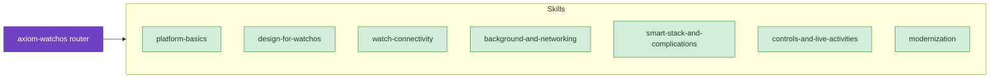

# watchOS

Build Apple Watch apps the supported way — SwiftUI-first, independent, and built with the watchOS 26 SDK. These skills cover app structure, Watch Connectivity, Smart Stack widgets and complications, controls, Live Activities, background tasks, and migration from WatchKit and ClockKit.

## When to Use These Skills

Use watchOS skills when you're:

- Starting a new watchOS app or adding a watchOS target to an existing iOS app
- Preparing for the April 2026 watchOS 26 SDK and ARM64 submission deadlines
- Coordinating data and state between a paired iPhone and Apple Watch
- Building complications, Smart Stack widgets, or controls for watch surfaces
- Presenting Live Activities on the watch
- Scheduling background refreshes or dealing with TN3135 networking limits
- Migrating WatchKit or ClockKit code to SwiftUI and WidgetKit

## Example Prompts

Questions you can ask Claude that will draw from these skills:

- "How do I structure a new watchOS app that also has a companion iPhone app?"
- "My watch app needs to work without the iPhone installed. What changes?"
- "How do I send a file from the phone to the watch and handle delivery failure?"
- "My complication is stale — how should I update it from a push notification?"
- "How do I migrate my ClockKit complication to WidgetKit?"
- "What are the watchOS 26 submission requirements?"

## Skills

- **[Platform Basics](/skills/watchos/platform-basics)** — App structure, independent vs. companion, entry point, submission gates
  - *"Starting a new watchOS app — watch-only, companion, or independent?"*
  - *"What do I need to verify before submitting to the App Store in April 2026?"*

- **[Design for watchOS](/skills/watchos/design-for-watchos)** — watchOS HIG, glanceable UX, navigation model
  - *"How should I structure navigation on the watch — NavigationStack or a TabView?"*
  - *"My watch screens feel cluttered. What does Apple recommend for glanceable UX?"*

- **[Watch Connectivity](/skills/watchos/watch-connectivity)** — WCSession, paired-device data transfer, Family Setup
  - *"How do I sync preferences between my iPhone and Apple Watch apps?"*
  - *"`transferUserInfo` vs. `updateApplicationContext` vs. `sendMessage` — which one do I use?"*

- **[Background and Networking](/skills/watchos/background-and-networking)** — Background tasks, freshness scheduling, TN3135 networking limits
  - *"How do I refresh my watch app's data while it's on the wrist?"*
  - *"Why do my network requests on the watch hit limits the iPhone doesn't?"*

- **[Smart Stack and Complications](/skills/watchos/smart-stack-and-complications)** — WidgetKit on the watch, RelevanceKit, ClockKit bridging
  - *"How do I make my complication show up in the Smart Stack at the right time?"*
  - *"My complication isn't updating — what's the right way to push new data?"*

- **[Controls and Live Activities](/skills/watchos/controls-and-live-activities)** — Controls on watch surfaces, Live Activities on watch
  - *"How do I add a control to the watch's Smart Stack and Control Center?"*
  - *"My Live Activity shows on iPhone — how do I make it look right on the watch?"*

- **[Modernization](/skills/watchos/modernization)** — WatchKit to SwiftUI, ClockKit to WidgetKit
  - *"My app still uses a WatchKit Extension — what's the migration path?"*
  - *"How do I replace my ClockKit complication provider with WidgetKit?"*

## Related

- **[axiom-health](/skills/health/)** — HealthKit sessions and WorkoutKit. Use when the watch app records workouts or reads health data
- **[axiom-swiftui](/skills/ui-design/)** — General SwiftUI patterns (state, layout, animations) that apply across iOS, watchOS, and macOS
- **[axiom-design](/skills/ui-design/hig)** — General Apple HIG, Liquid Glass, SF Symbols, typography
- **[axiom-accessibility](/diagnostic/accessibility-diag)** — VoiceOver rotor, AssistiveTouch, Double Tap — the watch-specific accessibility surfaces
- **[axiom-integration](/skills/integration/extensions-widgets)** — iOS-side widgets, core ActivityKit, and App Intents that a watch app may coordinate with
