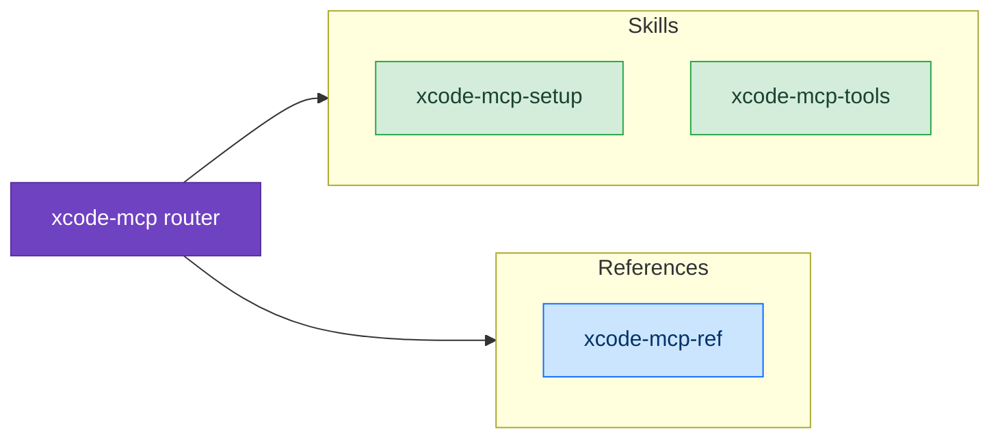

# Xcode MCP Integration

Xcode 26.3 ships a built-in MCP (Model Context Protocol) server that exposes 20 IDE tools to external AI clients. This skill suite teaches Claude how to set up, connect, and use Xcode's MCP tools effectively — from building and testing to rendering SwiftUI previews programmatically.

## When to Use

Use these skills when:
- Setting up `xcrun mcpbridge` for the first time
- Building, testing, or previewing your project via MCP tools
- Troubleshooting mcpbridge connection or permission issues
- Learning Xcode MCP workflow patterns (BuildFix loop, TestFix loop)
- Looking up specific tool parameters and schemas

## Example Prompts

Questions you can ask Claude that will draw from these skills:

- "How do I set up Xcode MCP with Claude Code?"
- "Build my project using MCP tools"
- "My mcpbridge connection keeps failing"
- "What parameters does BuildProject take?"
- "Run just the failing test, not the whole suite"
- "Render the preview for my ContentView"
- "Cursor can't parse Xcode's MCP responses"

## What This Skill Provides

- **Setup guides** for 5 MCP clients (Claude Code, Cursor, Codex, VS Code, Gemini CLI)
- **Workflow patterns** — iterative BuildFix loops, TestFix loops, preview verification
- **All 20 tool references** — parameters, return schemas, and gotchas
- **Window targeting** — tab identifier management and multi-Xcode support
- **Troubleshooting** — permission dialogs, schema compliance, stale connections
- **Conflict resolution** — when to use MCP tools vs `xcodebuild` vs standard file tools

## Skill Suite

This is a router skill with three specialized sub-skills:

| Skill | Type | Purpose |
|-------|------|---------|
| `axiom-xcode-mcp` | Router | Routes to the right specialized skill |
| `axiom-xcode-mcp-setup` | Specialized | Enable, connect, and troubleshoot per client |
| `axiom-xcode-mcp-tools` | Discipline | Workflow patterns, gotchas, window targeting |
| `axiom-xcode-mcp-ref` | Reference | All 20 tools with params, schemas, examples |

## The 20 Xcode MCP Tools

| Category | Tools |
|----------|-------|
| Discovery | `XcodeListWindows` |
| File Read | `XcodeRead`, `XcodeGlob`, `XcodeGrep`, `XcodeLS` |
| File Write | `XcodeWrite`, `XcodeUpdate`, `XcodeMakeDir` |
| File Destructive | `XcodeRM`, `XcodeMV` |
| Build | `BuildProject`, `GetBuildLog` |
| Test | `RunAllTests`, `RunSomeTests`, `GetTestList` |
| Diagnostics | `XcodeListNavigatorIssues`, `XcodeRefreshCodeIssuesInFile` |
| Execution | `ExecuteSnippet` |
| Preview | `RenderPreview` |
| Search | `DocumentationSearch` |

## Requirements

- **Xcode 26.3+** with MCP enabled in Settings > Intelligence
- **macOS** with Xcode installed and running
- At least one project/workspace open in Xcode

## Related

- [Xcode Debugging](/skills/debugging/xcode-debugging) — Environment-first diagnostics (Derived Data, zombie processes) — use when the issue is Xcode environment, not MCP
- [Apple Documentation Access](/skills/integration/apple-docs) — Reads Xcode-bundled for-LLM guides — use for bundled docs, while `DocumentationSearch` MCP tool searches Apple's online corpus
- [Build Debugging](/skills/debugging/build-debugging) — Dependency resolution for CocoaPods/SPM — use for traditional build debugging without MCP
