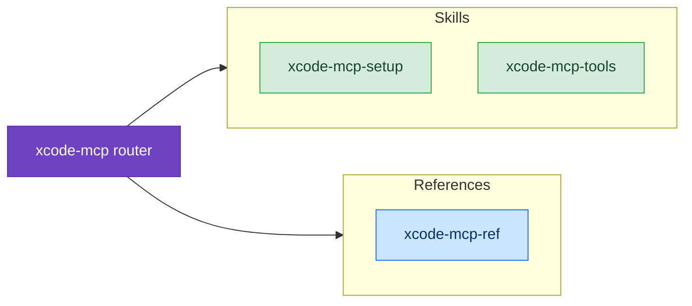

# Xcode MCP Integration

Xcode ships a built-in MCP (Model Context Protocol) server that exposes IDE tools to external AI clients — 54 of them on Xcode 27. This skill suite teaches Claude how to set up, connect, and use those tools effectively, from building and testing to rendering SwiftUI previews programmatically. On Xcode 27 the server can also run headless, with Xcode closed.

```mermaid
flowchart LR
    classDef router fill:#6f42c1,stroke:#5a32a3,color:#fff
    classDef discipline fill:#d4edda,stroke:#28a745,color:#1b4332
    classDef reference fill:#cce5ff,stroke:#0d6efd,color:#003366

    axiom_xcode_mcp["xcode-mcp router"]:::router

    subgraph skills_d["Skills"]
        xcode_mcp_setup["xcode-mcp-setup"]:::discipline
        xcode_mcp_tools["xcode-mcp-tools"]:::discipline
    end
    axiom_xcode_mcp --> skills_d

    subgraph skills_r["References"]
        xcode_mcp_ref["xcode-mcp-ref"]:::reference
    end
    axiom_xcode_mcp --> skills_r
```

## When to Use

Use these skills when:
- Setting up `xcrun mcpbridge` for the first time
- Running MCP headless, in CI or without keeping Xcode open
- Building, testing, or previewing your project via MCP tools
- Troubleshooting connection, permission, or hung-call problems
- Learning Xcode MCP workflow patterns (workspace bootstrap, BuildFix loop, TestFix loop)
- Looking up specific tool parameters and schemas

## Example Prompts

Questions you can ask Claude that will draw from these skills:

- "How do I set up Xcode MCP with Claude Code?"
- "Build my project using MCP tools"
- "How do I run Xcode MCP without keeping Xcode open?"
- "My mcpbridge connection keeps failing"
- "What parameters does BuildProject take?"
- "Run just the failing test, not the whole suite"
- "Render the preview for my ContentView"
- "My MCP tool call just hangs and never returns"

## What This Skill Provides

- **Setup guides** for 5 MCP clients (Claude Code, Cursor, Codex, VS Code, Gemini CLI), in attached or headless mode
- **Workflow patterns** – workspace bootstrap, iterative BuildFix loops, TestFix loops, preview verification
- **All 54 tool references** – parameters, return schemas, and gotchas
- **Workspace targeting** – identifier management, and why it's required even with one project open
- **Troubleshooting** – hung calls, agent approval, empty tool lists, stale connections
- **Conflict resolution** – when to use MCP tools vs `xcodebuild` vs standard file tools

## Skill Suite

This is a router skill with four sub-skills:

| Skill | Type | Purpose |
|-------|------|---------|
| `axiom-xcode-mcp` | Router | Routes to the right specialized skill |
| `xcode-mcp-setup` | Discipline | Enable, connect, and troubleshoot per client |
| `xcode-mcp-tools` | Discipline | Workflow patterns, gotchas, workspace targeting |
| `xcode-mcp-ref` | Reference | All 54 tools with params, schemas, examples |
| `axe-ref` | Reference | AXe simulator input (`tap`/`type`/`swipe`), documented at [AXe](/reference/axe-ref) |

## The Xcode MCP Tools

The server exposes 53 tools with no workspace open and 54 with one — `DocumentationSearch` is the only workspace-gated tool. The full per-tool reference is in [Xcode MCP Reference](/reference/xcode-mcp-ref).

| Category | Tools |
|----------|-------|
| Workspaces & Projects | `XcodeListWorkspaces`, `XcodeOpenWorkspace`, `XcodeCloseWorkspace`, `XcodeNewProject`, `XcodeListTemplates`, `XcodeNewTarget`, `XcodeListTargets` |
| File Read | `XcodeRead`, `XcodeGlob`, `XcodeGrep`, `XcodeLS` |
| File Write | `XcodeWrite`, `XcodeUpdate`, `XcodeMakeDir` |
| File Destructive | `XcodeRM`, `XcodeMV` |
| Build | `BuildProject`, `GetBuildLog`, `XcodeRefreshCodeIssuesInFile`, and build-settings tools |
| Run & Debug | `RunProject`, `StopProject`, `GetConsoleOutput`, `InvokeDebuggerCommand`, `RunCodeSnippet` |
| Test | `RunAllTests`, `RunSomeTests`, `GetTestList`, test-plan tools |
| Schemes & Destinations | `XcodeListSchemes`, `XcodeSwitchScheme`, `XcodeListRunDestinations`, `XcodeSwitchRunDestination` |
| Preview | `RenderPreview` |
| Device Interaction | `DeviceInteractionStartSession`, `DeviceInteractionSynthesize`, and session tools |
| Crash & Field Diagnostics | `GetTopCrashIssues`, `GetCrashIssueLogs`, and field-performance tools |
| Localization | `LocalizationPlanner`, `StringCatalogRead`, `StringCatalogEdit`, `StringCatalogContext` |
| Project Configuration | `AddEntitlement`, `AddInfoPlist` |
| Search | `DocumentationSearch` |

## Requirements

- **Xcode 26.3+** with MCP enabled in Settings > Intelligence, and a project open
- **Xcode 27** additionally supports headless operation with Xcode closed, after a one-time `sudo xcrun mcp-server enable`
- **macOS** with Xcode installed

## Related

- [Xcode Debugging](/skills/debugging/xcode-debugging) – Environment-first diagnostics (Derived Data, zombie processes) — use when the issue is Xcode environment, not MCP
- [Apple Documentation Access](/skills/integration/apple-docs) – Reads Xcode-bundled for-LLM guides — use for bundled docs, while `DocumentationSearch` MCP tool searches Apple's online corpus
- [Build Debugging](/skills/debugging/build-debugging) – Dependency resolution for CocoaPods/SPM — use for traditional build debugging without MCP
